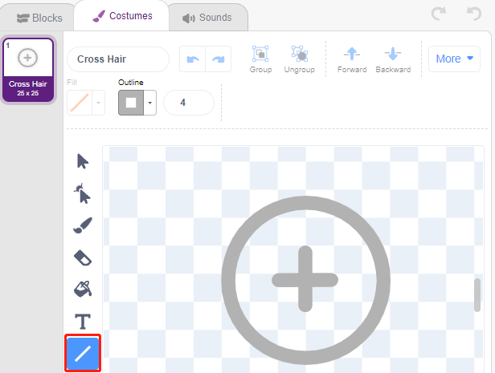
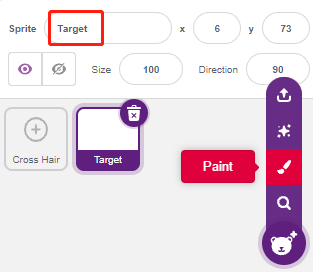

.. note::

    Ciao, benvenuto nella community di SunFounder Raspberry Pi & Arduino & ESP32 Enthusiasts su Facebook! Approfondisci Raspberry Pi, Arduino ed ESP32 insieme ad altri appassionati.

    **Perché unirti a noi?**

    - **Supporto esperto**: Risolvi problemi post-vendita e sfide tecniche con l'aiuto della nostra comunità e del nostro team.
    - **Impara e condividi**: Scambia suggerimenti e tutorial per migliorare le tue competenze.
    - **Anteprime esclusive**: Ottieni accesso anticipato agli annunci di nuovi prodotti e anteprime.
    - **Sconti speciali**: Approfitta di sconti esclusivi sui nostri prodotti più recenti.
    - **Promozioni e omaggi festivi**: Partecipa a omaggi e promozioni durante le festività.

    👉 Pronto a esplorare e creare con noi? Clicca su [|link_sf_facebook|] e unisciti oggi stesso!

.. _sh_shooting:

2.11 GIOCO - Tiro a Segno
======================================

Hai mai visto quei giochi di tiro a segno in TV? Più un concorrente spara un proiettile vicino al centro del bersaglio, maggiore sarà il suo punteggio.

Oggi realizzeremo anche noi un gioco di tiro a segno con Scratch. Nel gioco, lascia che il mirino spari il più vicino possibile al centro del bersaglio per ottenere un punteggio più alto.

Clicca sulla bandiera verde per iniziare. Usa il modulo di evitamento ostacoli per sparare un proiettile.

Componenti Necessari
-------------------------

In questo progetto, avremo bisogno dei seguenti componenti. 

È sicuramente conveniente acquistare un kit completo, ecco il link: 

.. list-table::
    :widths: 20 20 20
    :header-rows: 1

    *   - Nome	
        - ELEMENTI IN QUESTO KIT
        - LINK
    *   - ESP32 Starter Kit
        - 320+
        - |link_esp32_starter_kit|

Puoi anche acquistare i componenti separatamente dai link qui sotto.

.. list-table::
    :widths: 30 20
    :header-rows: 1

    *   - INTRODUZIONE AI COMPONENTI
        - LINK PER L'ACQUISTO

    *   - :ref:`cpn_esp32_wroom_32e`
        - |link_esp32_wroom_32e_buy|
    *   - :ref:`cpn_esp32_camera_extension`
        - |link_esp32_extension_board|
    *   - :ref:`cpn_wires`
        - |link_wires_buy|
    *   - :ref:`cpn_avoid`
        - |link_avoid_buy|

Cosa Imparerai
------------------

- Come funziona il modulo di evitamento ostacoli e l'intervallo angolare
- Dipingere diverse sprite
- Riconoscere i colori al tocco

Costruire il Circuito
----------------------------

Il modulo di evitamento ostacoli è un sensore di prossimità a infrarossi con distanza regolabile, il cui output è normalmente alto e diventa basso quando viene rilevato un ostacolo.

Ora costruisci il circuito secondo il diagramma qui sotto.

.. image:: img/circuit/12_shooting_bb.png

Programmazione
---------------------

**1. Dipingere la sprite del Mirino**

Elimina la sprite predefinita, seleziona il pulsante **Sprite** e clicca su **Dipingi**, apparirà una sprite vuota **Sprite1** e chiamala **Mirino**.

.. image:: img/14_shooting0.png

Vai alla pagina **Costumi** della sprite **Mirino**. Clicca sullo strumento **Cerchio**, rimuovi il colore di riempimento e imposta il colore e la larghezza del contorno.

.. image:: img/14_shooting02.png

Ora disegna un cerchio con lo strumento **Cerchio**. Dopo aver disegnato, puoi cliccare sullo strumento **Seleziona** e spostare il cerchio in modo che il punto di origine sia allineato con il centro della tela.

.. image:: img/14_shooting03.png

Usando lo strumento **Linea**, disegna una croce all'interno del cerchio.

**Dipingere la sprite del Bersaglio**

Crea una nuova sprite chiamata **Bersaglio**.

Vai alla pagina Costumi della sprite **Bersaglio**, clicca sullo strumento **Cerchio**, seleziona un colore di riempimento e rimuovi il contorno, poi dipingi un cerchio grande.

.. image:: img/14_shooting05.png

Usa lo stesso metodo per disegnare cerchi aggiuntivi, ognuno con un colore diverso, e puoi usare lo strumento **Avanti** o **Indietro** per cambiare la posizione dei cerchi sovrapposti. Nota che devi anche selezionare lo strumento per spostare i cerchi, in modo che l'origine di tutti i cerchi e il centro della tela siano allineati.

.. image:: img/14_shooting04.png

**3. Aggiungere uno sfondo**

Aggiungi uno sfondo adatto che preferibilmente non abbia troppi colori e non corrisponda ai colori nella sprite **Bersaglio**. Qui ho scelto lo sfondo **Wall1**.

.. image:: img/14_shooting06.png

**4. Script della sprite Mirino**

Imposta la posizione e la dimensione casuale della sprite **Mirino**, e lasciala muovere casualmente.

.. image:: img/14_shooting4.png

Quando una mano viene posizionata davanti al modulo di evitamento ostacoli, questo emetterà un livello basso come segnale di trasmissione.

.. image:: img/14_shooting5.png

Quando viene ricevuto il messaggio **shooting**, la sprite smette di muoversi e si riduce lentamente, simulando così l'effetto di un proiettile sparato.

.. image:: img/14_shooting6.png

Usa il blocco [Tocca colore ()] per determinare la posizione del colpo.

.. image:: img/14_shooting7.png

Quando il colpo è all'interno del cerchio giallo, viene segnalato 10.

.. image:: img/14_shooting8.png

Usa lo stesso metodo per determinare la posizione del proiettile, se non è impostato sulla sprite **Bersaglio**, significa che è fuori dal cerchio.

.. image:: img/14_shooting9.png
