.. note::

    こんにちは、SunFounderのRaspberry Pi & Arduino & ESP32愛好家コミュニティへようこそ！Facebook上でRaspberry Pi、Arduino、ESP32についてもっと深く掘り下げ、他の愛好家と交流しましょう。

    **参加する理由は？**

    - **エキスパートサポート**：コミュニティやチームの助けを借りて、販売後の問題や技術的な課題を解決します。
    - **学び＆共有**：ヒントやチュートリアルを交換してスキルを向上させましょう。
    - **独占的なプレビュー**：新製品の発表や先行プレビューに早期アクセスしましょう。
    - **特別割引**：最新製品の独占割引をお楽しみください。
    - **祭りのプロモーションとギフト**：ギフトや祝日のプロモーションに参加しましょう。

    👉 私たちと一緒に探索し、創造する準備はできていますか？[|link_sf_facebook|]をクリックして今すぐ参加しましょう！

.. _sh_balloon:

2.12 ゲーム - 風船を膨らます
=========================================

ここでは、風船を膨らませるゲームを行います。

緑の旗をクリックした後、風船がどんどん大きくなります。風船が大きすぎると爆発してしまい、小さすぎると落下してしまうので、いつボタンを押して上昇させるかを判断する必要があります。

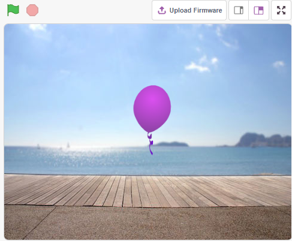

必要な部品
---------------------

このプロジェクトには、以下のコンポーネントが必要です。

全てのキットを購入することは非常に便利です。リンクはこちらです:

.. list-table::
    :widths: 20 20 20
    :header-rows: 1

    *   - 名前
        - このキットのアイテム
        - リンク
    *   - ESP32 Starter Kit
        - 320+
        - |link_esp32_starter_kit|

また、以下のリンクから個別に購入することもできます。

.. list-table::
    :widths: 30 20
    :header-rows: 1

    *   - コンポーネントの紹介
        - 購入リンク

    *   - :ref:`cpn_esp32_wroom_32e`
        - |link_esp32_wroom_32e_buy|
    *   - :ref:`cpn_esp32_camera_extension`
        - |link_esp32_extension_board|
    *   - :ref:`cpn_breadboard`
        - |link_breadboard_buy|
    *   - :ref:`cpn_wires`
        - |link_wires_buy|
    *   - :ref:`cpn_resistor`
        - |link_resistor_buy|
    *   - :ref:`cpn_button`
        - |link_button_buy|

学べること
---------------------

- スプライトのコスチュームを描く

回路の構築
-----------------------

ボタンは4ピンのデバイスで、ピン1がピン2に、ピン3がピン4に接続されており、ボタンが押されると4つのピンが接続されて回路が閉じます。

.. image:: img/5_buttonc.png

以下の図に従って回路を組み立てます。

* ボタンの左側のピンの1つをピン14に接続します。ピン14はプルダウン抵抗と0.1uF（104）のコンデンサー（ボタンが動作しているときにジッターを排除し、安定したレベルを出力するため）に接続されています。
* 抵抗とコンデンサーの他端をGNDに、ボタンの右側のピンの1つを5Vに接続します。

.. image:: img/circuit/6_doorbel_bb.png

プログラミング
------------------

**1. スプライトと背景を追加する**

デフォルトのスプライトを削除し、スプライトエリアの右下にある **Choose a Sprite** ボタンをクリックして、 **Balloon1** スプライトを選択します。

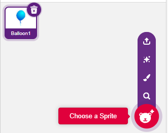

**Choose a backdrop** ボタンを使って **Boardwalk** 背景を追加するか、他のお好みの背景を追加します。

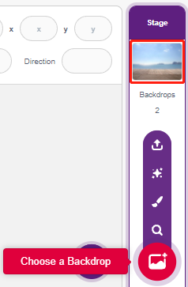

**2. Balloon1スプライトの衣装を描く**

次に、風船スプライトの爆発エフェクト衣装を描きましょう。

**Balloon1** スプライトの **Costumes** ページに移動し、左下の **Choose a Costume** ボタンをクリックして、 **Paint** を選び、白紙の **Costumes** を表示させます。

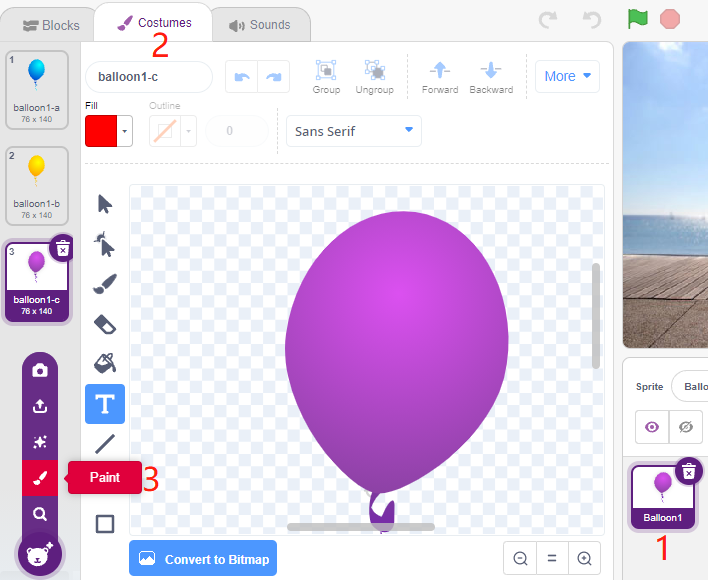

色を選んで、 **Brush** ツールを使って模様を描きます。

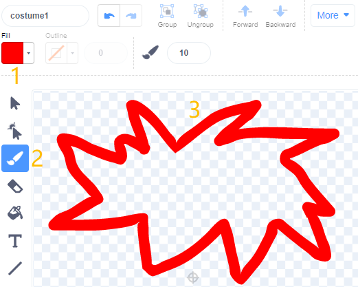

再度色を選び、塗りつぶしツールをクリックし、模様の内側にマウスを移動させて色を塗ります。

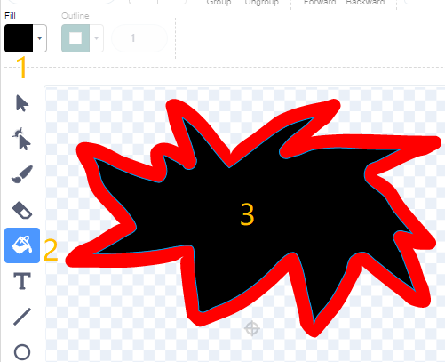

最後に、BOOMというテキストを書いて、爆発エフェクト衣装が完成です。

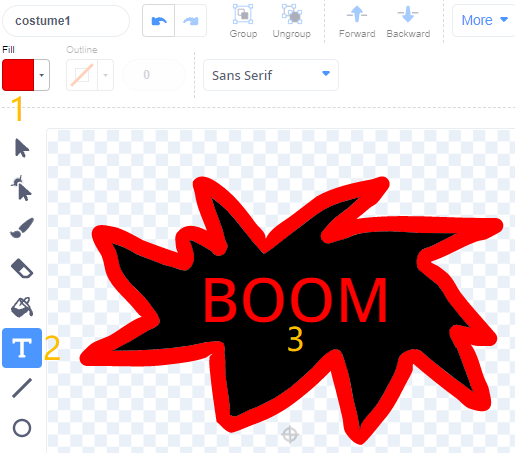

**3. Balloonスプライトのスクリプトを組む**

**Balloon1** スプライトの初期位置とサイズを設定します。

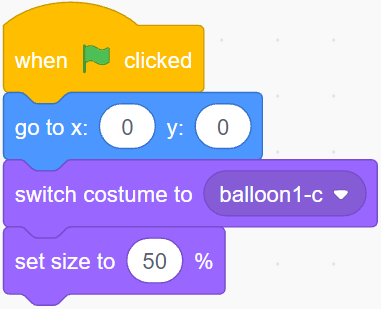

そして、 **Balloon** スプライトがゆっくりと大きくなるようにします。

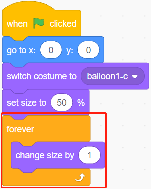

ボタンが押されたとき（値が1のとき）、 **Balloon1** スプライトのサイズの拡大が停止します。

* サイズが90未満の場合は落下します（y座標が減少）。
* サイズが90以上で120未満の場合は、空へ飛び立ちます（y座標が増加）。

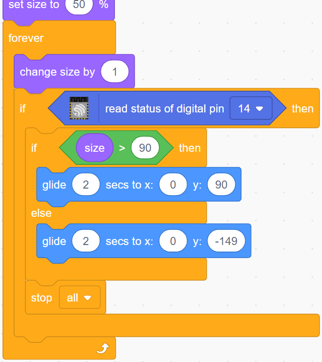

ボタンが押されていない場合、風船はゆっくりと大きくなり、サイズが120を超えると爆発します（爆発エフェクトの衣装に切り替え）。

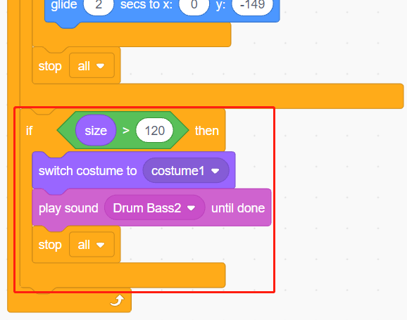
