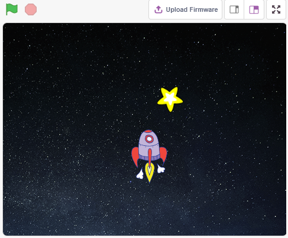
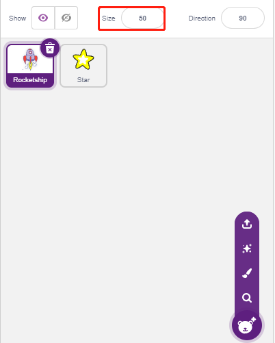
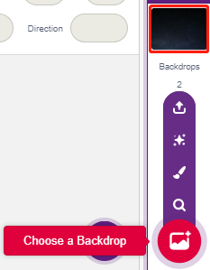
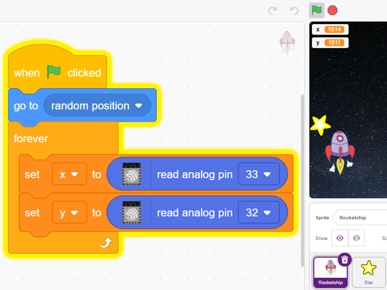
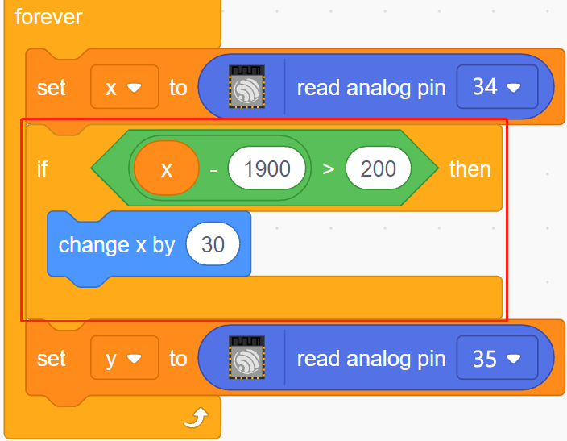
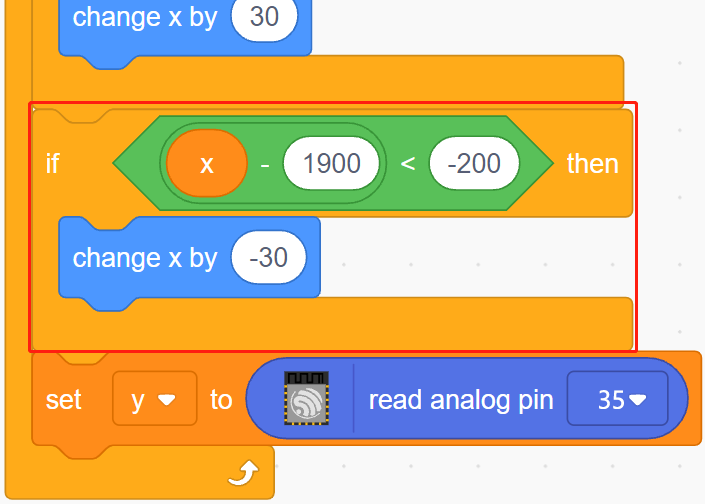
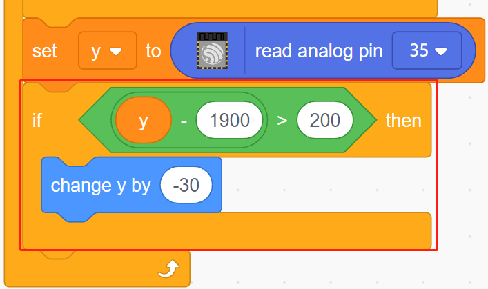
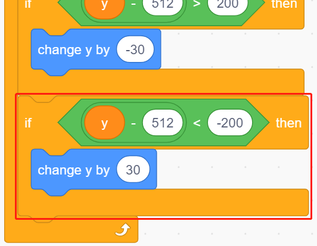
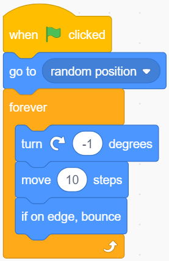
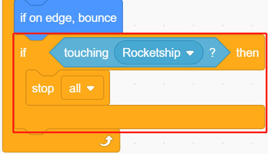

.. note::

    ¡Hola, bienvenido a la Comunidad de Aficionados a Raspberry Pi, Arduino y ESP32 de SunFounder en Facebook! Profundiza en Raspberry Pi, Arduino y ESP32 con otros entusiastas.

    **¿Por qué unirse?**

    - **Soporte de expertos**: Resuelve problemas posventa y desafíos técnicos con ayuda de nuestra comunidad y equipo.
    - **Aprender y compartir**: Intercambia consejos y tutoriales para mejorar tus habilidades.
    - **Vistas previas exclusivas**: Obtén acceso anticipado a anuncios de nuevos productos y avances.
    - **Descuentos especiales**: Disfruta de descuentos exclusivos en nuestros productos más nuevos.
    - **Promociones festivas y sorteos**: Participa en sorteos y promociones de fiestas.

    👉 ¿Listo para explorar y crear con nosotros? Haz clic en [|link_sf_facebook|] y únete hoy!

.. _sh_star_crossed:

2.13 JUEGO - Estrellas Cruzadas
==================================

En los próximos proyectos, jugaremos algunos minijuegos divertidos en PictoBlox.

Aquí usamos el módulo de Joystick para jugar un juego de Estrellas Cruzadas.

Una vez que se ejecuta el script, las estrellas aparecerán aleatoriamente en el escenario, necesitas usar el Joystick para controlar la Nave Espacial y evitar las estrellas, si las tocas, el juego terminará.

Componentes Necesarios
-------------------------

Para este proyecto, necesitaremos los siguientes componentes.

Es definitivamente conveniente comprar un kit completo, aquí está el enlace:

.. list-table::
    :widths: 20 20 20
    :header-rows: 1

    *   - Nombre	
        - ARTÍCULOS EN ESTE KIT
        - ENLACE
    *   - Kit de Inicio ESP32
        - 320+
        - |link_esp32_starter_kit|

También puedes comprarlos por separado en los enlaces a continuación.

.. list-table::
    :widths: 30 20
    :header-rows: 1

    *   - INTRODUCCIÓN DEL COMPONENTE
        - ENLACE DE COMPRA

    *   - :ref:`cpn_esp32_wroom_32e`
        - |link_esp32_wroom_32e_buy|
    *   - :ref:`cpn_esp32_camera_extension`
        - \-
    *   - :ref:`cpn_wires`
        - |link_wires_buy|
    *   - :ref:`cpn_joystick`
        - |link_joystick_buy|

Lo Que Aprenderás
---------------------

- Cómo funciona el módulo de Joystick
- Establecer las coordenadas x y y del sprite

Construye el Circuito
-----------------------

Un joystick es un dispositivo de entrada que consiste en un palo que pivota en una base e informa su ángulo o dirección al dispositivo que está controlando. Los joysticks se utilizan a menudo para controlar videojuegos y robots.

Para comunicar un rango completo de movimiento al ordenador, un joystick necesita medir la posición del palo en dos ejes: el eje X (de izquierda a derecha) y el eje Y (de arriba abajo).

Las coordenadas de movimiento del joystick se muestran en la siguiente figura.

.. note::

    * La coordenada x es de izquierda a derecha, el rango es 0-4095.
    * La coordenada y es de arriba abajo, el rango es 0-4095.

.. image:: img/16_joystick.png

Ahora construye el circuito según el siguiente diagrama.

.. image:: img/circuit/14_star_crossed_bb.png

Programación
------------------
El script completo logra el efecto de que, al hacer clic en la bandera verde, el sprite **Estrellas** se mueve en una curva en el escenario y necesitas usar el joystick para mover la **Nave Espacial**, de modo que no sea tocada por el sprite **Estrella**.

**1. Añadir sprites y fondos**

Elimina el sprite predeterminado, y usa el botón **Elegir un Sprite** para añadir el sprite **Nave Espacial** y el sprite **Estrella**. Nota que el tamaño del sprite **Nave** se establece al 50%.

Ahora añade el fondo **Estrellas** mediante **Elegir un Fondo**.

**2. Programación para Nave Espacial**

El sprite **Nave Espacial** logra el efecto de aparecer en una posición aleatoria y luego ser controlado por el joystick para moverlo hacia arriba, abajo, izquierda y derecha.

El flujo de trabajo es el siguiente.

* Al hacer clic en la bandera verde, haz que el sprite vaya a una ubicación aleatoria y crea 2 variables **x** y **y**, que almacenan los valores leídos de pin33 (VRX del Joystick) y pin35 (VRY del Joystick), respectivamente. Puedes dejar que el script se ejecute, moviendo el joystick hacia arriba y hacia abajo, izquierda y derecha, para ver el rango de valores para x y y.

* El valor de pin33 está en el rango 0-4095 (el medio es aproximadamente 1800). Usa ``x-1800>200`` para determinar si el Joystick se está moviendo hacia la derecha, y si es así, hacer que la coordenada x del sprite +30 (para mover el sprite hacia la derecha).

* Si el Joystick se mueve hacia la izquierda, deja que la coordenada x del sprite sea -30 (para mover el sprite hacia la izquierda).

* Dado que la coordenada y del Joystick es de arriba (0) a abajo (4095), y la coordenada y del sprite es de abajo hacia arriba. Entonces, para mover el Joystick hacia arriba y el sprite hacia arriba, la coordenada y debe ser -30 en el script.

* Si el joystick se mueve hacia abajo, la coordenada y del sprite es +30.

**3. Programación para Estrella**

El efecto a lograr por el sprite **Estrella** es aparecer en una ubicación aleatoria, y si golpea **Nave Espacial**, el script deja de ejecutarse y el juego termina.

* Al hacer clic en la bandera verde y el sprite va a una ubicación aleatoria, el bloque [girar grados] es para hacer que el sprite **Estrella** se mueva hacia adelante con un cambio de ángulo para que puedas ver que se está moviendo en una curva y si toca el borde, rebota.

* Si el sprite toca el sprite **Nave Espacial** mientras se mueve, detén la ejecución del script.

