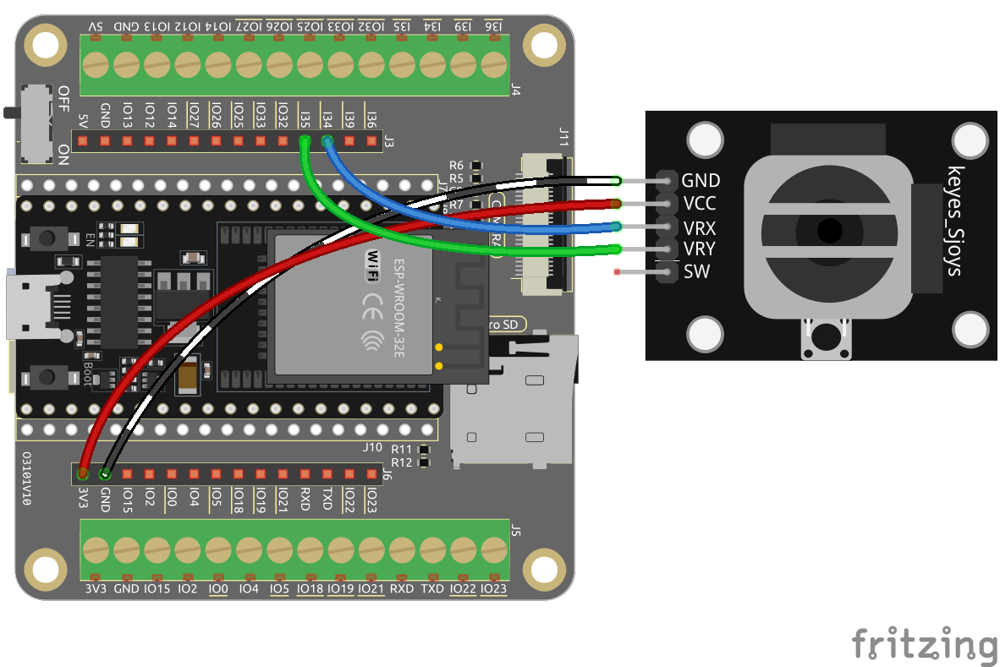

.. note::

    Ciao, benvenuto nella community di SunFounder Raspberry Pi & Arduino & ESP32 Enthusiasts su Facebook! Approfondisci Raspberry Pi, Arduino ed ESP32 insieme ad altri appassionati.

    **Perché unirti a noi?**

    - **Supporto esperto**: Risolvi problemi post-vendita e sfide tecniche con l'aiuto della nostra comunità e del nostro team.
    - **Impara e condividi**: Scambia suggerimenti e tutorial per migliorare le tue competenze.
    - **Anteprime esclusive**: Ottieni accesso anticipato agli annunci di nuovi prodotti e anteprime.
    - **Sconti speciali**: Approfitta di sconti esclusivi sui nostri prodotti più recenti.
    - **Promozioni e omaggi festivi**: Partecipa a omaggi e promozioni durante le festività.

    👉 Pronto a esplorare e creare con noi? Clicca su [|link_sf_facebook|] e unisciti oggi stesso!

.. _sh_star_crossed:

2.13 GIOCO - Star-Crossed
==================================

Nei prossimi progetti, giocheremo ad alcuni mini-giochi divertenti in PictoBlox.

Qui usiamo il modulo Joystick per giocare a Star-Crossed.

Dopo l'avvio dello script, le stelle appariranno casualmente sul palco. Devi usare il Joystick per controllare la navicella spaziale Rocketship ed evitare le stelle; se le tocchi, il gioco finirà.

Componenti Necessari
---------------------------------

In questo progetto, avremo bisogno dei seguenti componenti.

È sicuramente conveniente acquistare un kit completo, ecco il link:

.. list-table::
    :widths: 20 20 20
    :header-rows: 1

    *   - Nome	
        - ELEMENTI IN QUESTO KIT
        - LINK
    *   - ESP32 Starter Kit
        - 320+
        - |link_esp32_starter_kit|

Puoi anche acquistare i componenti separatamente dai link qui sotto.

.. list-table::
    :widths: 30 20
    :header-rows: 1

    *   - INTRODUZIONE AI COMPONENTI
        - LINK PER L'ACQUISTO

    *   - :ref:`cpn_esp32_wroom_32e`
        - |link_esp32_wroom_32e_buy|
    *   - :ref:`cpn_esp32_camera_extension`
        - |link_esp32_extension_board|
    *   - :ref:`cpn_wires`
        - |link_wires_buy|
    *   - :ref:`cpn_joystick`
        - |link_joystick_buy|

Cosa Imparerai
----------------------

- Come funziona il modulo Joystick
- Impostare le coordinate x e y della sprite

Costruire il Circuito
---------------------------

Un joystick è un dispositivo di input costituito da una leva che si muove su una base e comunica l'angolo o la direzione al dispositivo che controlla. I joystick sono spesso utilizzati per controllare videogiochi e robot.

Per comunicare un'intera gamma di movimenti al computer, un joystick deve misurare la posizione della leva su due assi: l'asse X (da sinistra a destra) e l'asse Y (su e giù).

Le coordinate di movimento del joystick sono mostrate nella figura seguente.

.. note::

    * La coordinata x va da sinistra a destra, con un intervallo da 0 a 4095.
    * La coordinata y va dall'alto verso il basso, con un intervallo da 0 a 4095.

.. image:: img/16_joystick.png

Ora costruisci il circuito secondo il diagramma seguente.

Programmazione
--------------------------
L'intero script serve a ottenere l'effetto per cui, quando si clicca sulla bandiera verde, la sprite **Stars** si muove con una curva sul palco e devi usare il joystick per muovere la sprite **Rocketship** affinché non venga toccata dalla sprite **Star**.

**1. Aggiungi sprite e sfondi**

Elimina la sprite predefinita e usa il pulsante **Scegli una Sprite** per aggiungere la sprite **Rocketship** e la sprite **Star**. Nota che la dimensione della sprite **Rocket** è impostata al 50%.

.. image:: img/16_sprite.png

Ora aggiungi lo sfondo **Stars** utilizzando **Scegli uno Sfondo**.

.. image:: img/16_sprite1.png

**2. Programmazione per Rocketship**

La sprite **Rocketship** deve ottenere l'effetto di apparire in una posizione casuale per poi essere controllata dal joystick per muoversi in alto, in basso, a sinistra e a destra.

Il flusso di lavoro è il seguente.

* Quando si clicca sulla bandiera verde, fai sì che la sprite vada in una posizione casuale e crea 2 variabili **x** e **y** che memorizzano rispettivamente i valori letti dal pin33 (VRX del Joystick) e dal pin35 (VRY del Joystick). Puoi far eseguire lo script, muovendo il joystick su e giù, a sinistra e a destra, per vedere l'intervallo di valori per x e y.

.. image:: img/16_roc2.png

* Il valore del pin33 è compreso nell'intervallo 0-4095 (il centro è circa 1800). Usa ``x-1800>200`` per determinare se il Joystick è spostato verso destra e, in tal caso, incrementa la coordinata x della sprite di +30 (per spostare la sprite verso destra).

.. image:: img/16_roc3.png

* Se il Joystick viene spostato a sinistra, imposta la coordinata x della sprite a -30 (sposta la sprite a sinistra).

.. image:: img/16_roc4.png

* Poiché la coordinata y del Joystick va dall'alto (0) verso il basso (4095) e la coordinata y della sprite va dal basso verso l'alto, per far muovere la sprite verso l'alto quando il Joystick viene spostato verso l'alto, la coordinata y deve essere -30 nello script.

* Se il Joystick viene spostato verso il basso, la coordinata y della sprite è +30.

.. image:: img/16_roc6.png

**3. Programmazione per Star**

L'effetto da ottenere dalla sprite **Star** è quello di apparire in una posizione casuale e, se tocca la sprite **Rocketship**, lo script si interrompe e il gioco finisce.

* Quando si clicca sulla bandiera verde e la sprite va in una posizione casuale, il blocco [turn degrees] serve a far avanzare la sprite **Star** con un leggero cambiamento d'angolo in modo che sembri che si muova in una curva e, se tocca il bordo, rimbalza.

.. image:: img/16_star1.png

* Se la sprite tocca la sprite **Rocketship** mentre si muove, interrompi l'esecuzione dello script.

.. image:: img/16_star2.png
