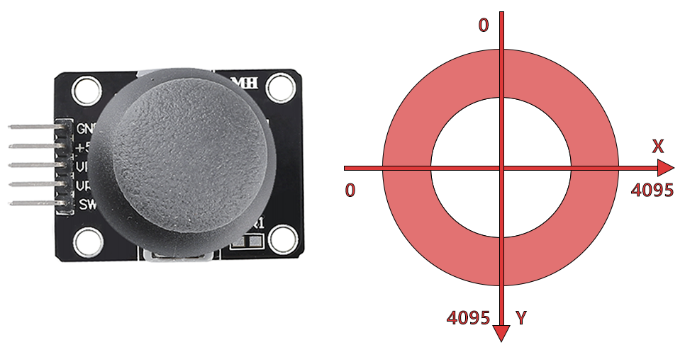

.. note::

    Hallo und willkommen in der SunFounder Raspberry Pi & Arduino & ESP32 Enthusiasten-Gemeinschaft auf Facebook! Tauchen Sie tiefer ein in die Welt von Raspberry Pi, Arduino und ESP32 mit anderen Enthusiasten.

    **Warum beitreten?**

    - **Expertenunterstützung**: Lösen Sie Nachverkaufsprobleme und technische Herausforderungen mit Hilfe unserer Gemeinschaft und unseres Teams.
    - **Lernen & Teilen**: Tauschen Sie Tipps und Anleitungen aus, um Ihre Fähigkeiten zu verbessern.
    - **Exklusive Vorschauen**: Erhalten Sie frühzeitigen Zugang zu neuen Produktankündigungen und exklusiven Einblicken.
    - **Spezialrabatte**: Genießen Sie exklusive Rabatte auf unsere neuesten Produkte.
    - **Festliche Aktionen und Gewinnspiele**: Nehmen Sie an Gewinnspielen und Feiertagsaktionen teil.

    👉 Sind Sie bereit, mit uns zu erkunden und zu erschaffen? Klicken Sie auf [|link_sf_facebook|] und treten Sie heute bei!

.. _sh_star_crossed:

2.13 SPIEL - Sternenkreuzung
===============================

In den nächsten Projekten werden wir einige unterhaltsame Minispiele in PictoBlox spielen.

Hier verwenden wir das Joystick-Modul, um das Spiel Sternenkreuzung zu spielen.

Nachdem das Skript ausgeführt wurde, erscheinen Sterne zufällig auf der Bühne, und du musst den Joystick verwenden, um das Raumschiff zu steuern und den Sternen auszuweichen. Wenn du sie berührst, ist das Spiel vorbei.

.. image:: img/16_rocket.png

Benötigte Komponenten
---------------------

Für dieses Projekt benötigen wir die folgenden Komponenten.

Es ist definitiv praktisch, ein ganzes Set zu kaufen. Hier ist der Link:

.. list-table::
    :widths: 20 20 20
    :header-rows: 1

    *   - Name	
        - ARTIKEL IN DIESEM KIT
        - LINK
    *   - ESP32 Starter Kit
        - 320+
        - |link_esp32_starter_kit|

Sie können sie auch separat über die untenstehenden Links kaufen.

.. list-table::
    :widths: 30 20
    :header-rows: 1

    *   - KOMPONENTENBESCHREIBUNG
        - KAUF-LINK

    *   - :ref:`cpn_esp32_wroom_32e`
        - |link_esp32_wroom_32e_buy|
    *   - :ref:`cpn_esp32_camera_extension`
        - |link_esp32_extension_board|
    *   - :ref:`cpn_wires`
        - |link_wires_buy|
    *   - :ref:`cpn_joystick`
        - |link_joystick_buy|

Was Sie Lernen Werden
---------------------

- Funktionsweise des Joystick-Moduls
- Setzen der x- und y-Koordinaten des Sprites

Schaltung Aufbauen
-----------------------

Ein Joystick ist ein Eingabegerät, das aus einem auf einer Basis schwenkbaren Stick besteht und dessen Winkel oder Richtung an das Gerät meldet, das er steuert. Joysticks werden häufig verwendet, um Videospiele und Roboter zu steuern.

Um einem Computer einen vollen Bewegungsbereich zu vermitteln, muss ein Joystick die Position des Sticks auf zwei Achsen messen - der X-Achse (links nach rechts) und der Y-Achse (oben nach unten).

Die Bewegungskoordinaten des Joysticks werden in der folgenden Abbildung gezeigt.

.. note::

    * Die x-Koordinate verläuft von links nach rechts, der Bereich ist 0-4095.
    * Die y-Koordinate verläuft von oben nach unten, Bereich ist 0-4095.

Bauen Sie die Schaltung gemäß dem folgenden Diagramm auf.

.. image:: img/circuit/14_star_crossed_bb.png

Programmierung
------------------
Das gesamte Skript soll den Effekt erzielen, dass beim Klicken auf die grüne Flagge das **Stars**-Sprite in einer Kurve auf der Bühne bewegt wird und du den Joystick verwenden musst, um das **Rocketship** zu bewegen, sodass es nicht vom **Star**-Sprite berührt wird.

**1. Sprites und Hintergründe hinzufügen**

Lösche das Standard-Sprite und füge über den Button **Choose a Sprite** das **Rocketship**-Sprite und das **Star**-Sprite hinzu. Beachte, dass die Größe des **Rocket**-Sprites auf 50% gesetzt wird.

.. image:: img/16_sprite.png

Füge nun den **Stars**-Hintergrund über **Choose a Backdrop** hinzu.

.. image:: img/16_sprite1.png

**2. Skript für Raumschiff**

Das **Rocketship**-Sprite soll so programmiert werden, dass es an einer zufälligen Position erscheint und dann durch den Joystick gesteuert nach oben, unten, links und rechts bewegt wird.

Der Arbeitsablauf ist wie folgt.

* Wenn die grüne Flagge angeklickt wird, gehe das Sprite zu einer zufälligen Position und erstelle 2 Variablen **x** und **y**, die die Werte von Pin33 (VRX des Joysticks) und Pin35 (VRY des Joysticks) speichern. Du kannst das Skript laufen lassen, den Joystick nach oben und unten, links und rechts bewegen, um den Wertebereich von x und y zu sehen.

.. image:: img/16_roc2.png

* Der Wert von Pin33 liegt im Bereich 0-4095 (die Mitte ist etwa 1800). Verwende ``x-1800>200``, um zu bestimmen, ob der Joystick nach rechts bewegt wird, und wenn ja, erhöhe die x-Koordinate des Sprites um +30 (um das Sprite nach rechts zu bewegen).

.. image:: img/16_roc3.png

* Wenn der Joystick nach links bewegt wird, lasse die x-Koordinate des Sprites -30 sein (lass das Sprite nach links bewegen).

.. image:: img/16_roc4.png

* Da die y-Koordinate des Joysticks von oben (0) nach unten (4095) verläuft und die y-Koordinate des Sprites von unten nach oben. Um also den Joystick nach oben und das Sprite nach oben zu bewegen, muss die y-Koordinate im Skript -30 sein.

.. image:: img/16_roc5.png

* Wenn der Joystick nach unten bewegt wird, ist die y-Koordinate des Sprites +30.

.. image:: img/16_roc6.png

**3. Skript für Stern**

Das zu erzielende Ergebnis des **Star**-Sprites ist, dass es an einer zufälligen Stelle erscheint, und wenn es **Rocketship** trifft, stoppt das Skript und das Spiel endet.

* Wenn die grüne Flagge angeklickt wird und das Sprite zu einer zufälligen Position geht, ist der [turn degrees]-Block dafür gedacht, das **Star**-Sprite mit einer kleinen Winkeländerung vorwärts zu bewegen, sodass du sehen kannst, dass es in einer Kurve bewegt wird und wenn es am Rand ist, abprallt.

.. image:: img/16_star1.png

* Wenn das Sprite das **Rocketship**-Sprite während der Bewegung berührt, stoppe das Skript.

.. image:: img/16_star2.png
