.. note::

    Hallo und willkommen in der SunFounder Raspberry Pi & Arduino & ESP32 Enthusiasten-Gemeinschaft auf Facebook! Tauchen Sie tiefer ein in die Welt von Raspberry Pi, Arduino und ESP32 mit anderen Enthusiasten.

    **Warum beitreten?**

    - **Expertenunterstützung**: Lösen Sie Nachverkaufsprobleme und technische Herausforderungen mit Hilfe unserer Gemeinschaft und unseres Teams.
    - **Lernen & Teilen**: Tauschen Sie Tipps und Anleitungen aus, um Ihre Fähigkeiten zu verbessern.
    - **Exklusive Vorschauen**: Erhalten Sie frühzeitigen Zugang zu neuen Produktankündigungen und exklusiven Einblicken.
    - **Spezialrabatte**: Genießen Sie exklusive Rabatte auf unsere neuesten Produkte.
    - **Festliche Aktionen und Gewinnspiele**: Nehmen Sie an Gewinnspielen und Feiertagsaktionen teil.

    👉 Sind Sie bereit, mit uns zu erkunden und zu erschaffen? Klicken Sie auf [|link_sf_facebook|] und treten Sie heute bei!

.. _sh_eat_apple:

2.14 SPIEL - Apfel Essen
==============================

In diesem Projekt spielen wir ein Spiel, bei dem wir einen Knopf verwenden, um den Käfer zu steuern, damit er Äpfel isst.

Wenn die grüne Flagge angeklickt wird, drücke den Knopf und der Käfer wird sich drehen. Drücke den Knopf erneut und der Käfer hält an und bewegt sich in diesem Winkel vorwärts. Du musst den Winkel des Käfers so steuern, dass er sich vorwärts bewegt, ohne die schwarze Linie auf der Karte zu berühren, bis er den Apfel isst. Wenn er die schwarze Linie berührt, ist das Spiel vorbei.

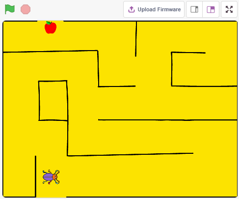

Benötigte Komponenten
-----------------------

Für dieses Projekt benötigen wir die folgenden Komponenten.

Es ist definitiv praktisch, ein ganzes Set zu kaufen. Hier ist der Link:

.. list-table::
    :widths: 20 20 20
    :header-rows: 1

    *   - Name	
        - ARTIKEL IN DIESEM KIT
        - LINK
    *   - ESP32 Starter Kit
        - 320+
        - |link_esp32_starter_kit|

Sie können sie auch separat über die untenstehenden Links kaufen.

.. list-table::
    :widths: 30 20
    :header-rows: 1

    *   - KOMPONENTENBESCHREIBUNG
        - KAUF-LINK

    *   - :ref:`cpn_esp32_wroom_32e`
        - |link_esp32_wroom_32e_buy|
    *   - :ref:`cpn_esp32_camera_extension`
        - |link_esp32_extension_board|
    *   - :ref:`cpn_breadboard`
        - |link_breadboard_buy|
    *   - :ref:`cpn_wires`
        - |link_wires_buy|
    *   - :ref:`cpn_resistor`
        - |link_resistor_buy|
    *   - :ref:`cpn_button`
        - |link_button_buy|

Schaltung Aufbauen
-----------------------

Der Knopf ist ein 4-poliges Gerät, da Pin 1 mit Pin 2 verbunden ist und Pin 3 mit Pin 4, wenn der Knopf gedrückt wird, sind die 4 Pins verbunden, wodurch der Stromkreis geschlossen wird.

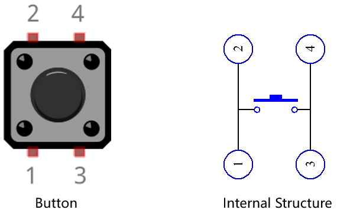

Bauen Sie die Schaltung gemäß dem folgenden Diagramm auf.

* Verbinden Sie einen der Pins auf der linken Seite des Knopfes mit Pin14, der mit einem Pull-Down-Widerstand und einem 0,1uF (104) Kondensator verbunden ist (um Schwankungen zu eliminieren und ein stabiles Level auszugeben, wenn der Knopf betätigt wird).
* Verbinden Sie das andere Ende des Widerstands und des Kondensators mit GND, und einen der Pins auf der rechten Seite des Knopfes mit 5V.

.. image:: img/circuit/6_doorbel_bb.png

Programmierung
------------------
Das Ziel ist es, den Knopf zu verwenden, um die Richtung des **Beetle**-Sprites zu steuern, damit es vorwärts geht und den Apfel isst, ohne die schwarze Linie auf dem **Maze**-Hintergrund zu berühren. Wenn der Apfel gegessen wird, wird der Hintergrund gewechselt.

Füge nun die relevanten Hintergründe und Sprites hinzu.

**1. Hintergründe und Sprites hinzufügen**

Füge einen **Maze**-Hintergrund über den Button **Choose a backdrop** hinzu.

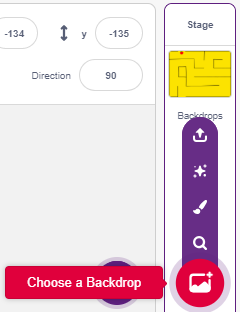

Lösche das Standard-Sprite und wähle dann das **Beetle**-Sprite aus.

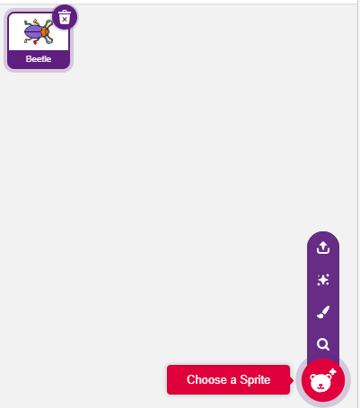

Platziere das **Beetle**-Sprite am Eingang des **Maze**-Hintergrunds, merke dir die x,y-Koordinatenwerte an diesem Punkt und ändere die Größe des Sprites auf 40%.

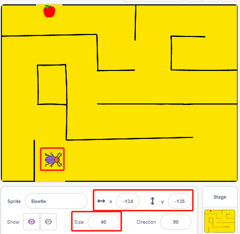

**2. Einen Hintergrund zeichnen**

Jetzt ist es an der Zeit, einen einfachen Hintergrund mit dem WIN!-Zeichen darauf zu zeichnen.

Klicke zuerst auf die Miniaturansicht des Hintergrunds, um zur **Backdrops**-Seite zu gelangen und klicke auf den leeren Hintergrund1.

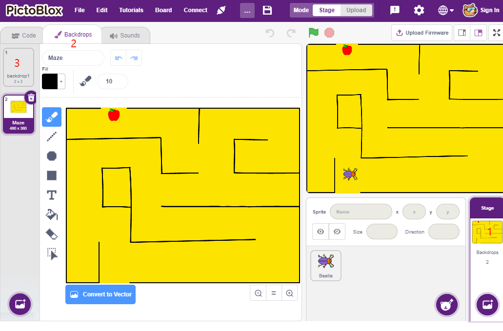

Beginne jetzt mit dem Zeichnen, du kannst das Bild unten als Referenz verwenden oder deinen eigenen Hintergrund zeichnen, solange der Ausdruck gewinnend ist.

* Verwende das **Circle**-Werkzeug, um eine Ellipse mit der Farbe Rot und ohne Umrandung zu zeichnen.
* Dann verwende das **Text**-Werkzeug, schreibe das Zeichen \"WIN!\", setze die Zeichenfarbe auf Schwarz und passe die Größe und Position des Zeichens an.
* Benenne den Hintergrund als **Win**.

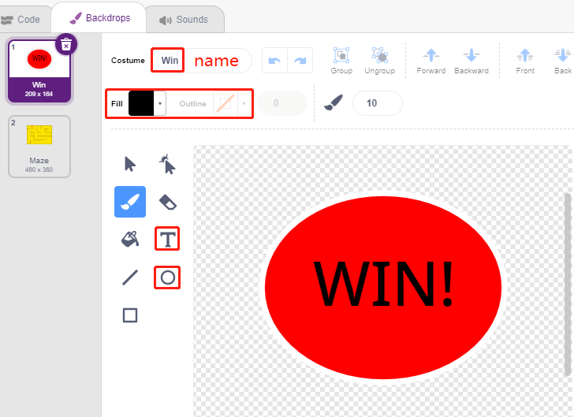

**3. Skript für den Hintergrund**

Der Hintergrund muss jedes Mal, wenn das Spiel beginnt, auf **Maze** umgeschaltet werden.

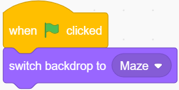

**4. Skripte für das Sprite Käfer schreiben**

Schreibe jetzt ein Skript für das Sprite **Beetle**, um vorwärtsbewegen und die Richtung unter Kontrolle eines Knopfes ändern zu können. Der Arbeitsablauf ist wie folgt.

* Wenn die grüne Flagge angeklickt wird, setze den Winkel des **Beetle** auf 90 und die Position auf (-134, -134) oder ersetze sie durch den Koordinatenwert deiner eigenen Platzierung. Erstelle die Variable **flag** und setze den Anfangswert auf -1.

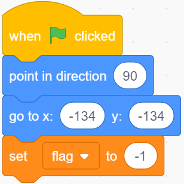

Als Nächstes werden im [forever]-Block vier [if]-Blöcke verwendet, um verschiedene mögliche Szenarien zu bestimmen.

* Wenn der Knopf 1 ist (gedrückt), verwende den [`mod <https://en.scratch-wiki.info/wiki/Boolean_Block>`_]-Block, um den Wert der Variable **flag** zwischen 0 und 1 umzuschalten (abwechselnd zwischen 0 für diesen Druck und 1 für den nächsten Druck).

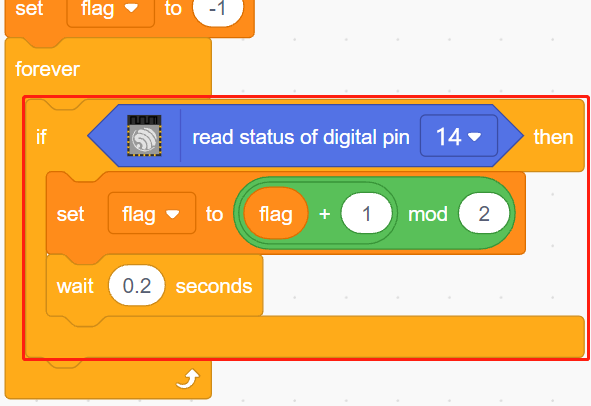

* Wenn Flag=0 (dieser Knopfdruck), lasse das **Beetle**-Sprite sich im Uhrzeigersinn drehen. Dann bestimme, ob Flag gleich 1 ist (Knopf erneut gedrückt), das **Beetle**-Sprite bewegt sich vorwärts. Andernfalls dreht es sich weiter im Uhrzeigersinn.

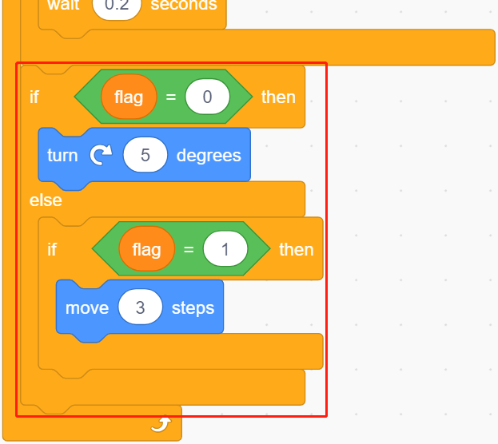

* Wenn das Käfer-Sprite Schwarz berührt (die schwarze Linie auf dem **Maze**-Hintergrund), endet das Spiel und das Skript stoppt.

.. note::
    
    Du musst auf den Farbbereich im [Touch color]-Block klicken und dann das Pipettenwerkzeug verwenden, um die Farbe der schwarzen Linie auf der Bühne aufzunehmen. Wenn du willkürlich ein Schwarz wählst, funktioniert dieser [Touch color]-Block nicht.

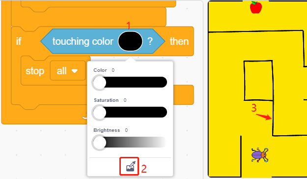

* Wenn Käfer Rot berührt (Verwende auch das Strohwerkzeug, um die rote Farbe des Apfels aufzunehmen), wird der Hintergrund auf **Win** umgeschaltet, was bedeutet, dass das Spiel erfolgreich ist und das Skript stoppt.

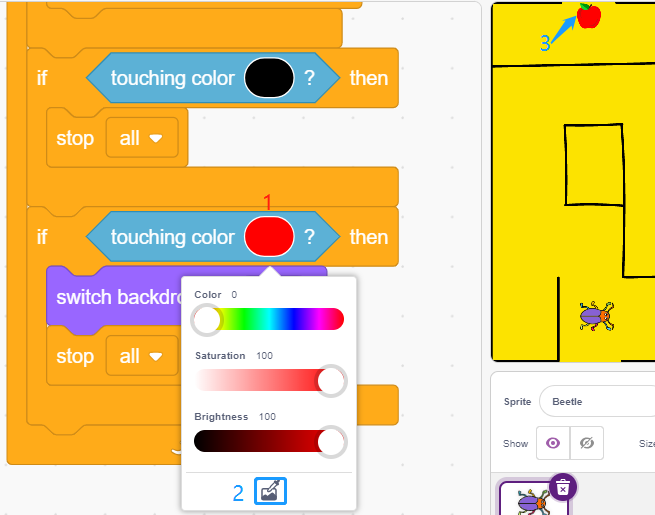

