.. note::

    Hallo und willkommen in der SunFounder Raspberry Pi & Arduino & ESP32 Enthusiasten-Gemeinschaft auf Facebook! Tauchen Sie tiefer ein in die Welt von Raspberry Pi, Arduino und ESP32 mit anderen Enthusiasten.

    **Warum beitreten?**

    - **Expertenunterstützung**: Lösen Sie Nachverkaufsprobleme und technische Herausforderungen mit Hilfe unserer Gemeinschaft und unseres Teams.
    - **Lernen & Teilen**: Tauschen Sie Tipps und Anleitungen aus, um Ihre Fähigkeiten zu verbessern.
    - **Exklusive Vorschauen**: Erhalten Sie frühzeitigen Zugang zu neuen Produktankündigungen und exklusiven Einblicken.
    - **Spezialrabatte**: Genießen Sie exklusive Rabatte auf unsere neuesten Produkte.
    - **Festliche Aktionen und Gewinnspiele**: Nehmen Sie an Gewinnspielen und Feiertagsaktionen teil.

    👉 Sind Sie bereit, mit uns zu erkunden und zu erschaffen? Klicken Sie auf [|link_sf_facebook|] und treten Sie heute bei!

.. _sh_parrot:

2.15 SPIEL - Flappy Papagei
==============================

Hier verwenden wir das Ultraschallmodul, um ein Flappy-Papagei-Spiel zu spielen.

Nachdem das Skript läuft, bewegt sich der grüne Bambus langsam von rechts nach links auf einer zufälligen Höhe. Platziere jetzt deine Hand über dem Ultraschallmodul, wenn der Abstand zwischen deiner Hand und dem Ultraschallmodul weniger als 10 beträgt, fliegt der Papagei nach oben, sonst fällt er nach unten.
Du musst den Abstand zwischen deiner Hand und dem Ultraschallmodul kontrollieren, damit der Papagei den grünen Bambus (Schläger) meiden kann, wenn er ihn berührt, ist das Spiel vorbei.

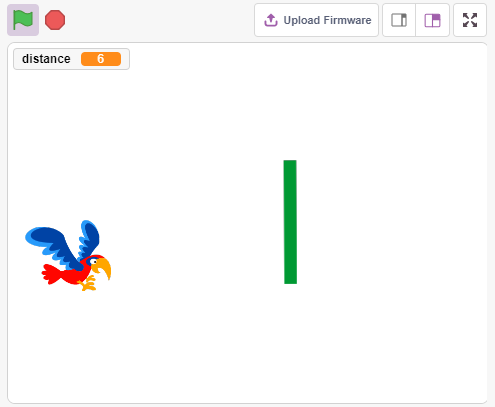

Benötigte Komponenten
---------------------

Für dieses Projekt benötigen wir die folgenden Komponenten.

Es ist definitiv praktisch, ein ganzes Set zu kaufen. Hier ist der Link:

.. list-table::
    :widths: 20 20 20
    :header-rows: 1

    *   - Name	
        - ARTIKEL IN DIESEM KIT
        - LINK
    *   - ESP32 Starter Kit
        - 320+
        - |link_esp32_starter_kit|

Sie können sie auch separat über die untenstehenden Links kaufen.

.. list-table::
    :widths: 30 20
    :header-rows: 1

    *   - KOMPONENTENBESCHREIBUNG
        - KAUF-LINK

    *   - :ref:`cpn_esp32_wroom_32e`
        - |link_esp32_wroom_32e_buy|
    *   - :ref:`cpn_esp32_camera_extension`
        - |link_esp32_extension_board|
    *   - :ref:`cpn_wires`
        - |link_wires_buy|
    *   - :ref:`cpn_ultrasonic`
        - |link_ultrasonic_buy|

Schaltung Aufbauen
-----------------------

Ein Ultraschallsensormodul ist ein Instrument, das die Entfernung zu einem Objekt mit Ultraschallwellen misst.
Es hat zwei Sonden. Eine sendet Ultraschallwellen und die andere empfängt die Wellen und verwandelt die Zeit des Sendens und Empfangens in eine Entfernung, um so die Entfernung zwischen dem Gerät und einem Hindernis zu messen.

Bauen Sie die Schaltung gemäß dem folgenden Diagramm auf.

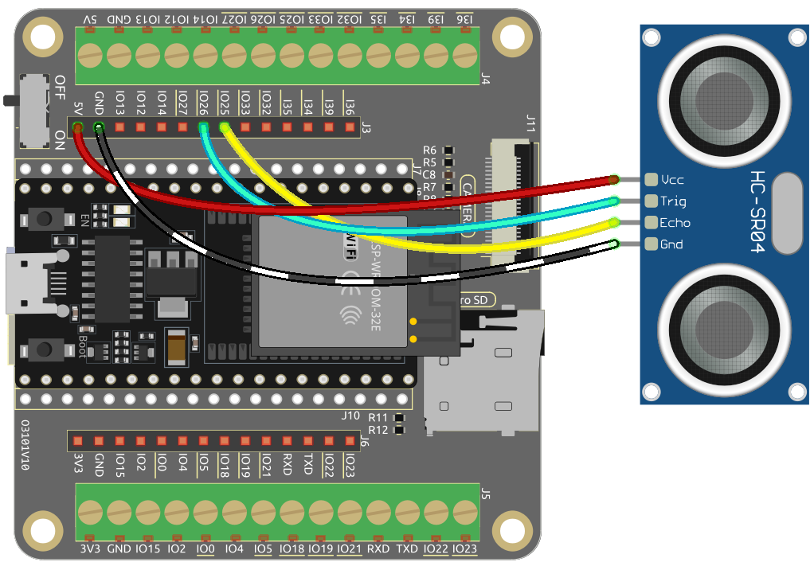

Programmierung
------------------

Das zu erreichende Ziel ist es, das Ultraschallmodul zu verwenden, um die Flughöhe des Sprites **Parrot** zu steuern, während es das Sprite **Paddle** vermeidet.

**1. Ein Sprite hinzufügen**

Lösche das Standard-Sprite und füge über den Button **Choose a Sprite** das **Parrot**-Sprite hinzu. Setze seine Größe auf 50% und verschiebe seine Position in die linke Mitte.

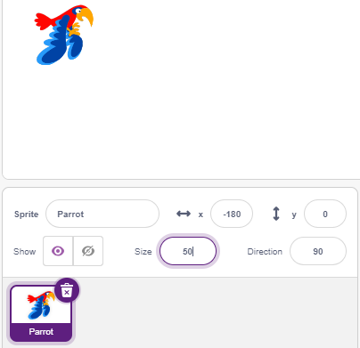

Füge nun das **Paddle**-Sprite hinzu, setze seine Größe auf 150%, stelle seinen Winkel auf 180 ein und verschiebe seine anfängliche Position in die obere rechte Ecke.

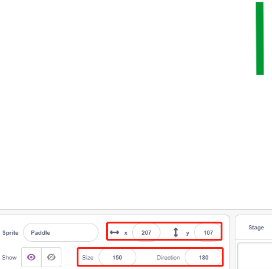

Gehe zur **Costumes**-Seite des **Paddle**-Sprites und entferne die Umrandung.

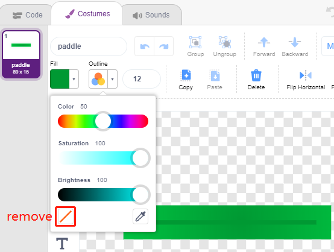

**2. Skript für das Papagei-Sprite**

Programmiere jetzt das **Parrot**-Sprite, das im Flug ist und dessen Flughöhe durch den Erfassungsabstand des Ultraschallmoduls bestimmt wird.

* Wenn die grüne Flagge angeklickt wird, wechsle das Kostüm alle 0,2 Sekunden, damit es immer im Flug ist.

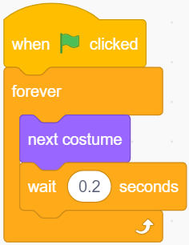

* Lies den Wert des Ultraschallmoduls und speichere ihn nach dem Runden mit dem [round]-Block in der Variable **distance**.

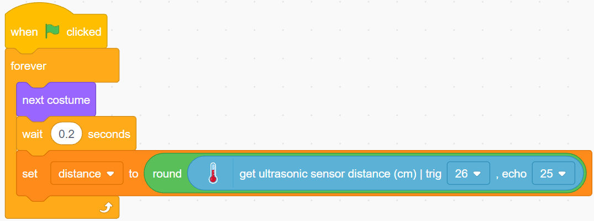

* Wenn die Ultraschall-Erfassungsdistanz weniger als 10 cm beträgt, erhöhe die y-Koordinate um 50, das **Parrot**-Sprite fliegt nach oben. Andernfalls wird der y-Koordinatenwert um 40 verringert, **Parrot** fällt nach unten.

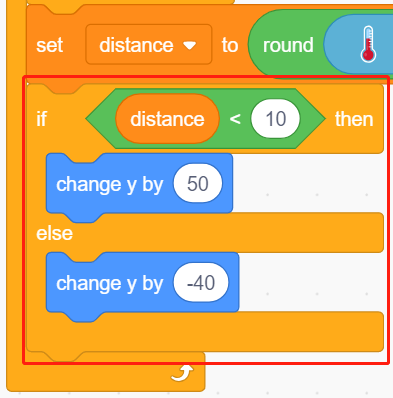

* Wenn das **Parrot**-Sprite das **Paddle**-Sprite berührt, endet das Spiel und das Skript stoppt.

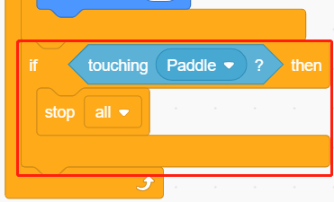

**3. Skript für das Schläger-Sprite**

Schreibe jetzt das Skript für das **Paddle**-Sprite, das zufällig auf der Bühne erscheinen muss.

* Verstecke das Sprite **Paddle**, wenn die grüne Flagge angeklickt wird, und klone es gleichzeitig. Der [`create clone of <https://en.scratch-wiki.info/wiki/Create_Clone_of_()_(block)>`_]-Block ist ein Steuerungsblock und ein Stapelblock. Er erstellt einen Klon des Sprites im Argument. Es kann auch das Sprite klonen, in dem es läuft, wodurch Klone von Klonen rekursiv erstellt werden.

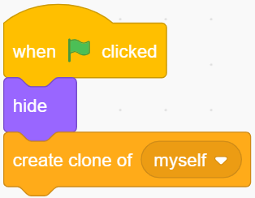

* Wenn **Paddle** als Klon präsentiert wird, ist seine Position 220 (rechts) für die x-Koordinate und seine y-Koordinate zufällig zwischen (-125 bis 125) (Höhe zufällig).

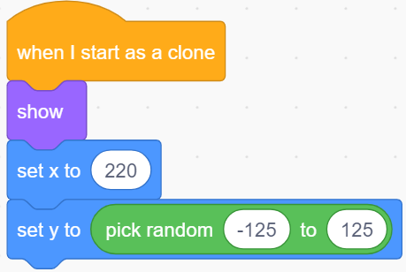

* Verwende den [repeat]-Block, um den x-Koordinatenwert langsam zu verringern, sodass du sehen kannst, wie der Klon des **Paddle**-Sprites langsam von rechts nach links bewegt wird, bis es verschwindet.

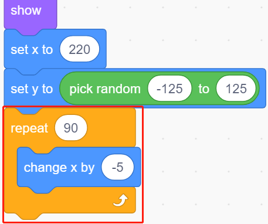

* Klone erneut ein neues **Paddle**-Sprite und lösche den vorherigen Klon.

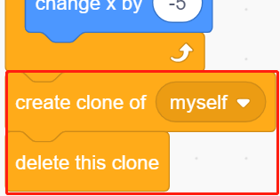
