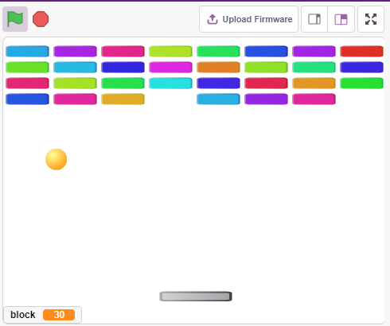

.. note::

    こんにちは、SunFounderのRaspberry Pi & Arduino & ESP32愛好家コミュニティへようこそ！Facebook上でRaspberry Pi、Arduino、ESP32についてもっと深く掘り下げ、他の愛好家と交流しましょう。

    **参加する理由は？**

    - **エキスパートサポート**：コミュニティやチームの助けを借りて、販売後の問題や技術的な課題を解決します。
    - **学び＆共有**：ヒントやチュートリアルを交換してスキルを向上させましょう。
    - **独占的なプレビュー**：新製品の発表や先行プレビューに早期アクセスしましょう。
    - **特別割引**：最新製品の独占割引をお楽しみください。
    - **祭りのプロモーションとギフト**：ギフトや祝日のプロモーションに参加しましょう。

    👉 私たちと一緒に探索し、創造する準備はできていますか？[|link_sf_facebook|]をクリックして今すぐ参加しましょう！

.. _sh_breakout_clone:

2.16 GAME - ブレイクアウトクローン
==================================

ここではポテンショメータを使用してブレイクアウトクローンゲームをプレイします。

緑の旗をクリックした後、ポテンショメータを使用してステージ上のパドルを制御し、ボールをキャッチして上に行き、レンガを打つようにします。全てのレンガが消えればゲームに勝利し、ボールをキャッチしなければゲームは失敗します。

必要な部品
---------------------

このプロジェクトには以下のコンポーネントが必要です。

全キットを購入するのが間違いなく便利です。こちらがリンクです：

.. list-table::
    :widths: 20 20 20
    :header-rows: 1

    *   - 名前
        - このキットのアイテム
        - リンク
    *   - ESP32 Starter Kit
        - 320+
        - |link_esp32_starter_kit|

また、以下のリンクから個別に購入することもできます。

.. list-table::
    :widths: 30 20
    :header-rows: 1

    *   - コンポーネントの紹介
        - 購入リンク

    *   - :ref:`cpn_esp32_wroom_32e`
        - |link_esp32_wroom_32e_buy|
    *   - :ref:`cpn_esp32_camera_extension`
        - \-
    *   - :ref:`cpn_breadboard`
        - |link_breadboard_buy|
    *   - :ref:`cpn_wires`
        - |link_wires_buy|
    *   - :ref:`cpn_pot`
        - |link_potentiometer_buy|

回路の構築
-----------------------

ポテンショメータは3端子の抵抗要素で、両側の端子は5VとGNDに接続され、中央の端子はpin35に接続されます。esp32ボードのADCコンバータによる変換後、値の範囲は0-4095です。

.. image:: img/circuit/5_moving_mouse_bb.png

プログラミング
------------------

ステージには3つのスプライトがあります。

**1. パドルスプライト**

**Paddle** によって達成されるべき効果は、初期位置がステージの底の中央にあり、ポテンショメータによって左または右に動かすことができます。

* デフォルトのスプライトを削除し、 **Choose a Sprite** ボタンを使用して **Paddle** スプライトを追加し、そのxとyを(0, -140)に設定します。

    .. image:: img/17_padd1.png

* **Costumes** ページに移動し、アウトラインを削除し、色をダークグレーに変更します。

    .. image:: img/17_padd3.png

* 緑の旗がクリックされたときに初期位置を(0, -140)に設定し、pin35（ポテンショメータ）の値を変数 **a0** に読み込むように **Paddle** スプライトをスクリプト化します。 **Paddle** スプライトはステージ上でx座標-195〜195の間で左右に動きますので、変数 **a0** の範囲0〜4095を-195〜195にマップする[map]ブロックを使用する必要があります。

    .. image:: img/17_padd2.png

* これで、ポテンショメータを回して **Paddle** がステージ上で左右に動くかどうかを確認できます。

**2. ボールスプライト**

ボールスプライトの効果は、ステージ上を動き回り、端に触れたら跳ね返り、ステージ上のブロックに触れたら下に跳ね返り、落ちる途中でパドルスプライトに触れたら上に跳ね返ることです。触れなかった場合、スクリプトの実行が停止し、ゲームが終了します。

* **Ball** スプライトを追加します。

    .. image:: img/17_ball1.png

* 緑の旗がクリックされたら、 **Ball** スプライトの角度を45度に設定し、初期位置を(0, -120)に設定します。

    .. image:: img/17_ball2.png

* 今、 **Ball** スプライトがステージ上を動き回り、端に触れると跳ね返るようにし、緑の旗をクリックして効果を確認します。

    .. image:: img/17_ball3.png

* **Ball** スプライトが **Paddle** スプライトに触れたときは反射させます。簡単な方法は角度を直接反転させることですが、そうするとボールの軌道が完全に固定されてしまい、つまらなくなってしまいます。そのため、2つのスプライトの中心を計算して、バッフルの中心の反対方向にボールを跳ね返すようにします。

    .. image:: img/17_ball4.png

    .. image:: img/17_ball6.png

* **Ball** スプライトがステージの端に落ちたら、スクリプトの実行が停止し、ゲームが終了します。

    .. image:: img/17_ball5.png

**3. ブロック1スプライト**

**Block1** スプライトは、ステージ上に自身のクローンをランダムな色で4x8生成し、 **Ball** スプライトに触れたらクローンを削除する効果を持っています。

**Block1** スプライトは **PictoBlox** ライブラリにはないため、自分で描くか既存のスプライトを変更する必要があります。ここでは **Button3** スプライトを変更して使用します。

* **Button3** スプライトを追加した後、 **Costumes** ページに移動します。まず **button-a** を削除し、次に **button-b** の幅と高さを縮小し、スプライト名を **Block1** に変更します。以下の画像のように。

    .. note::

        * **Block1** の幅については、スクリーン上でシミュレートして8つ並べることができるかどうかを確認できます。できなければ適宜幅を縮小してください。
        * **Block1** スプライトを縮小する過程で、スプライトの中心点が中央にあることを保つ必要があります。

    .. image:: img/17_bri2.png

* まず2つの変数を作成します。 **block** はブロックの数を、 **roll** は列の数を格納するためです。

    .. image:: img/17_bri3.png

* **Block1** スプライトのクローンを作成する必要があります。これにより、左から右、上から下にかけて、ランダムな色で合計4x8の一つ一つが表示されます。

    .. image:: img/17_bri4.png

* スクリプトを書いた後、緑の旗をクリックしてステージ上の表示を見ます。もし密集しすぎていたり小さすぎたりしたら、サイズを変更できます。

    .. image:: img/17_bri5.png

* トリガーイベントを書きます。クローンされた **Block1** スプライトが **Ball** スプライトに触れたら、クローンを削除し、メッセージ **crush** を送信します。

    .. image:: img/17_bri6.png

* **Ball** スプライトに戻り、放送された **crush** を受け取ったとき（ **Ball** スプライトが **Block1** スプライトのクローンに触れる）、 **Ball** は反対方向に飛び出します。

    .. image:: img/17_ball7.png
