.. note::

    こんにちは、SunFounderのRaspberry Pi & Arduino & ESP32愛好家コミュニティへようこそ！Facebook上でRaspberry Pi、Arduino、ESP32についてもっと深く掘り下げ、他の愛好家と交流しましょう。

    **参加する理由は？**

    - **エキスパートサポート**：コミュニティやチームの助けを借りて、販売後の問題や技術的な課題を解決します。
    - **学び＆共有**：ヒントやチュートリアルを交換してスキルを向上させましょう。
    - **独占的なプレビュー**：新製品の発表や先行プレビューに早期アクセスしましょう。
    - **特別割引**：最新製品の独占割引をお楽しみください。
    - **祭りのプロモーションとギフト**：ギフトや祝日のプロモーションに参加しましょう。

    👉 私たちと一緒に探索し、創造する準備はできていますか？[|link_sf_facebook|]をクリックして今すぐ参加しましょう！

.. _sh_fishing:

2.17 GAME - 釣りゲーム
===========================

ここではボタンを使った釣りゲームを行います。

スクリプトが実行されると、魚がステージ上を左右に泳ぎます。魚がフックに近づいたとき（長押しを推奨）ボタンを押して魚を捕まえ、捕まえた魚の数は自動的に記録されます。

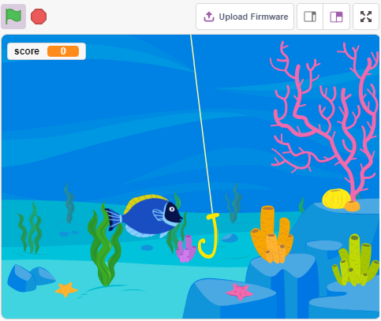

必要な部品
---------------------

このプロジェクトには以下のコンポーネントが必要です。

全キットを購入するのが確実に便利です。こちらがリンクです：

.. list-table::
    :widths: 20 20 20
    :header-rows: 1

    *   - 名前
        - このキットのアイテム
        - リンク
    *   - ESP32 Starter Kit
        - 320+
        - |link_esp32_starter_kit|

また、以下のリンクから個別に購入することもできます。

.. list-table::
    :widths: 30 20
    :header-rows: 1

    *   - コンポーネントの紹介
        - 購入リンク

    *   - :ref:`cpn_esp32_wroom_32e`
        - |link_esp32_wroom_32e_buy|
    *   - :ref:`cpn_esp32_camera_extension`
        - |link_esp32_extension_board|
    *   - :ref:`cpn_breadboard`
        - |link_breadboard_buy|
    *   - :ref:`cpn_wires`
        - |link_wires_buy|
    *   - :ref:`cpn_resistor`
        - |link_resistor_buy|
    *   - :ref:`cpn_button`
        - |link_button_buy|

回路の構築
-----------------------

ボタンは4ピンデバイスで、ピン1がピン2に、ピン3がピン4に接続されており、ボタンを押すと4つのピンが接続され、回路が閉じます。

.. image:: img/5_buttonc.png

以下の図に従って回路を構築してください。

* ボタンの左側のピンの一つをピン14に接続し、プルダウン抵抗と0.1uF（104）キャパシタ（ボタン作動時にジッタを消去し、安定したレベルを出力するため）に接続します。
* 抵抗とキャパシタのもう一方の端をGNDに、ボタンの右側のピンの一つを5Vに接続します。

.. image:: img/circuit/6_doorbel_bb.png

プログラミング
------------------

まず **Underwater** の背景を選択し、 **Fish** スプライトを追加してステージ上で行き来させます。次に **Fishhook** スプライトを描き、ボタンで制御して釣りを始めます。 **Fish** スプライトがフック状態（赤色に変わる）で **Fishhook** スプライトに触れると、フックされます。

**1. 背景の追加**

**Choose a Backdrop** ボタンを使って **Underwater** の背景を追加します。

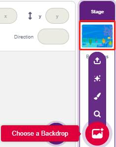

**2. フィッシュフックスプライト**

**Fishhook** スプライトは通常、黄色い状態で水中に留まります。ボタンが押されると、釣り状態（赤）になり、ステージ上に移動します。

Pictobloxには **Fishhook** スプライトがないため、 **Glow-J** スプライトを修正してフィッシュフックのように見せることができます。

* **Choose a Sprite** から **Glow-J** スプライトを追加します。

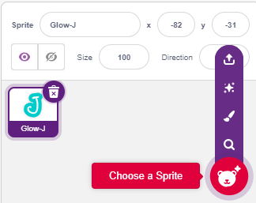

* 今、 **Glow-J** スプライトの **Costumes** ページに移動し、画面のシアンの塗りを選択して削除します。次に、Jの色を赤に変更し、幅を縮小します。最も重要な点は、その上部がちょうど中心点にあるようにする必要があります。

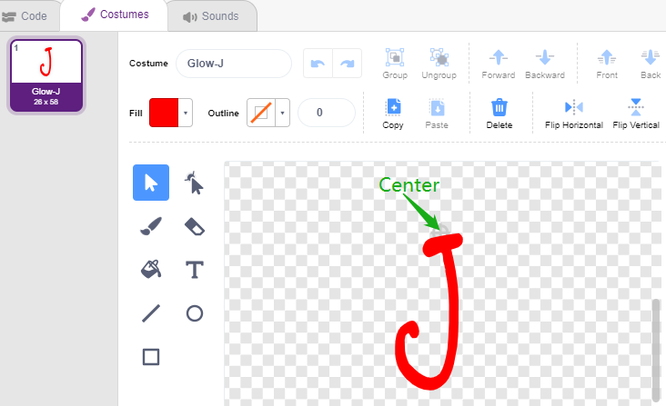

* **Line tool** を使用して、中心点から上にできるだけ長い線を引きます（ステージ外の線）。スプライトを描いたら、スプライト名を **Fishhook** に設定し、適切な位置に移動します。

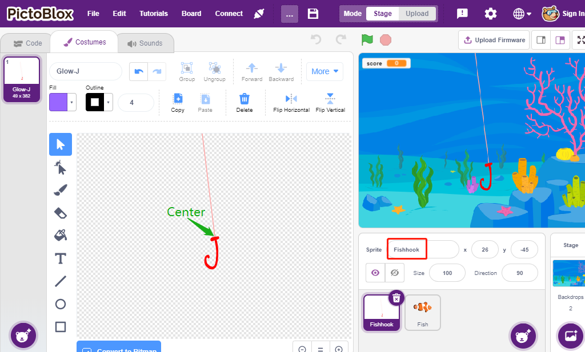

* 緑の旗がクリックされたら、スプライトの色効果を30（黄色）に設定し、初期位置を設定します。

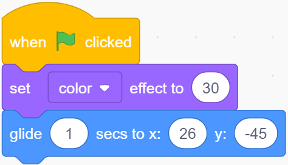

* ボタンが押されたら、色効果を0（赤、釣り状態を開始）に設定し、0.1秒待ってから **Fishhook** スプライトをステージの上部に移動します。ボタンを離して **Fishhook** を初期位置に戻します。

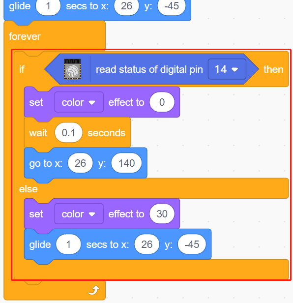

**3. 魚スプライト**

**Fish** スプライトが達成する効果は、ステージ上を左右に移動し、釣り状態の **Fishhook** スプライトに遭遇すると、縮小して特定の位置に移動してから消え、その後新しい **fish** スプライトをクローンします。

* 今、 **fish** スプライトを追加し、そのサイズと位置を調整します。

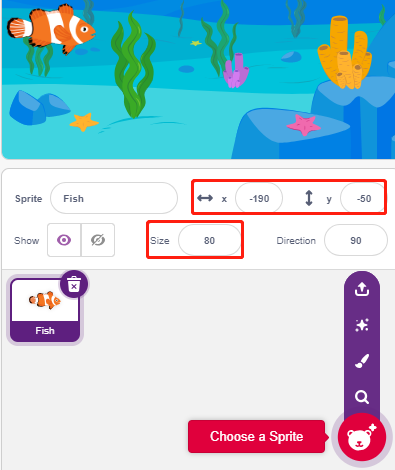

* **score** 変数を作成して捕まえた魚の数を格納し、このスプライトを隠してクローンします。

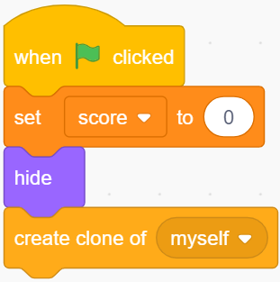

* **fish** スプライトのクローンを表示し、コスチュームを切り替えて最終的に初期位置を設定します。

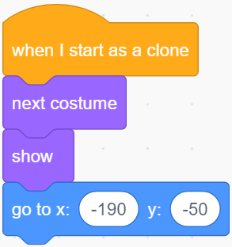

* **fish** スプライトのクローンが左右に動き、端に触れると跳ね返ります。

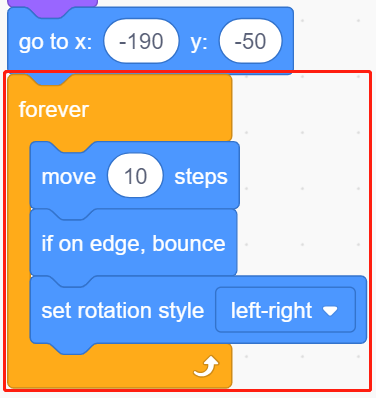

* **fish** スプライトのクローンは、 **Fishhook** スプライトを通過する際に反応しません。釣り状態（赤に変わる）の **Fishhook** スプライトに触れると、捕まえられ、その時点でスコア（変数score）+1となり、スコアアニメーションも表示されます（40%縮小し、速やかにスコアボードの位置に移動して消えます）。同時に新しい魚が作成され（新しい魚スプライトのクローン）、ゲームは続きます。

.. note::
    
    [Touch color]ブロック内の色領域をクリックし、ステージ上の **Fishhook** スプライトの赤色をピペットツールで選択する必要があります。任意の色を選んだ場合、この[Touch color]ブロックは機能しません。

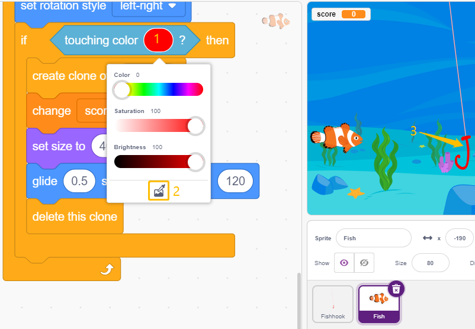
