    Bonjour, bienvenue dans la communauté des passionnés de SunFounder Raspberry Pi & Arduino & ESP32 sur Facebook ! Plongez plus profondément dans l'univers du Raspberry Pi, Arduino et ESP32 avec d'autres passionnés.

    **Pourquoi nous rejoindre ?**

    - **Support d'experts** : Résolvez les problèmes après-vente et les défis techniques avec l'aide de notre communauté et de notre équipe.
    - **Apprendre & Partager** : Échangez des astuces et des tutoriels pour améliorer vos compétences.
    - **Aperçus exclusifs** : Accédez en avant-première aux annonces de nouveaux produits.
    - **Réductions exclusives** : Profitez de réductions exclusives sur nos nouveaux produits.
    - **Promotions festives et cadeaux** : Participez à des cadeaux et à des promotions festives.

    👉 Prêt à explorer et créer avec nous ? Cliquez sur [|link_sf_facebook|] et rejoignez-nous dès aujourd'hui !

.. _sh_tap_tile:

2.18 JEU - Ne tapez pas sur la tuile blanche
==================================================

Je suis sûr que beaucoup d'entre vous ont joué à ce jeu sur vos téléphones portables. Ce jeu consiste à taper sur des tuiles noires apparaissant aléatoirement pour ajouter des points, la vitesse augmente progressivement, taper sur les tuiles blanches ou manquer les tuiles noires met fin au jeu.

Nous allons maintenant le reproduire avec PictoBlox.

Insérez deux modules d'évitement d'obstacles IR verticalement sur la planche à pain. Lorsque votre main est placée au-dessus de l'un des modules IR, un point clignotant apparaîtra sur la scène, représentant un tapotement effectué.

Si le tapotement est sur une tuile noire, le score augmente de 1, si c'est sur une tuile blanche, le score diminue de 1.

Vous devez décider de placer votre main au-dessus du module IR gauche ou au-dessus du module IR droit, en fonction de la position de la tuile noire sur la scène.

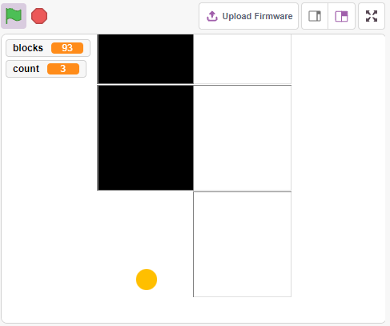

Composants nécessaires
--------------------------

Pour ce projet, nous avons besoin des composants suivants.

Il est certainement pratique d'acheter un kit complet, voici le lien :

.. list-table::
    :widths: 20 20 20
    :header-rows: 1

    *   - Nom	
        - ARTICLES DANS CE KIT
        - LIEN
    *   - Kit de démarrage ESP32
        - 320+
        - |link_esp32_starter_kit|

Vous pouvez également les acheter séparément via les liens ci-dessous.

.. list-table::
    :widths: 30 20
    :header-rows: 1

    *   - INTRODUCTION DES COMPOSANTS
        - LIEN D'ACHAT

    *   - :ref:`cpn_esp32_wroom_32e`
        - |link_esp32_wroom_32e_buy|
    *   - :ref:`cpn_esp32_camera_extension`
        - |link_esp32_extension_board|
    *   - :ref:`cpn_breadboard`
        - |link_breadboard_buy|
    *   - :ref:`cpn_wires`
        - |link_wires_buy|
    *   - :ref:`cpn_avoid`
        - |link_avoid_buy|

Construire le circuit
------------------------

Le module d'évitement d'obstacles est un capteur de proximité infrarouge réglable dont la sortie est normalement haute et basse lorsqu'un obstacle est détecté.

Construisez maintenant le circuit selon le schéma ci-dessous.

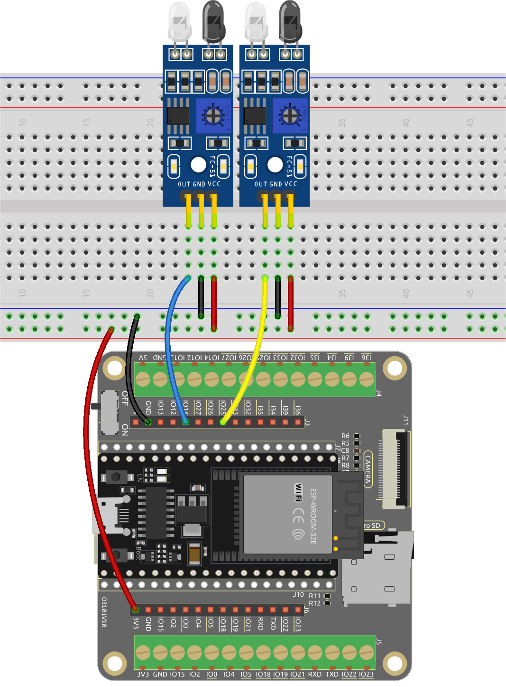

Programmation
-----------------

Ici, nous devons avoir 3 sprites, **Tile**, **Left IR** et **Right IR**.

* **Sprite Tile** : utilisé pour obtenir l'effet des tuiles noires et blanches alternant vers le bas, dans le jeu sur téléphone portable il y a généralement 4 colonnes, ici nous en faisons seulement deux.
* **Sprite Left IR** : utilisé pour obtenir l'effet de clic, lorsque le module IR gauche détecte votre main, il envoie un message - **left** au sprite **Left IR**, le laissant commencer à fonctionner. S'il touche la tuile noire sur la scène, le score augmente de 1, sinon le score diminue de 1.
* **Sprite Right IR** : la fonction est essentiellement la même que **Left IR**, sauf qu'il reçoit l'information **right**.

**1. Dessiner un sprite Tile**.

Supprimez le sprite par défaut, survolez l'icône **Ajouter un Sprite**, sélectionnez **Peindre** et un sprite vide apparaîtra nommé **Tile**.

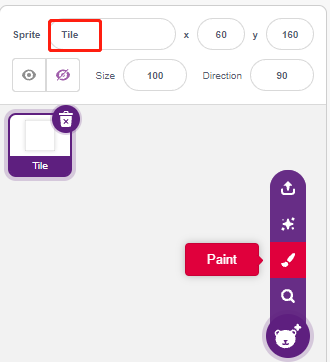

Allez à la page **Costumes** et utilisez l'outil **Rectangle** pour dessiner un rectangle.

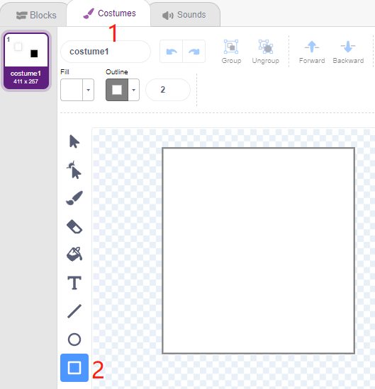

Sélectionnez le rectangle et cliquez sur **Copier** -> **Coller** pour faire un rectangle identique, puis déplacez les deux rectangles pour qu'ils soient alignés.

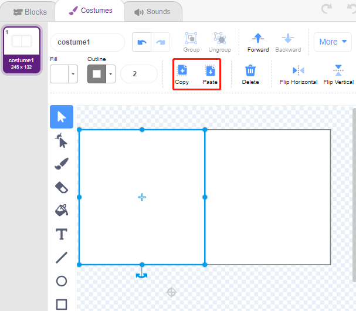

Sélectionnez l'un des rectangles et choisissez une couleur de remplissage noire.

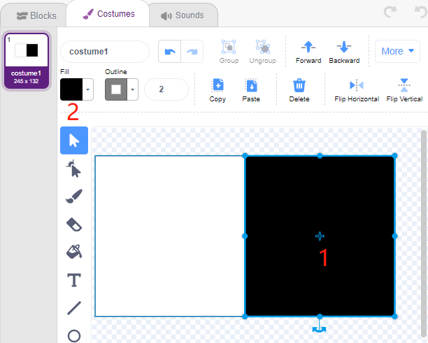

Sélectionnez maintenant les deux rectangles et déplacez-les pour que leurs points centraux correspondent au centre de la toile.

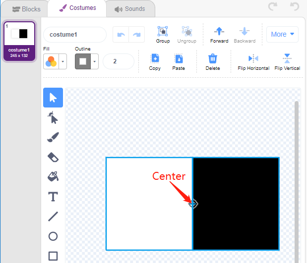

Dupliquez le costume1, en alternant les couleurs de remplissage des deux rectangles. Par exemple, la couleur de remplissage du costume1 est blanche à gauche et noire à droite, et la couleur de remplissage du costume2 est noire à gauche et blanche à droite.

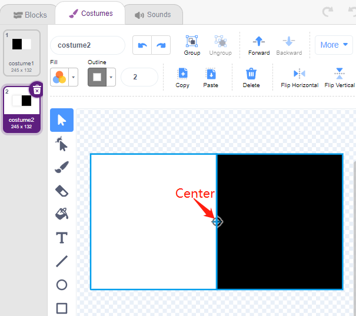

**2. Script du sprite Tile**

Revenez maintenant à la page **Blocs** et définissez la position initiale du sprite **Tile** de sorte qu'il soit en haut de la scène.

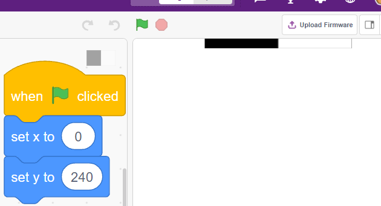

Créez une variable - **blocks** et donnez-lui une valeur initiale pour déterminer le nombre de fois que le sprite **Tile** apparaîtra. Utilisez le bloc [répéter jusqu'à] pour que la variable **blocks** diminue progressivement jusqu'à ce que **blocks** soit 0. Pendant ce temps, faites en sorte que le sprite **Tile** change de costume aléatoirement.

Après avoir cliqué sur le drapeau vert, vous verrez le sprite **Tile** sur la scène changer rapidement de costume.

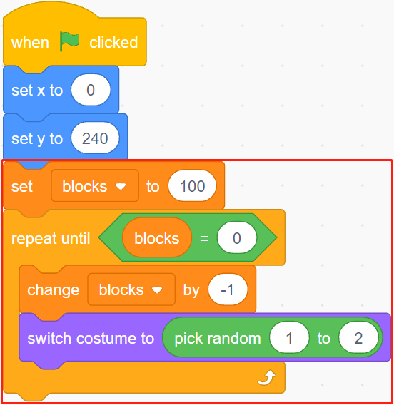

Créez des clones du sprite **Tile** pendant que la variable **blocks** diminue, et arrêtez l'exécution du script lorsque **blocks** est 0. Deux blocs [attendre () secondes] sont utilisés ici, le premier pour limiter l'intervalle entre les clones de **Tile** et le second pour permettre à la variable **blocks** de diminuer à 0 sans arrêter immédiatement le programme, donnant au dernier sprite de tuile suffisamment de temps pour se déplacer.

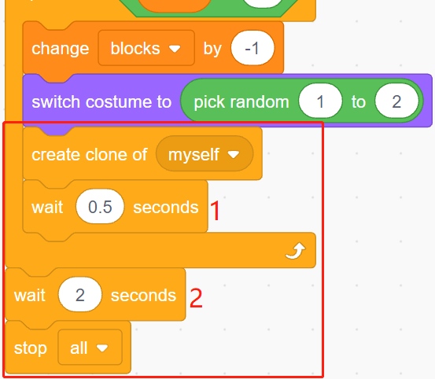

Maintenant, script le clone du sprite **Tile** pour qu'il se déplace lentement vers le bas et se supprime lorsqu'il atteint le bas de la scène. Le changement de la coordonnée y affecte la vitesse de chute, plus la valeur est grande, plus la vitesse de chute est rapide.

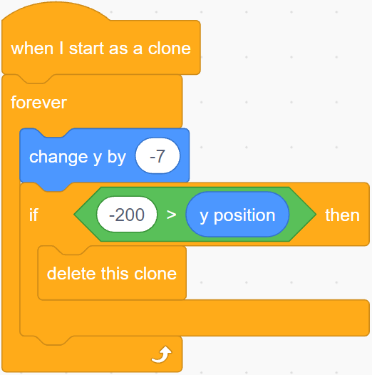

Masquez le corps et affichez le clone.

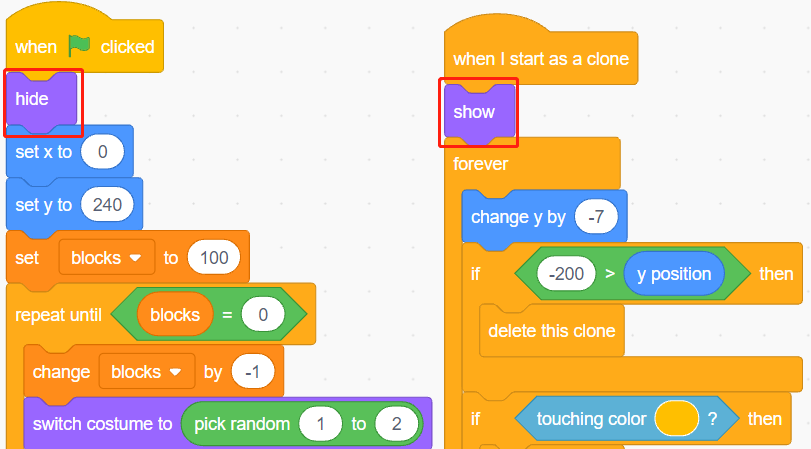

**3. Lire les valeurs des 2 modules IR**

Dans le décor, lisez les valeurs des 2 modules IR et effectuez les actions correspondantes.

* Si le module d'évitement d'obstacles IR gauche détecte votre main, diffusez un message - **left**.
* Si le module d'évitement d'obstacles IR droit détecte votre main, diffusez un message - **right**.

.. image:: img/21_tile9.png
    :width: 800

**4. Sprite Left IR**

Encore une fois, survolez l'icône **Ajouter un Sprite** et sélectionnez **Peindre** pour créer un nouveau sprite appelé **Left IR**.

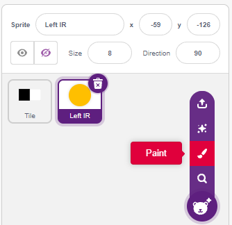

Allez à la page **Costumes** du sprite **Left IR**, sélectionnez la couleur de remplissage (n'importe quelle couleur sauf noir et blanc) et dessinez un cercle.

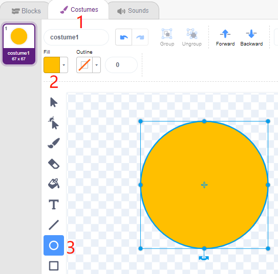

Commencez maintenant à script le sprite **Left IR**. Lorsque le message - **left** est reçu (le module IR gauche détecte un obstacle), alors déterminez si le bloc noir du sprite **Tile** est touché, et si c'est le cas, laissez la variable **count** augmenter de 1, sinon diminuez de 1.

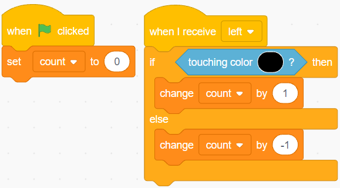

.. note::

    Vous devez faire apparaître le sprite **Tile** sur la scène, puis absorber la couleur du bloc noir dans le sprite **Tile**.

    .. image:: img/21_tile13.png

Faites maintenant l'effet de détection (agrandir et rétrécir) pour **Left IR**.

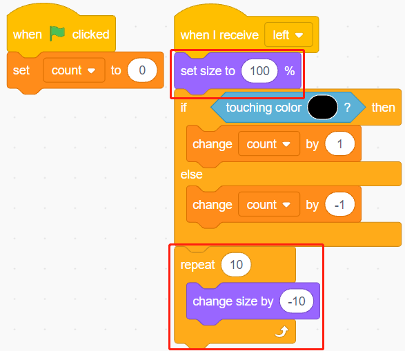

Faites en sorte que le sprite **Left IR** se cache lorsque le drapeau vert est cliqué, qu'il s'affiche lorsque le message - **left** est reçu, puis se cache à nouveau.

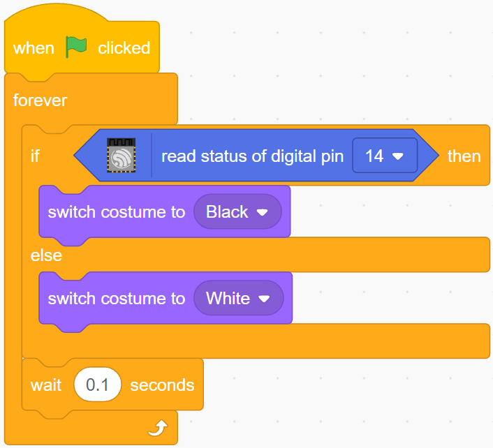

**5. Sprite Right IR**

Copiez le sprite **Left IR** et renommez-le en **Right IR**.

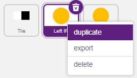

Puis changez le message reçu en - **right**.

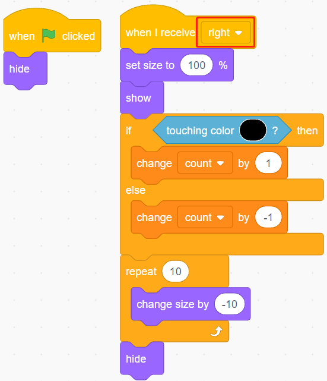

Maintenant tous les scripts sont terminés et vous pouvez cliquer sur le drapeau vert pour exécuter le script.
