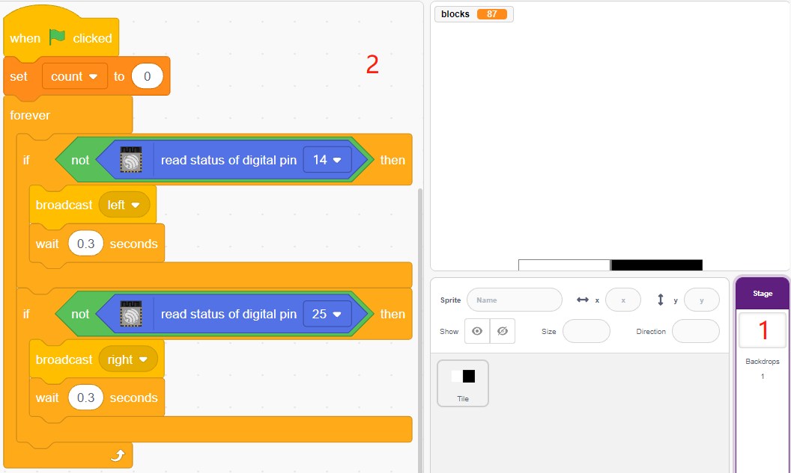

.. note::

    ¡Hola, bienvenido a la Comunidad de Aficionados a Raspberry Pi, Arduino y ESP32 de SunFounder en Facebook! Profundiza en Raspberry Pi, Arduino y ESP32 con otros entusiastas.

    **쯇or qué unirse?**

    - **Soporte de expertos**: Resuelve problemas posventa y desafíos técnicos con ayuda de nuestra comunidad y equipo.
    - **Aprender y compartir**: Intercambia consejos y tutoriales para mejorar tus habilidades.
    - **Vistas previas exclusivas**: Obtén acceso anticipado a anuncios de nuevos productos y avances.
    - **Descuentos especiales**: Disfruta de descuentos exclusivos en nuestros productos más nuevos.
    - **Promociones festivas y sorteos**: Participa en sorteos y promociones de fiestas.

    游녤 쯃isto para explorar y crear con nosotros? Haz clic en [|link_sf_facebook|] y únete hoy!

.. _sh_tap_tile:

2.18 JUEGO - No Toques la Baldosa Blanca
==========================================

Estoy seguro de que muchos de vosotros habéis jugado a este juego en vuestros teléfonos móviles. Este juego se juega tocando baldosas negras que aparecen al azar para sumar puntos, la velocidad se va incrementando, tocar una baldosa blanca o perder una negra significa el fin del juego.

Ahora utilizaremos PictoBlox para replicarlo.

Inserta dos módulos de evitación de obstáculos IR verticalmente en la placa de pruebas, cuando tu mano está colocada sobre uno de los módulos IR, aparecerá un punto parpadeante en el escenario, representando que se ha hecho un toque.

Si el toque es a la baldosa negra, la puntuación aumenta en 1, tocar la baldosa blanca, la puntuación disminuye en 1.

Necesitas decidir si colocar tu mano sobre el módulo IR de la izquierda o sobre el de la derecha, dependiendo de la posición de la baldosa negra en el escenario.

.. image:: img/21_tile.png

Componentes Necesarios
--------------------------

Para este proyecto, necesitaremos los siguientes componentes.

Es definitivamente conveniente comprar un kit completo, aquí está el enlace:

.. list-table::
    :widths: 20 20 20
    :header-rows: 1

    *   - Nombre	
        - ELEMENTOS EN ESTE KIT
        - ENLACE
    *   - Kit de Inicio ESP32
        - 320+
        - |link_esp32_starter_kit|

También puedes comprarlos por separado en los enlaces a continuación.

.. list-table::
    :widths: 30 20
    :header-rows: 1

    *   - INTRODUCCIÓN AL COMPONENTE
        - ENLACE DE COMPRA

    *   - :ref:`cpn_esp32_wroom_32e`
        - |link_esp32_wroom_32e_buy|
    *   - :ref:`cpn_esp32_camera_extension`
        - \-
    *   - :ref:`cpn_breadboard`
        - |link_breadboard_buy|
    *   - :ref:`cpn_wires`
        - |link_wires_buy|
    *   - :ref:`cpn_avoid`
        - |link_avoid_buy|

Construir el Circuito
-----------------------

El módulo de evitación de obstáculos es un sensor de proximidad infrarrojo ajustable en distancia cuya salida es normalmente alta y baja cuando se detecta un obstáculo.

Ahora construye el circuito según el diagrama a continuación.

.. image:: img/circuit/19_tap_tile_bb.png

Programación
------------------

Aquí necesitamos tener 3 sprites, **Baldosa**, **IR Izquierdo** y **IR Derecho**.

* **Sprite Baldosa**: utilizado para lograr el efecto de baldosas negras y blancas alternas descendiendo, en el teléfono móvil este juego generalmente tiene 4 columnas, aquí solo haremos dos columnas.
* **Sprite IR Izquierdo**: utilizado para lograr el efecto de clic, cuando el módulo IR izquierdo siente tu mano, enviará un mensaje - **izquierda** al sprite **IR Izquierdo**, permitiéndole empezar a funcionar. Si toca la baldosa negra en el escenario, la puntuación aumentará en 1, de lo contrario, disminuirá en 1.
* **Sprite IR Derecho**: La función es básicamente la misma que **IR Izquierdo**, excepto que recibe la información **derecha**.

**1. Pinta un sprite Baldosa**.

Elimina el sprite predeterminado, pasa el mouse sobre el icono de **Añadir Sprite**, selecciona **Pintar** y aparecerá un sprite en blanco y nómbralo **Baldosa**.

.. image:: img/21_tile1.png

Ve a la página de **Disfraces** y usa la herramienta **Rectángulo** para dibujar un rectángulo.

Selecciona el rectángulo y haz clic en **Copiar** -> **Pegar** para hacer un rectángulo idéntico, luego mueve los dos rectángulos a una posición alineada.

.. image:: img/21_tile01.png

Selecciona uno de los rectángulos y elige un color de relleno negro.

.. image:: img/21_tile02.png

Ahora selecciona ambos rectángulos y muévelos de modo que sus puntos centrales coincidan con el centro del lienzo.

.. image:: img/21_tile0.png

Duplica el disfraz1, alternando los colores de relleno de los dos rectángulos. Por ejemplo, el color de relleno del disfraz1 es blanco a la izquierda y negro a la derecha, y el color de relleno del disfraz2 es negro a la izquierda y blanco a la derecha.

.. image:: img/21_tile3.png

**2. Programando el sprite Baldosa**

Ahora vuelve a la página de **Bloques** y establece la posición inicial del sprite **Baldosa** para que esté en la parte superior del escenario.

.. image:: img/21_tile4.png

Crea una variable -**bloques** y dale un valor inicial para determinar la cantidad de veces que el sprite **Baldosa** aparecerá. Usa el bloque [repetir hasta] para hacer que la variable **bloques** disminuya gradualmente hasta que **bloques** sea 0. Durante este tiempo, haz que el sprite **Baldosa** cambie aleatoriamente de disfraz.

Después de hacer clic en la bandera verde, verás el sprite **Baldosa** en el escenario cambiar rápidamente de disfraces.

.. image:: img/21_tile5.png

Crea clones del sprite **Baldosa** mientras la variable **bloques** esté disminuyendo, y detén el script cuando bloques sea 0. Aquí se utilizan dos bloques [esperar () segundos], el primero para limitar el intervalo entre los clones de **Baldosa** y el segundo es para permitir que la variable bloques disminuya a 0 sin detener el programa inmediatamente, dando al último sprite baldosa suficiente tiempo para moverse.

.. image:: img/21_tile6.png

Ahora programa el clon del sprite **Baldosa** para que se mueva lentamente hacia abajo y lo elimine cuando llegue a la parte inferior del escenario. El cambio en la coordenada y afecta la velocidad de caída, cuanto mayor sea el valor, más rápida será la velocidad de caída.

.. image:: img/21_tile7.png

Oculta el cuerpo y muestra el clon.

.. image:: img/21_tile8.png

**3. Leer los valores de los 2 módulos IR**

En el fondo, lee los valores de los 2 módulos IR y realiza las acciones correspondientes.

* Si el módulo de evitación de obstáculos IR izquierdo siente tu mano, transmite un mensaje - **izquierda**.
* Si el módulo de evitación de obstáculos IR derecho siente tu mano, transmite un mensaje - **derecha**.

**4. Sprite IR Izquierdo**

Una vez más, pasa el mouse sobre el icono de **Añadir sprite** y selecciona **Pintar** para crear un nuevo sprite llamado **IR Izquierdo**.

.. image:: img/21_tile10.png

Ve a la página de **Disfraces** del sprite **IR Izquierdo**, selecciona el color de relleno (cualquier color fuera de negro y blanco) y dibuja un círculo.

Ahora comienza a programar el sprite **IR Izquierdo**. Cuando se reciba el mensaje - **izquierda** (el módulo receptor IR de la izquierda detecta un obstáculo), entonces determina si se ha tocado el bloque negro del sprite **Baldosa**, y si es así, deja que la variable **cuenta** sume 1, de lo contrario, resta 1.

.. image:: img/21_tile12.png

.. note::

    Necesitas hacer que el sprite **Baldosa** aparezca en el escenario, y luego absorber el color del bloque negro en el sprite **Baldosa**.

    .. image:: img/21_tile13.png

Ahora hagamos el efecto de detección (aumentar y disminuir) para **IR Izquierdo**.

.. image:: img/21_tile14.png

Haz que el sprite **IR Izquierdo** se oculte cuando se haga clic en la bandera verde, se muestre cuando se reciba el mensaje - **izquierda**, y finalmente se oculte de nuevo.

.. image:: img/21_tile15.png

**5. Sprite IR Derecho**

Copia el sprite **IR Izquierdo** y renómbralo a **IR Derecho**.

.. image:: img/21_tile16.png

Luego cambia el mensaje recibido a - **derecha**.

.. image:: img/21_tile17.png

Ahora toda la programación está completa y puedes hacer clic en la bandera verde para ejecutar el script.
