.. note::

    こんにちは、SunFounderのRaspberry Pi & Arduino & ESP32愛好家コミュニティへようこそ！Facebook上でRaspberry Pi、Arduino、ESP32についてもっと深く掘り下げ、他の愛好家と交流しましょう。

    **参加する理由は？**

    - **エキスパートサポート**：コミュニティやチームの助けを借りて、販売後の問題や技術的な課題を解決します。
    - **学び＆共有**：ヒントやチュートリアルを交換してスキルを向上させましょう。
    - **独占的なプレビュー**：新製品の発表や先行プレビューに早期アクセスしましょう。
    - **特別割引**：最新製品の独占割引をお楽しみください。
    - **祭りのプロモーションとギフト**：ギフトや祝日のプロモーションに参加しましょう。

    👉 私たちと一緒に探索し、創造する準備はできていますか？[|link_sf_facebook|]をクリックして今すぐ参加しましょう！

.. _sh_protect_heart:

2.19 GAME - 心臓を守れ
=====================================

このプロジェクトでは、反応速度をテストするゲームを作りましょう。

ステージには、矩形のボックスで守られた心臓があり、ステージの任意の位置からこの心臓に向かって矢が飛んできます。矢の色はランダムに黒と白が交互に変わり、矢はどんどん速くなります。

矩形ボックスの色と矢の色が同じ場合は、矢は外側でブロックされ、レベルが1加算されます。色が同じでない場合は、矢が心臓を射抜き、ゲームオーバーになります。

ここで矩形ボックスの色は、ライン追跡モジュールによって制御されます。モジュールが黒い面（反射する面）に置かれている場合、矩形ボックスの色は黒になり、それ以外の場合は白になります。

ですので、矢の色に応じてライン追跡モジュールを白い面に置くか黒い面に置くかを決める必要があります。

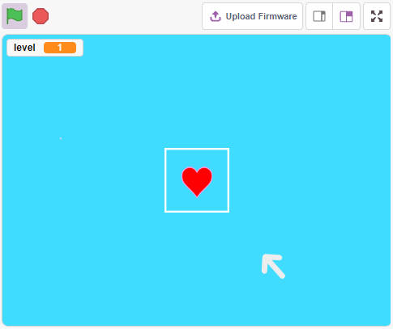

必要な部品
---------------------

このプロジェクトには以下のコンポーネントが必要です。

全キットを購入するのが間違いなく便利です。こちらがリンクです：

.. list-table::
    :widths: 20 20 20
    :header-rows: 1

    *   - 名前
        - このキットのアイテム
        - リンク
    *   - ESP32 Starter Kit
        - 320+
        - |link_esp32_starter_kit|

また、以下のリンクから個別に購入することもできます。

.. list-table::
    :widths: 30 20
    :header-rows: 1

    *   - コンポーネントの紹介
        - 購入リンク

    *   - :ref:`cpn_esp32_wroom_32e`
        - |link_esp32_wroom_32e_buy|
    *   - :ref:`cpn_esp32_camera_extension`
        - \-
    *   - :ref:`cpn_wires`
        - |link_wires_buy|
    *   - :ref:`cpn_line_track`
        - |link_line_track_buy|

回路の構築
-----------------------

これはデジタルライン追跡モジュールで、黒い線を検出すると1を出力し、白い線を検出すると0の値を出力します。さらに、モジュール上のポテンショメータを調整して、その感知距離を調整できます。

以下の図に従って回路を構築してください。

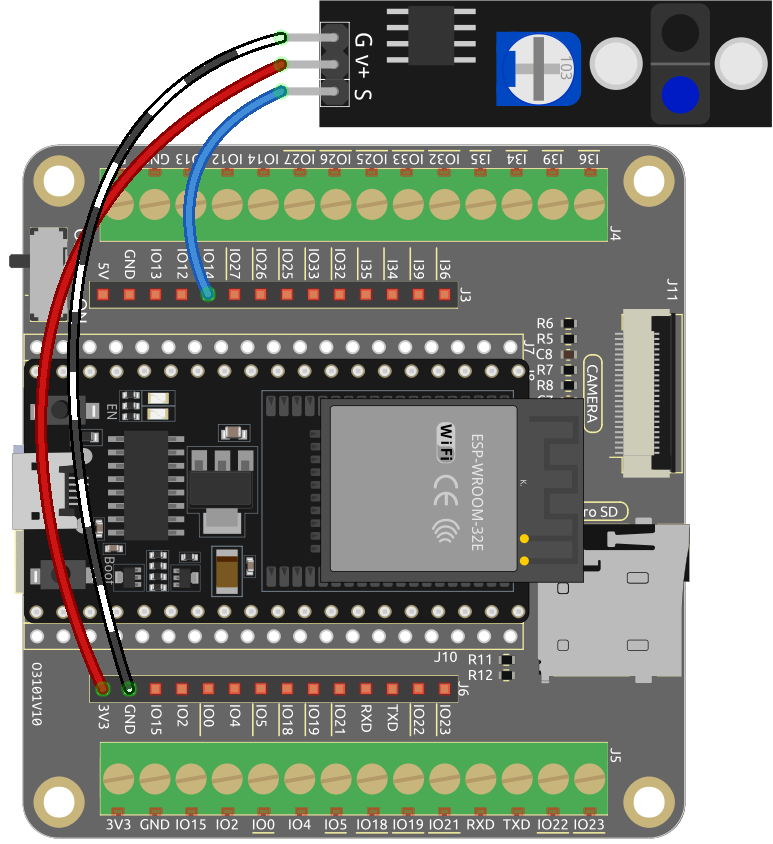

.. note::

    プロジェクトを始める前に、モジュールの感度を調整する必要があります。

    上記の図に従って配線をし、R3ボードに電源を入れます（USBケーブルを直接差し込むか、9Vバッテリーボタンケーブルを使用）。コードをアップロードすることなく。

    今、デスクトップに黒い電気テープを貼り、ライントラックモジュールをデスクトップから2cmの高さに置きます。

    センサーを下向きにして、モジュールの信号LEDが白いテーブル上で点灯し、黒いテープ上で消灯することを確認します。

    もしそうでない場合は、モジュール上のポテンショメータを調整して、上記の効果が得られるようにする必要があります。

プログラミング
------------------

ここでは3つのスプライト、 **Heart**、 **Square Box**、 **Arrow1** を作成する必要があります。

* **Heart**：ステージの中央に停止しており、 **Arrow1** スプライトに触れられたらゲームオーバーです。
* **Square Box**：黒と白の2種類のコスチュームがあり、ライントラッキングモジュールの値に応じてコスチュームを切り替えます。
* **Arrow**：黒/白の任意の位置からステージの中央に向かって飛行します。 その色が **Square Box** スプライトの色と一致する場合、ブロックされ、ランダムな位置からステージの中央に向かって再飛行します。 その色が **Square Box** スプライトの色と一致しない場合、 **Heart** スプライトを通過し、ゲームが終了します。

**1. スクエアボックススプライトを追加**

アロー1とスクエアボックススプライトはどちらも白いコスチュームを持っているため、ステージ上に表示されるようにするには、黒、白、赤以外の任意の色で背景を塗ります。

* **Backdrop1** をクリックして **Backdrops** ページに移動します。
* 塗りつぶしたい色を選択します。
* **Rectangle** を使って描画ボードと同じサイズの長方形を描きます。

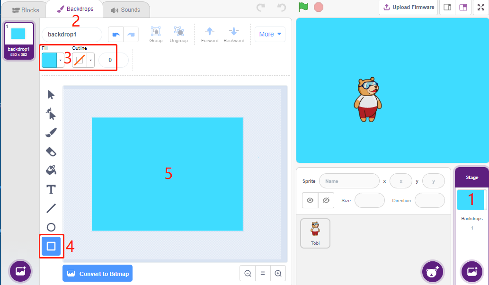

デフォルトのスプライトを削除し、 **Choose a Sprite** ボタンを使用して **Square Box** スプライトを追加し、そのxとyを(0, 0)に設定します。

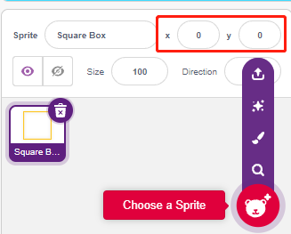

**Square Box** スプライトの **Costumes** ページに移動し、黒と白のコスチュームを設定します。

* 選択ツールをクリックします
* キャンバス上の長方形を選択します
* 塗りつぶしの色を黒に設定します
* そしてコスチュームの名前を **Black** にします

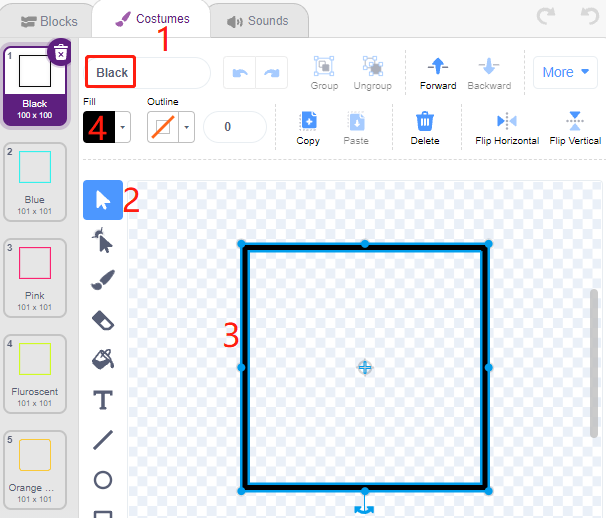

2番目のコスチュームを選択し、塗りつぶしの色を白に設定し、名前をホワイトにして、残りのコスチュームを削除します。

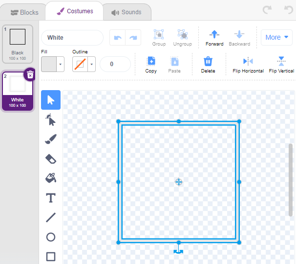

**2. ハートスプライトを追加**

**Heart** スプライトも追加し、その位置を(0, 0)に設定し、サイズを縮小してスクエアボックスの中に位置するように見えるようにします。

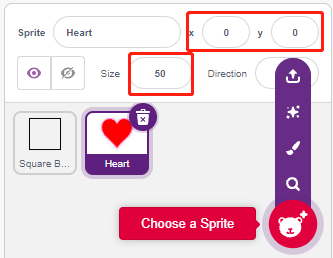

**Costumes** ページで、ハートの紫色のコスチュームを調整して、壊れたように見えるようにします。

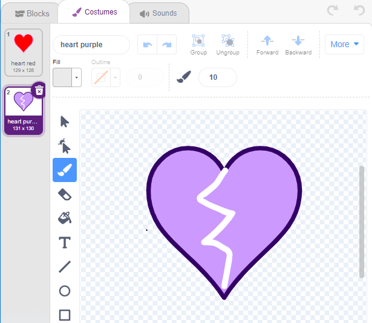

**3. アロー1スプライトを追加**

**Arrow1** スプライトを追加します。

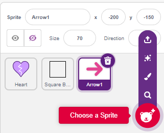

**Costumes** ページで、右向きのコスチュームを保持してコピーし、その色を黒と白に設定します。

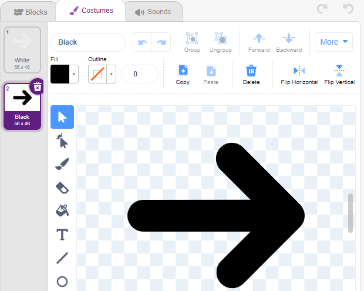

**4. スクエアボックススプライトのスクリプト**

**Blocks** ページに戻り、 **Square Box** スプライトのスクリプトを作成します。

* デジタルピン2（ラインフォローイングモジュール）の値が1（黒い線が検出された）の場合、コスチュームを **Black** に切り替えます。
* そうでなければ、コスチュームを **White** に切り替えます。

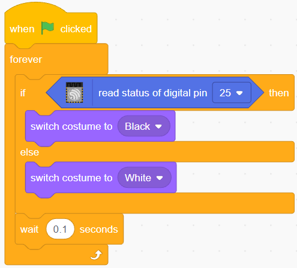

**5. ハートスプライトのスクリプト**

**Heart** スプライトは **Square Box** の内側に保護されており、デフォルトは赤いコスチュームです。アロー1スプライトに触れると、ゲームが終了します。

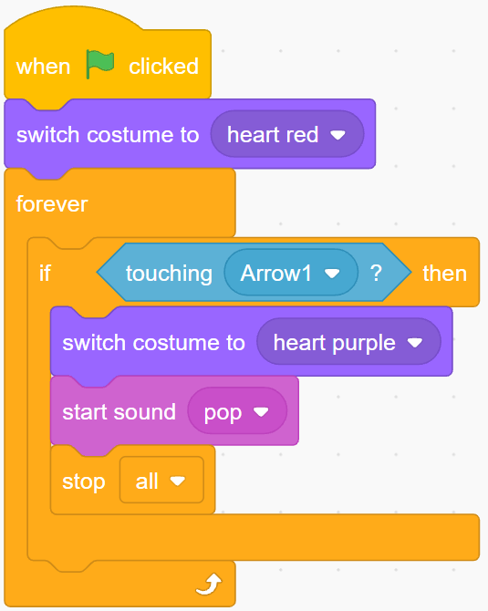

**6. アロー1スプライトのスクリプト**

緑の旗がクリックされたときに **Arrow1** スプライトを隠し、クローンを作成します。

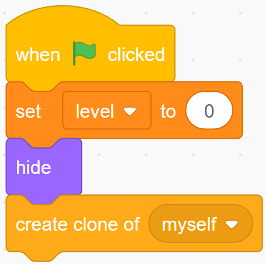

[init] ブロックを作成して、 **Arrow1** スプライトの位置、方向、色を初期化します。

ランダムな位置に現れ、それと **Heart** スプライトとの距離が200未満の場合は外側に移動し、距離が200以上になるまで続けます。

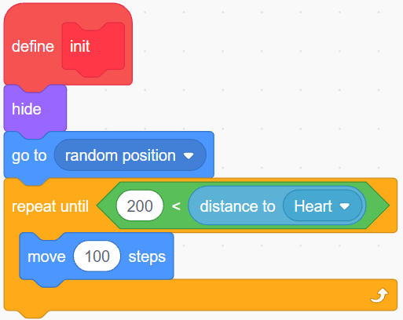

その方向を **Heart** スプライトに向けます。

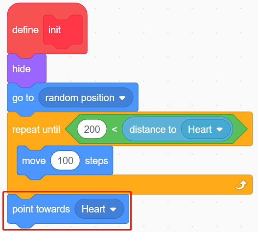

その色を黒/白の間でランダムに交互に変えます。

* 変数colorが0の場合、コスチュームを **White** に切り替えます。
* 変数colorが1の場合、コスチュームを **Black** に切り替えます。

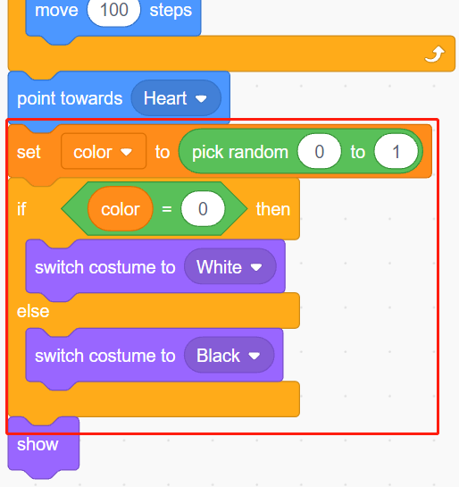

今、動き始めさせます。変数 **level** の値が増えるにつれて、速く移動します。

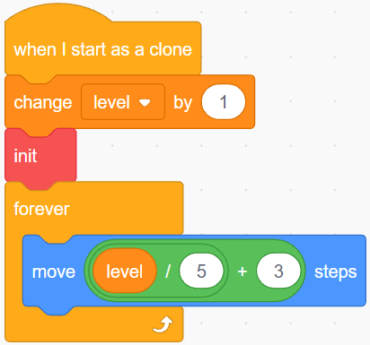

今、 **Square Box** スプライトとの衝突効果を設定します。

* **Arrow1** スプライトと **Square Box** スプライトの色が同じ場合（ライントラックモジュールの値によって変更されます）、黒または白であれば、新しいクローンが作成され、ゲームが続きます。
* 色が一致しない場合、 **Arrow1** スプライトは移動を続け、 **Heart** スプライトに当たるとゲームが終了します。

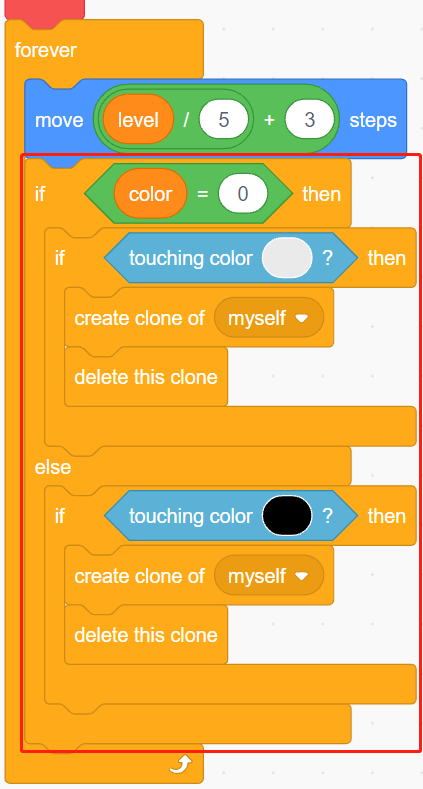

.. note::
    二つの[touch color()]ブロックは、それぞれスクエアボックスの黒/白のコスチュームを選択する必要があります。

    .. image:: img/22_heart16.png

