    Bonjour, bienvenue dans la communauté des passionnés de SunFounder Raspberry Pi & Arduino & ESP32 sur Facebook ! Plongez plus profondément dans l'univers du Raspberry Pi, Arduino et ESP32 avec d'autres passionnés.

    **Pourquoi nous rejoindre ?**

    - **Support d'experts** : Résolvez les problèmes après-vente et les défis techniques avec l'aide de notre communauté et de notre équipe.
    - **Apprendre & Partager** : Échangez des astuces et des tutoriels pour améliorer vos compétences.
    - **Aperçus exclusifs** : Accédez en avant-première aux annonces de nouveaux produits.
    - **Réductions exclusives** : Profitez de réductions exclusives sur nos nouveaux produits.
    - **Promotions festives et cadeaux** : Participez à des cadeaux et à des promotions festives.

    👉 Prêt à explorer et créer avec nous ? Cliquez sur [|link_sf_facebook|] et rejoignez-nous dès aujourd'hui !

.. _sh_protect_heart:

2.19 JEU - Protégez Votre Cœur
=====================================

Dans ce projet, nous allons créer un jeu qui teste la vitesse de réaction.

Sur la scène, il y a un cœur protégé dans une boîte rectangulaire, et des flèches volent vers ce cœur depuis n'importe quelle position sur la scène. La couleur de la flèche alterne entre le noir et le blanc de manière aléatoire et la flèche vole de plus en plus vite.

Si la couleur de la boîte rectangulaire et celle de la flèche sont identiques, la flèche est bloquée à l'extérieur et le niveau augmente de 1 ; si les couleurs sont différentes, la flèche traverse le cœur et le jeu est terminé.

Ici, la couleur de la boîte rectangulaire est contrôlée par le module de suivi de ligne. Lorsque le module est placé sur une surface noire (une surface réfléchissante), la couleur de la boîte rectangulaire est noire, sinon elle est blanche.

Vous devez donc décider de placer le module de suivi de ligne sur une surface blanche ou une surface noire en fonction de la couleur de la flèche.

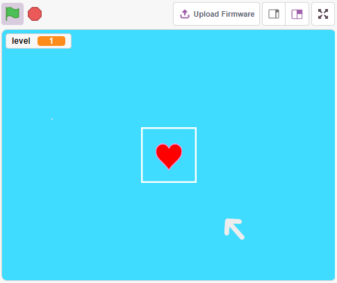

Composants nécessaires
---------------------------

Pour ce projet, nous avons besoin des composants suivants.

Il est certainement pratique d'acheter un kit complet, voici le lien :

.. list-table::
    :widths: 20 20 20
    :header-rows: 1

    *   - Nom	
        - ARTICLES DANS CE KIT
        - LIEN
    *   - Kit de démarrage ESP32
        - 320+
        - |link_esp32_starter_kit|

Vous pouvez également les acheter séparément via les liens ci-dessous.

.. list-table::
    :widths: 30 20
    :header-rows: 1

    *   - INTRODUCTION DES COMPOSANTS
        - LIEN D'ACHAT

    *   - :ref:`cpn_esp32_wroom_32e`
        - |link_esp32_wroom_32e_buy|
    *   - :ref:`cpn_esp32_camera_extension`
        - |link_esp32_extension_board|
    *   - :ref:`cpn_wires`
        - |link_wires_buy|
    *   - :ref:`cpn_line_track`
        - |link_line_track_buy|

Construire le circuit
------------------------

Il s'agit d'un module de suivi de ligne numérique. Lorsqu'une ligne noire est détectée, il émet une valeur de 1 ; lorsqu'une ligne blanche est détectée, il émet une valeur de 0. De plus, vous pouvez ajuster sa distance de détection à l'aide du potentiomètre sur le module.

Construisez maintenant le circuit selon le schéma ci-dessous.

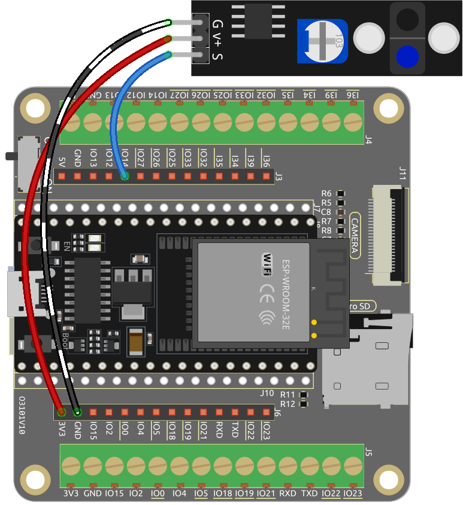

.. note::

    Avant de commencer le projet, vous devez ajuster la sensibilité du module.

    Branchez le câblage selon le schéma ci-dessus, puis alimentez la carte R3, sans télécharger le code.

    Collez maintenant un ruban adhésif noir sur le bureau, placez le module de suivi de ligne à une hauteur de 2 cm du bureau.

    Avec le capteur orienté vers le bas, observez la LED de signal sur le module pour vous assurer qu'elle s'allume sur la table blanche et s'éteint sur le ruban adhésif noir.

    Si ce n'est pas le cas, vous devez ajuster le potentiomètre sur le module pour obtenir l'effet décrit ci-dessus.

Programmation
------------------

Nous devons créer 3 sprites : **Heart**, **Square Box** et **Arrow1**.

* **Heart** : reste au centre de la scène, si touché par le sprite **Arrow1**, le jeu est terminé.
* **Square Box** : a deux types de costumes, noir et blanc, et changera de costume selon la valeur du module de suivi de ligne.
* **Arrow** : vole vers le centre de la scène depuis n'importe quelle position en noir/blanc ; si sa couleur correspond à celle du sprite **Square Box**, il est bloqué et retourne vers le centre de la scène depuis une position aléatoire ; si sa couleur ne correspond pas, il traverse le sprite **Heart** et le jeu est terminé.

**1. Ajouter le sprite Square Box**

Puisque les sprites Arrow1 et Square Box ont tous deux des costumes blancs, afin qu'ils soient affichés sur la scène, remplissez maintenant l'arrière-plan avec une couleur qui peut être n'importe quelle couleur sauf noir, blanc et rouge.

* Cliquez sur **Backdrop1** pour aller à sa page **Backdrops**.
* Sélectionnez la couleur que vous souhaitez remplir.
* Utilisez l'outil **Rectangle** pour dessiner un rectangle de la même taille que la planche à dessin.

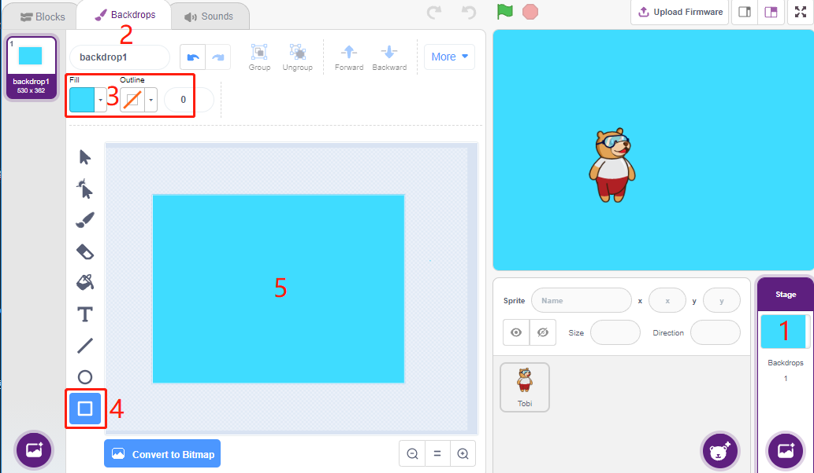

Supprimez le sprite par défaut, utilisez le bouton **Choisir un Sprite** pour ajouter le sprite **Square Box**, et définissez ses coordonnées x et y à (0, 0).

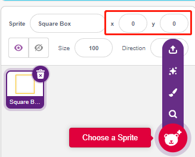

Allez à la page **Costumes** du sprite **Square Box** et définissez les costumes noir et blanc.

* Cliquez sur l'outil de sélection
* Sélectionnez le rectangle sur la toile
* Sélectionnez la couleur de remplissage en noir
* et nommez le costume **Black**

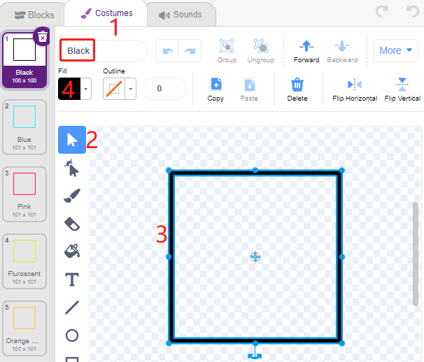

Sélectionnez le deuxième costume, définissez la couleur de remplissage en blanc, nommez-le White et supprimez le reste des costumes.

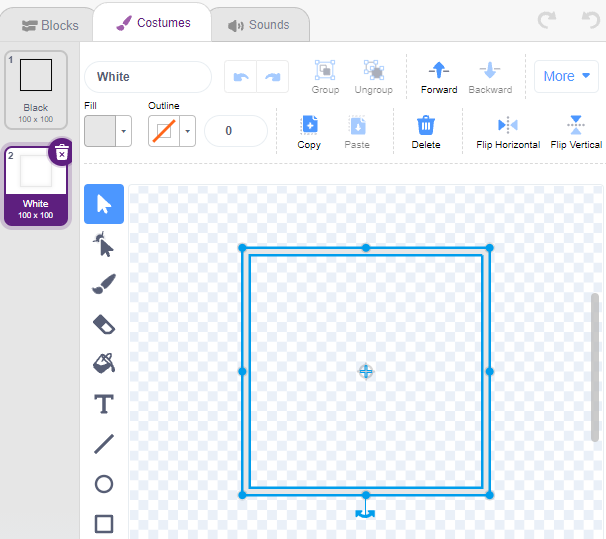

**2. Ajouter le sprite Heart**

Ajoutez également un sprite **Heart**, définissez sa position à (0, 0) et réduisez sa taille pour qu'il apparaisse situé à l'intérieur de la Square Box.

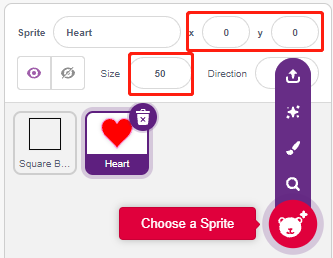

Sur la page **Costumes**, ajustez le costume violet du cœur pour qu'il semble être cassé.

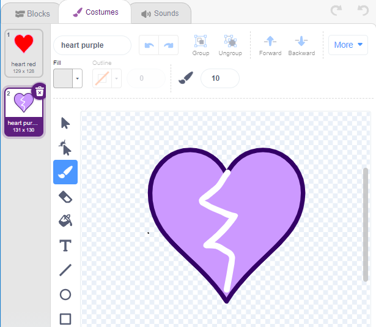

**3. Ajouter le sprite Arrow1**

Ajoutez un sprite **Arrow1**.

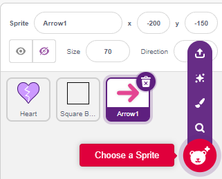

Sur la page **Costumes**, gardez et copiez le costume tourné vers la droite et définissez sa couleur en noir et blanc.

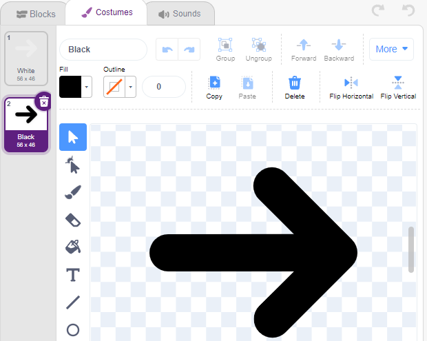

**4. Script pour le sprite Square Box**

Retournez à la page **Blocs** et script le sprite **Square Box**.

* Ainsi, lorsque la valeur de la broche numérique 2 (module de suivi de ligne) est 1 (ligne noire détectée), changez le costume en **Black**.
* Sinon, changez le costume en **White**.

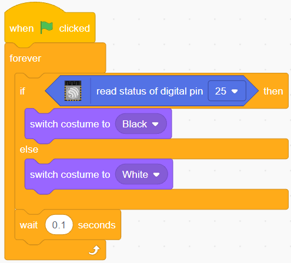

**5. Script pour le sprite Heart**

Le sprite **Heart** est protégé à l'intérieur du **Square Box**, et par défaut a un costume rouge. Lorsque le sprite Arrow1 est touché, le jeu se termine.

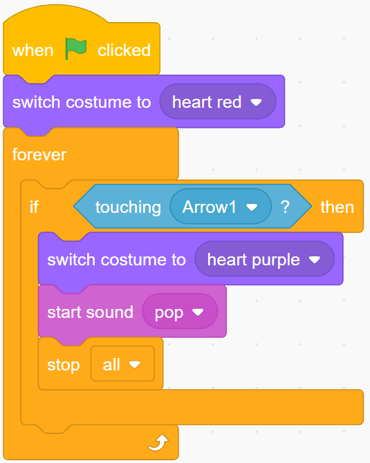

**6. Script pour le sprite Arrow1**

Faites en sorte que le sprite **Arrow1** se cache et crée un clone lorsque le drapeau vert est cliqué.

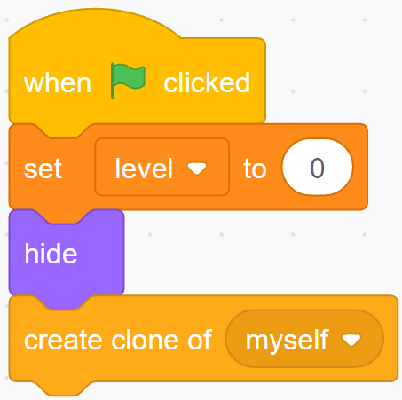

Créez un bloc [init] pour initialiser la position, l'orientation et la couleur du sprite **Arrow1**.

Il apparaît à un endroit aléatoire, et si la distance entre lui et le sprite **Heart** est inférieure à 200, il se déplace vers l'extérieur jusqu'à ce que la distance soit supérieure à 200.

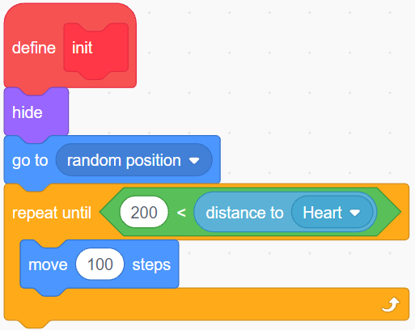

Définissez sa direction pour faire face au sprite **Heart**.

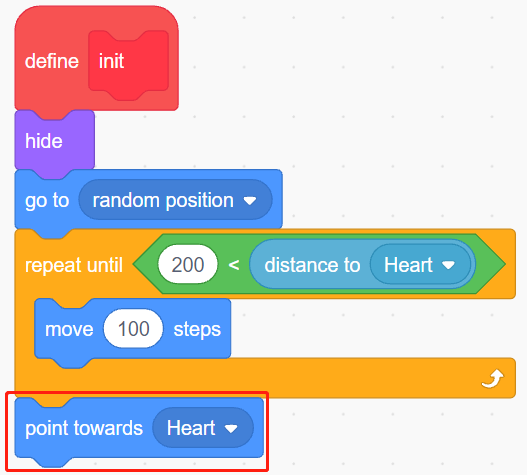

Faites en sorte que sa couleur alterne de manière aléatoire entre le noir et le blanc.

* La variable color est 0, le costume devient **White**.
* La variable color est 1, le costume devient **Black**.

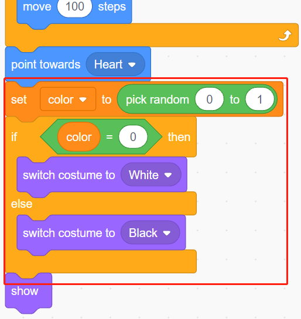

Maintenant, laissez-le commencer à bouger, il ira de plus en plus vite au fur et à mesure que la valeur de la variable **level** augmente.

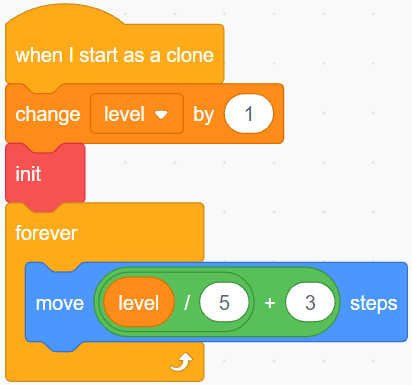

Définissez maintenant son effet de collision avec le sprite **Square Box**.

* Si le sprite **Arrow1** et le sprite **Square Box** ont la même couleur (qui sera modifiée en fonction de la valeur du module de suivi de ligne), soit noir soit blanc, un nouveau clone est créé et le jeu continue.
* Si leurs couleurs ne correspondent pas, le sprite **Arrow1** continue de bouger et le jeu se termine lorsqu'il touche le sprite **Heart**.

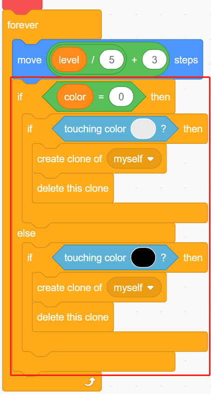

.. note::
    Les deux blocs [touch color()] doivent absorber séparément les costumes noirs/blancs de Square Box.

    .. image:: img/22_heart16.png
