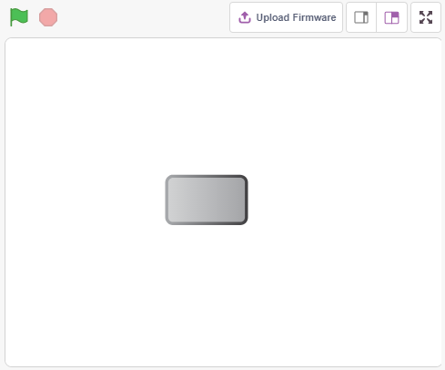
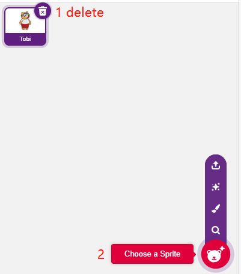
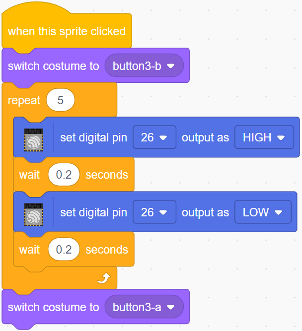

.. note::

    Bonjour, bienvenue dans la communauté SunFounder Raspberry Pi & Arduino & ESP32 Enthusiasts sur Facebook ! Plongez dans l'univers de Raspberry Pi, Arduino et ESP32 avec d'autres passionnés.

    **Pourquoi nous rejoindre ?**

    - **Support d'experts** : Résolvez les problèmes après-vente et les défis techniques avec l'aide de notre communauté et de notre équipe.
    - **Apprendre et partager** : Échangez des astuces et des tutoriels pour améliorer vos compétences.
    - **Aperçus exclusifs** : Accédez en avant-première aux annonces de nouveaux produits et aux avant-premières.
    - **Réductions spéciales** : Profitez de réductions exclusives sur nos derniers produits.
    - **Promotions festives et cadeaux** : Participez à des tirages au sort et à des promotions festives.

    👉 Prêt à explorer et créer avec nous ? Cliquez sur [|link_sf_facebook|] et rejoignez-nous dès aujourd'hui !

.. _sh_table_lamp:

2.1 Lampe de Table
=======================

Ici, nous connectons une LED sur la breadboard et faisons en sorte que le sprite contrôle le clignotement de cette LED.

Lorsque le sprite Bouton sur la scène est cliqué, la LED clignote 5 fois puis s'arrête.

Composants nécessaires
---------------------------

Pour ce projet, nous avons besoin des composants suivants. 

Il est certainement pratique d'acheter un kit complet, voici le lien : 

.. list-table::
    :widths: 20 20 20
    :header-rows: 1

    *   - Nom	
        - ARTICLES DANS CE KIT
        - LIEN
    *   - Kit de démarrage ESP32
        - 320+
        - |link_esp32_starter_kit|

Vous pouvez également les acheter séparément à partir des liens ci-dessous.

.. list-table::
    :widths: 30 20
    :header-rows: 1

    *   - INTRODUCTION AUX COMPOSANTS
        - LIEN D'ACHAT

    *   - :ref:`cpn_esp32_wroom_32e`
        - |link_esp32_wroom_32e_buy|
    *   - :ref:`cpn_esp32_camera_extension`
        - |link_esp32_extension_board|
    *   - :ref:`cpn_breadboard`
        - |link_breadboard_buy|
    *   - :ref:`cpn_wires`
        - |link_wires_buy|
    *   - :ref:`cpn_resistor`
        - |link_resistor_buy|
    *   - :ref:`cpn_led`
        - |link_led_buy|

Ce que vous apprendrez
--------------------------

- Breadboard, LEDs et résistances
- Construction d'un circuit sur une breadboard
- Supprimer et sélectionner des sprites
- Changer les costumes

- Définir un nombre limité de boucles de répétition

Construisez le circuit
--------------------------

Suivez le schéma ci-dessous pour construire le circuit sur la breadboard.

Comme l'anode de la LED (la broche la plus longue) est connectée à la broche 26 via une résistance de 220Ω, et la cathode de la LED est connectée à GND, vous pouvez allumer la LED en donnant un niveau haut à la broche 26.

.. image:: img/circuit/1_hello_led_bb.png

Programmation
-----------------

La programmation entière est divisée en 3 parties : la première partie consiste à sélectionner le sprite souhaité, la deuxième partie à changer le costume du sprite pour le rendre cliquable, et la troisième partie à faire clignoter la LED.

**1. Sélectionnez le sprite Button3**

Supprimez le sprite Tobi existant en utilisant le bouton Supprimer dans le coin supérieur droit, et sélectionnez à nouveau un sprite.

Ici, nous sélectionnons le sprite **Button3**.

.. image:: img/2_button3.png

Cliquez sur Costumes dans le coin supérieur droit et vous verrez que le sprite Button3 a 2 costumes, nous définissons **button3-a** pour être relâché et **button3-b** pour être pressé.

.. image:: img/2_button3_2.png

**2. Changement de costumes**.

Lorsque le sprite est cliqué (palette **Événements**), il change de costume pour **button3-b** (palette **Apparence**).

.. image:: img/2_switch.png

**3. Faites clignoter la LED 5 fois**

Utilisez le bloc [Répéter] pour faire clignoter la LED 5 fois (cycle High -> Low) et enfin, revenez au costume **button3-a**.

* [Répéter 10] : nombre limité de boucles de répétition, vous pouvez définir le nombre de répétitions vous-même, de la palette **Contrôle**.

