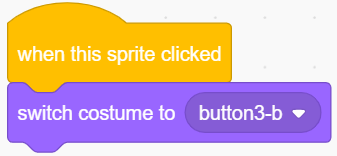

.. note::

    こんにちは、SunFounderのRaspberry Pi & Arduino & ESP32愛好家コミュニティへようこそ！Facebook上でRaspberry Pi、Arduino、ESP32についてもっと深く掘り下げ、他の愛好家と交流しましょう。

    **参加する理由は？**

    - **エキスパートサポート**：コミュニティやチームの助けを借りて、販売後の問題や技術的な課題を解決します。
    - **学び＆共有**：ヒントやチュートリアルを交換してスキルを向上させましょう。
    - **独占的なプレビュー**：新製品の発表や先行プレビューに早期アクセスしましょう。
    - **特別割引**：最新製品の独占割引をお楽しみください。
    - **祭りのプロモーションとギフト**：ギフトや祝日のプロモーションに参加しましょう。

    👉 私たちと一緒に探索し、創造する準備はできていますか？[|link_sf_facebook|]をクリックして今すぐ参加しましょう！

.. _sh_table_lamp:

2.1 テーブルランプ
====================

ここでは、ブレッドボード上のLEDを接続し、スプライトがこのLEDの点滅を制御するようにします。

ステージ上のButtonスプライトをクリックすると、LEDが5回点滅した後、停止します。

.. image:: img/2_button.png

必要な部品
---------------------

このプロジェクトには、以下のコンポーネントが必要です。

全キットを購入すると便利です。こちらがリンクです:

.. list-table::
    :widths: 20 20 20
    :header-rows: 1

    *   - 名前
        - このキットのアイテム
        - リンク
    *   - ESP32 Starter Kit
        - 320+
        - |link_esp32_starter_kit|

下記のリンクから個別に購入することもできます。

.. list-table::
    :widths: 30 20
    :header-rows: 1

    *   - コンポーネントの紹介
        - 購入リンク

    *   - :ref:`cpn_esp32_wroom_32e`
        - |link_esp32_wroom_32e_buy|
    *   - :ref:`cpn_esp32_camera_extension`
        - |link_esp32_extension_board|
    *   - :ref:`cpn_breadboard`
        - |link_breadboard_buy|
    *   - :ref:`cpn_wires`
        - |link_wires_buy|
    *   - :ref:`cpn_resistor`
        - |link_resistor_buy|
    *   - :ref:`cpn_led`
        - |link_led_buy|

学べること
---------------------

- ブレッドボード、LED、抵抗器
- ブレッドボード上での回路構築
- スプライトの削除と選択
- コスチュームの切り替え

- 繰り返し回数を限定する

回路の構築
-----------------------

下の図を参考にして、ブレッドボード上に回路を構築してください。

LEDのアノード（長いピン）は220Ωの抵抗を介してピン26に接続され、LEDのカソードはGNDに接続されているため、ピン9に高レベルを与えるとLEDを点灯させることができます。

.. image:: img/circuit/1_hello_led_bb.png

プログラミング
------------------

プログラミングは3部分に分かれており、最初の部分では希望するスプライトを選択し、2つ目の部分ではスプライトのコスチュームを切り替えてクリック可能に見えるようにし、3つ目の部分ではLEDを点滅させます。

**1. Button3スプライトの選択**

右上のDeleteボタンを使って既存のTobiスプライトを削除し、もう一度スプライトを選択してください。

ここでは、 **Button3** スプライトを選択します。

.. image:: img/2_button3.png

右上のCostumesをクリックすると、Button3スプライトに2つのコスチュームがあるのがわかります。 **button3-a** をリリース状態に、 **button3-b** を押された状態に設定します。

.. image:: img/2_button3_2.png

**2. コスチュームの切り替え**。

スプライトがクリックされたとき（ **イベント** パレット）、 **button3-b** のコスチュームに切り替えます（ **ルックス** パレット）。

**3. LEDを5回点滅させる**

[Repeat]ブロックを使用してLEDを5回点滅させ（High-> LOWサイクル）、最後にコスチュームを **button3-a** に戻します。

* [Repeat 10]: 繰り返し回数を限定する、回数は自分で設定できます（ **コントロール** パレットから）。

