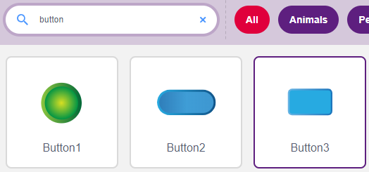

.. note::

    Hallo und willkommen in der SunFounder Raspberry Pi & Arduino & ESP32 Enthusiasten-Gemeinschaft auf Facebook! Tauchen Sie tiefer ein in die Welt von Raspberry Pi, Arduino und ESP32 mit anderen Enthusiasten.

    **Warum beitreten?**

    - **Expertenunterstützung**: Lösen Sie Nachverkaufsprobleme und technische Herausforderungen mit Hilfe unserer Gemeinschaft und unseres Teams.
    - **Lernen & Teilen**: Tauschen Sie Tipps und Anleitungen aus, um Ihre Fähigkeiten zu verbessern.
    - **Exklusive Vorschauen**: Erhalten Sie frühzeitigen Zugang zu neuen Produktankündigungen und exklusiven Einblicken.
    - **Spezialrabatte**: Genießen Sie exklusive Rabatte auf unsere neuesten Produkte.
    - **Festliche Aktionen und Gewinnspiele**: Nehmen Sie an Gewinnspielen und Feiertagsaktionen teil.

    👉 Sind Sie bereit, mit uns zu erkunden und zu erschaffen? Klicken Sie auf [|link_sf_facebook|] und treten Sie heute bei!

.. _sh_table_lamp:

2.1 Tischlampe
================

Hier verbinden wir eine LED auf dem Steckbrett und lassen den Sprite die Blinkfrequenz dieser LED steuern.

Wenn der Button-Sprite auf der Bühne angeklickt wird, blinkt die LED 5 Mal und stoppt dann.

.. image:: img/2_button.png

Benötigte Komponenten
---------------------

Für dieses Projekt benötigen wir die folgenden Komponenten.

Es ist definitiv praktisch, ein ganzes Kit zu kaufen, hier ist der Link:

.. list-table::
    :widths: 20 20 20
    :header-rows: 1

    *   - Name	
        - ARTIKEL IN DIESEM KIT
        - LINK
    *   - ESP32 Starter Kit
        - 320+
        - |link_esp32_starter_kit|

Sie können die Komponenten auch einzeln über die untenstehenden Links kaufen.

.. list-table::
    :widths: 30 20
    :header-rows: 1

    *   - KOMPONENTENBESCHREIBUNG
        - KAUF-LINK

    *   - :ref:`cpn_esp32_wroom_32e`
        - |link_esp32_wroom_32e_buy|
    *   - :ref:`cpn_esp32_camera_extension`
        - \-
    *   - :ref:`cpn_breadboard`
        - |link_breadboard_buy|
    *   - :ref:`cpn_wires`
        - |link_wires_buy|
    *   - :ref:`cpn_resistor`
        - |link_resistor_buy|
    *   - :ref:`cpn_led`
        - |link_led_buy|

Was Sie Lernen Werden
---------------------

- Steckbrett, LEDs und Widerstände
- Aufbau eines Stromkreises auf einem Steckbrett
- Löschen und Auswählen von Sprites
- Wechseln von Kostümen

- Festlegen einer begrenzten Anzahl von Wiederholungsschleifen

Schaltung Aufbauen
-----------------------

Folgen Sie dem untenstehenden Diagramm, um die Schaltung auf dem Steckbrett aufzubauen.

Da die Anode der LED (der längere Pin) über einen 220Ω-Widerstand mit Pin 26 verbunden ist und die Kathode der LED mit GND verbunden ist, können Sie die LED zum Leuchten bringen, indem Sie Pin 9 auf ein hohes Level setzen.

.. image:: img/circuit/1_hello_led_bb.png

Programmierung
------------------

Die gesamte Programmierung ist in 3 Teile gegliedert: Der erste Teil ist die Auswahl des gewünschten Sprites, der zweite Teil ist das Wechseln des Kostüms für den Sprite, damit er klickbar erscheint, und der dritte Teil ist das Blinken der LED.

**1. Button3-Sprite auswählen**

Löschen Sie das bestehende Tobi-Sprite mit dem Löschen-Knopf in der oberen rechten Ecke und wählen Sie ein Sprite erneut aus.

.. image:: img/2_tobi.png

Hier wählen wir das **Button3**-Sprite.

Klicken Sie in der oberen rechten Ecke auf Kostüme und Sie werden sehen, dass das Button3-Sprite 2 Kostüme hat. Wir setzen **button3-a** als freigegeben und **button3-b** als gedrückt.

.. image:: img/2_button3_2.png

**2. Kostüme wechseln**.

Wenn das Sprite angeklickt wird (**Events**-Palette), wechselt es zum Kostüm für **button3-b** (**looks**-Palette).

.. image:: img/2_switch.png

**3. Die LED 5 Mal blinken lassen**

Verwenden Sie den [Repeat]-Block, um die LED 5 Mal blinken zu lassen (High-> LOW Zyklus) und schließlich das Kostüm zurück auf **button3-a** zu wechseln.

* [Repeat 10]: Begrenzte Anzahl von Wiederholungsschleifen, Sie können die Anzahl der Wiederholungen selbst festlegen, aus der **Control**-Palette.

.. image:: img/2_led_on_off.png
