.. note::

    ¡Hola, bienvenido a la Comunidad de Aficionados a Raspberry Pi, Arduino y ESP32 de SunFounder en Facebook! Profundiza en Raspberry Pi, Arduino y ESP32 con otros entusiastas.

    **¿Por qué unirse?**

    - **Soporte de expertos**: Resuelve problemas posventa y desafíos técnicos con ayuda de nuestra comunidad y equipo.
    - **Aprender y compartir**: Intercambia consejos y tutoriales para mejorar tus habilidades.
    - **Vistas previas exclusivas**: Obtén acceso anticipado a anuncios de nuevos productos y avances.
    - **Descuentos especiales**: Disfruta de descuentos exclusivos en nuestros productos más nuevos.
    - **Promociones festivas y sorteos**: Participa en sorteos y promociones de fiestas.

    👉 ¿Listo para explorar y crear con nosotros? Haz clic en [|link_sf_facebook|] y únete hoy!

.. _sh_dragon:

2.20 JUEGO - Matar al Dragón
==============================

Aquí, utilizamos el joystick para jugar a un juego de matar dragones.

Al hacer clic en verde, el dragón flotará arriba y abajo en el lado derecho y lanzará fuego intermitentemente. Necesitas usar el joystick para controlar el movimiento de la varita mágica y lanzar ataques estelares al dragón, evitando las llamas que dispara, y finalmente derrotarlo.

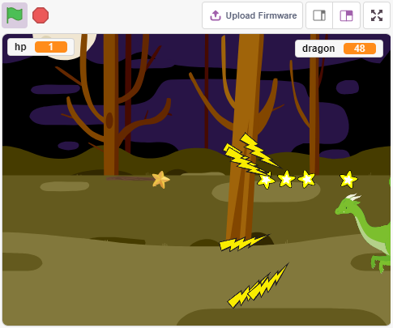

Componentes Necesarios
------------------------

Para este proyecto, necesitaremos los siguientes componentes.

Es definitivamente conveniente comprar un kit completo, aquí está el enlace:

.. list-table::
    :widths: 20 20 20
    :header-rows: 1

    *   - Nombre	
        - ELEMENTOS EN ESTE KIT
        - ENLACE
    *   - Kit de Inicio ESP32
        - 320+
        - |link_esp32_starter_kit|

También puedes comprarlos por separado en los enlaces a continuación.

.. list-table::
    :widths: 30 20
    :header-rows: 1

    *   - INTRODUCCIÓN AL COMPONENTE
        - ENLACE DE COMPRA

    *   - :ref:`cpn_esp32_wroom_32e`
        - |link_esp32_wroom_32e_buy|
    *   - :ref:`cpn_esp32_camera_extension`
        - |link_esp32_extension_board|
    *   - :ref:`cpn_wires`
        - |link_wires_buy|
    *   - :ref:`cpn_joystick`
        - |link_joystick_buy|

Construir el Circuito
-----------------------

Un joystick es un dispositivo de entrada compuesto por un palo que pivota sobre una base e informa su ángulo o dirección al dispositivo que está controlando. Los joysticks se utilizan a menudo para controlar videojuegos y robots.

Para comunicar un rango completo de movimiento al ordenador, un joystick necesita medir la posición del palo en dos ejes: el eje X (de izquierda a derecha) y el eje Y (de arriba abajo).

Las coordenadas de movimiento del joystick se muestran en la siguiente figura.

.. note::

    * La coordenada x es de izquierda a derecha, el rango es 0-1023.
    * La coordenada y es de arriba abajo, el rango es 0-1023.

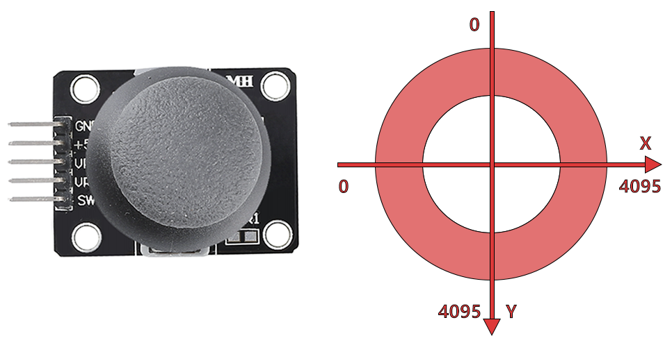

Ahora construye el circuito según el siguiente diagrama.

.. image:: img/circuit/14_star_crossed_bb.png

Programación
------------------

**1. Dragón**

Se añade el fondo **Bosques** a través del botón **Elegir un Fondo**.

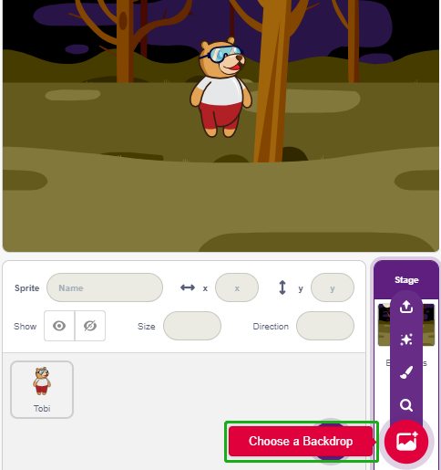

* Elimina el sprite predeterminado y añade el sprite **Dragón**.

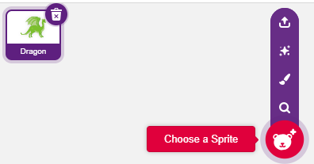

* Ve a la página de **Disfraces** y voltea horizontalmente los disfraces dragón-b y dragón-c.

.. image:: img/19_dragon1.png

* Establece el tamaño al 50%.

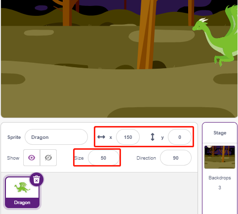

* Ahora crea una variable - **dragón** para registrar los puntos de vida del dragón, y establece el valor inicial a 50.

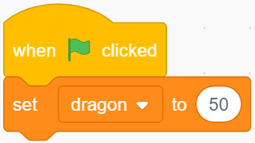

* A continuación, cambia el disfraz del sprite a **dragón-b** y haz que el sprite **Dragón** se mueva arriba y abajo en un rango.

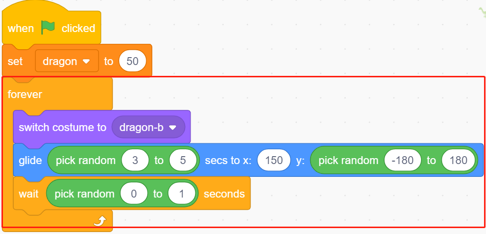

* Añade un sprite **Rayo** como el fuego lanzado por el sprite **Dragón**. Necesitas rotarlo 90° en el sentido de las agujas del reloj en la página de Disfraces, esto es para hacer que el sprite **Rayo** se mueva en la dirección correcta.

.. note::
    Al ajustar el disfraz del sprite **Rayo**, puedes moverlo fuera del centro, ¡esto debe evitarse! El punto central debe estar justo en el medio del sprite.

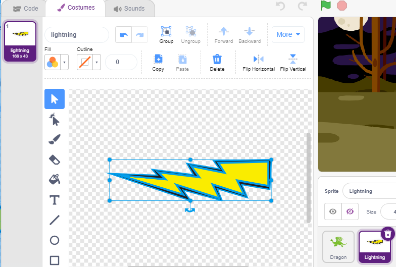

* Ajusta el disfraz de **dragon-c** del sprite **Dragón** para que su punto central esté en la cola del fuego. Esto hará que las posiciones del sprite **Dragón** y del sprite **Relámpago** sean correctas, evitando que el **Relámpago** se lance desde los pies del dragón.

.. image:: img/19_dragon5.png

* Correspondientemente, **dragon-b** necesita hacer coincidir la cabeza del dragón con el punto central.

.. image:: img/19_dragon5.png

* Ajusta el tamaño y la orientación del sprite **Relámpago** para hacer que la imagen luzca más armoniosa.

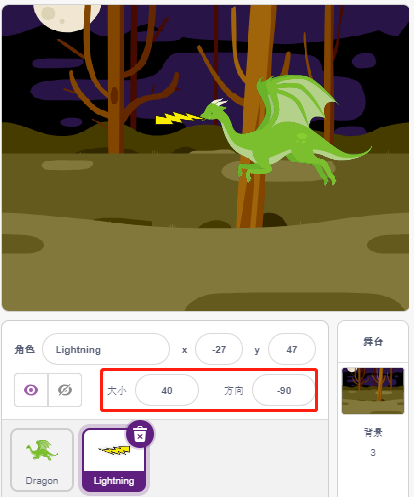

* Ahora programa el sprite **Relámpago**. Es fácil, solo haz que siga al sprite **Dragón** todo el tiempo. En este punto, haz clic en la bandera verde y verás al **Dragón** moviéndose con un relámpago en su boca.

.. image:: img/19_lightning4.png

* Vuelve al sprite **Dragón**, ahora haz que sople fuego, teniendo cuidado de que el fuego en su boca no se dispare, sino que cree un clon para el sprite **Relámpago**.

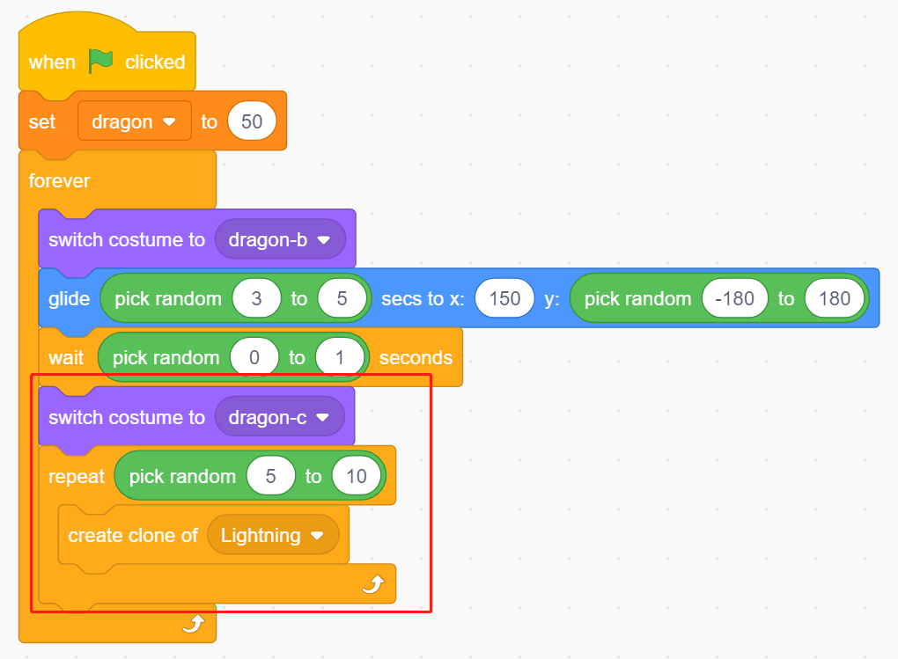

* Haz clic en el sprite **Relámpago** y permite que el clon de **Relámpago** se dispare en un ángulo aleatorio, rebotará en la pared y desaparecerá después de cierto tiempo.

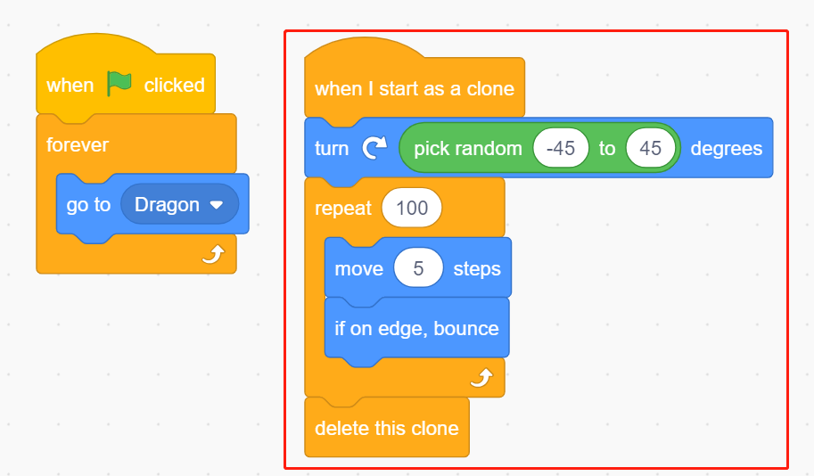

* En el sprite **Relámpago**, oculta su cuerpo y muestra el clon.

.. image:: img/19_lightning6.png

Ahora el dragón puede moverse hacia arriba y hacia abajo y soplar fuego.

**2. Varita**

* Crea un sprite **Varita** y rota su dirección a 180 para que apunte hacia la derecha.

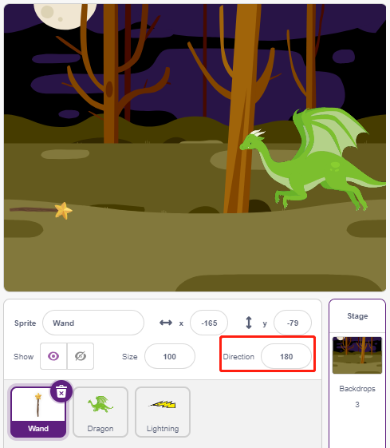

* Ahora crea una variable **hp** para registrar su valor de vida, inicialmente establecido en 3. Luego lee el valor del Joystick, que se utiliza para controlar el movimiento de la varita.

.. image:: img/19_wand2.png

* El dragón tiene relámpagos, ¡y la varita que los destruye tiene su "bala mágica"! Crea un sprite **Estrella**, redimensiónalo y prográmalo para que siempre siga al sprite **Varita**, y limita el número de estrellas a tres.

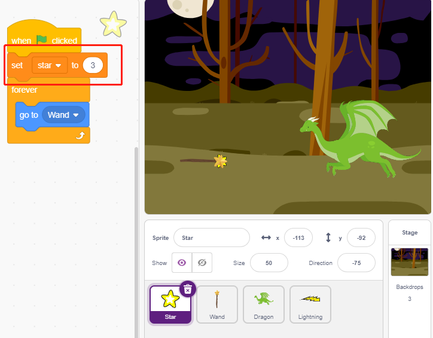

* Haz que el sprite **Varita** dispare estrellas automáticamente. El sprite **Varita** dispara estrellas de la misma manera que el dragón sopla fuego -- creando clones.

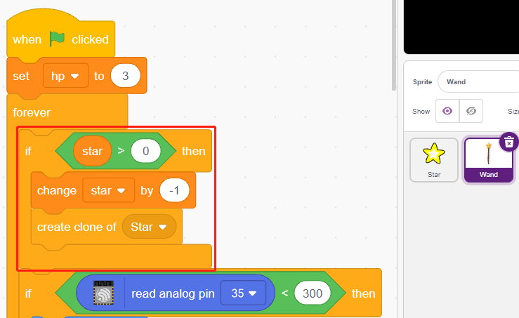

* Vuelve al sprite **Estrella** y programa su clon para que gire y dispare hacia la derecha, desaparezca después de ir más allá del escenario y restaurando el número de estrellas. Igual que con el sprite **Relámpago**, oculta el cuerpo y muestra el clon.

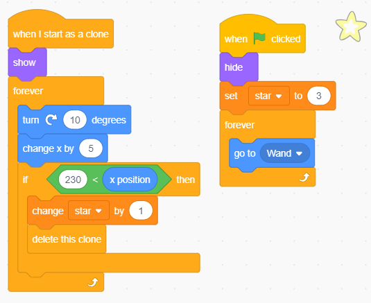

Ahora tenemos una varita que dispara balas de estrella.

**3. ¡Lucha!**

La varita y el dragón están actualmente en desacuerdo, y vamos a hacer que luchen. El dragón es fuerte, y la varita es el valiente que se enfrenta al dragón. La interacción entre ellos consiste en las siguientes partes.

1. si la varita toca al dragón, será repelida hacia atrás y perderá puntos de vida.
2. si un relámpago golpea la varita, la varita perderá puntos de vida.
3. si la bala de estrella golpea al dragón, el dragón perderá puntos de vida.

Una vez que esto esté resuelto, pasemos a cambiar los guiones para cada sprite.

* Si la **Varita** golpea al **Dragón**, será repelida hacia atrás y perderá puntos de vida.

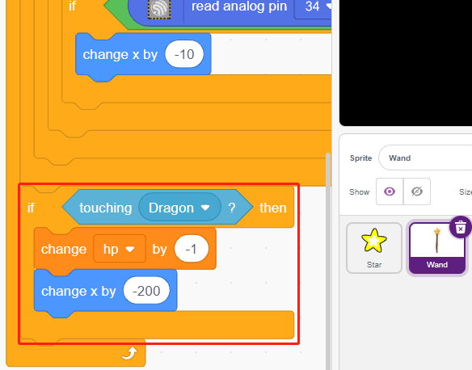

* Si **Relámpago** (un clon del sprite **Relámpago**) golpea al sprite **Varita**, hará un sonido de estallido y desaparecerá, y la **Varita** perderá puntos de vida.

.. image:: img/19_lightning7.png

* Si una **Estrella** (clon del sprite **Estrella**) golpea al **Dragón**, emitirá un sonido de recolección y desaparecerá, mientras restaura el conteo de **Estrellas**, y el **Dragón** perderá puntos de vida.

.. image:: img/19_star4.png

**4. Escenario**

La batalla entre la **Varita** y el **Dragón** eventualmente se dividirá en ganadores y perdedores, lo que representamos con el escenario.

* Añade el fondo **Cielo Azul**, y escribe el personaje "¡GANASTE!" en él para representar que el dragón ha sido derrotado y ha llegado el amanecer.

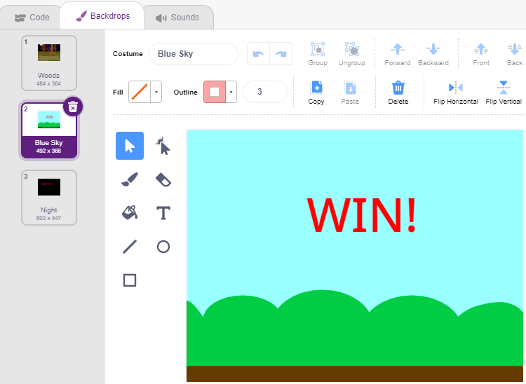

* Y modifica el fondo en blanco de la siguiente manera, para representar que el juego ha fallado y todo estará en oscuridad.

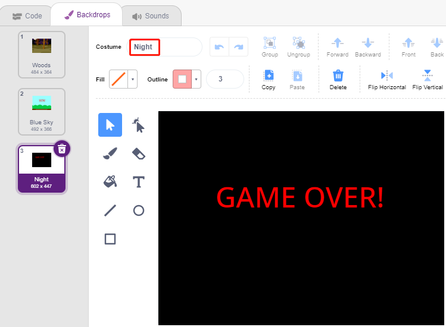

* Ahora escribe un guion para cambiar estos fondos, cuando se haga clic en la bandera verde, cambia al fondo **Bosque**; si el punto de vida del dragón es menos de 1, entonces el juego tiene éxito y cambia el fondo a **Cielo Azul**; si el valor de vida de la **Varita** es menos de 1, entonces cambia al fondo **Noche** y el juego falla.

.. image:: img/19_sky1.png
