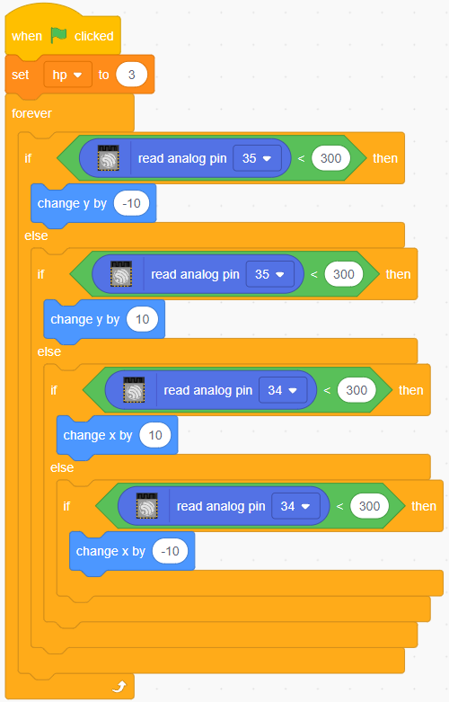

.. _sh_dragon:

2.20 SPIEL - Drachen Töten
============================

Hier verwenden wir den Joystick, um ein Drachentötungsspiel zu spielen.

Beim Klicken auf Grün schwebt der Drache auf der rechten Seite auf und ab und spuckt intermittierend Feuer. Sie müssen den Joystick verwenden, um die Bewegung des Zauberstabs zu steuern und Sternenangriffe auf den Drachen zu starten, während Sie den von ihm abgefeuerten Flammen ausweichen, um ihn schließlich zu besiegen.

.. image:: img/19_dragon.png

Benötigte Komponenten
---------------------

Für dieses Projekt benötigen wir die folgenden Komponenten.

Es ist definitiv praktisch, ein ganzes Kit zu kaufen, hier ist der Link:

.. list-table::
    :widths: 20 20 20
    :header-rows: 1

    *   - Name
        - ARTIKEL IN DIESEM KIT
        - LINK
    *   - ESP32 Starter Kit
        - 320+
        - |link_esp32_starter_kit|

Sie können sie auch einzeln über die untenstehenden Links kaufen.

.. list-table::
    :widths: 30 20
    :header-rows: 1

    *   - KOMPONENTENBESCHREIBUNG
        - KAUF-LINK

    *   - :ref:`cpn_esp32_wroom_32e`
        - |link_esp32_wroom_32e_buy|
    *   - :ref:`cpn_esp32_camera_extension`
        - \-
    *   - :ref:`cpn_wires`
        - |link_wires_buy|
    *   - :ref:`cpn_joystick`
        - |link_joystick_buy|

Schaltung Aufbauen
-----------------------

Ein Joystick ist ein Eingabegerät, bestehend aus einem Hebel, der auf einer Basis schwenkt und seinen Winkel oder seine Richtung an das Gerät meldet, das er steuert. Joysticks werden häufig verwendet, um Videospiele und Roboter zu steuern.

Um einen vollständigen Bewegungsbereich an den Computer zu übermitteln, muss ein Joystick die Position des Hebels auf zwei Achsen messen - die X-Achse (links nach rechts) und die Y-Achse (oben nach unten).

Die Bewegungskoordinaten des Joysticks werden in der folgenden Abbildung gezeigt.

.. note::

    * Die x-Koordinate verläuft von links nach rechts, der Bereich beträgt 0-1023.
    * Die y-Koordinate verläuft von oben nach unten, der Bereich beträgt 0-1023.

.. image:: img/16_joystick.png

Bauen Sie nun den Schaltkreis gemäß dem folgenden Diagramm auf.

.. image:: img/circuit/14_star_crossed_bb.png

Programmierung
------------------

**1. Drache**

**Woods**-Hintergrund über den Button **Choose a Backdrop** hinzugefügt.

.. image:: img/19_dragon01.png

* Löschen Sie das Standard-Sprite und fügen Sie das **Dragon**-Sprite hinzu.

.. image:: img/19_dragon0.png

* Gehen Sie zur Seite **Costumes** und spiegeln Sie die Kostüme dragon-b und dragon-c horizontal.

.. image:: img/19_dragon1.png

* Stellen Sie die Größe auf 50% ein.

.. image:: img/19_dragon3.png

* Erstellen Sie nun eine Variable - **dragon** - um die Lebenspunkte des Drachens aufzuzeichnen und setzen Sie den Anfangswert auf 50.

.. image:: img/19_dragon2.png

* Wechseln Sie anschließend das Kostüm des Sprites zu **dragon-b** und lassen Sie das **Dragon**-Sprite in einem Bereich auf und ab schweben.

.. image:: img/19_dragon4.png

* Fügen Sie ein **Lightning**-Sprite als vom **Dragon**-Sprite geblasenes Feuer hinzu. Drehen Sie es auf der Seite Kostüme um 90° im Uhrzeigersinn, damit sich das **Lightning**-Sprite in die richtige Richtung bewegt.

.. note::
    Beim Anpassen des Kostüms des **Lightning**-Sprites kann es aus der Mitte verschoben werden, was unbedingt vermieden werden muss! Der Mittelpunkt muss genau in der Mitte des Sprites liegen!

.. image:: img/19_lightning1.png

* Passen Sie dann das **dragon-c**-Kostüm des **Dragon**-Sprites so an, dass sein Mittelpunkt am Ende des Feuerschwanzes liegt. Dadurch werden die Positionen des **Dragon**-Sprites und des **Lightning**-Sprites korrekt und verhindern, dass der **Lightning** von den Füßen des Drachens abgefeuert wird. 

.. image:: img/19_dragon5.png

* Entsprechend muss bei **dragon-b** der Kopf des Drachens mit dem Mittelpunkt übereinstimmen.

.. image:: img/19_dragon5.png

* Passen Sie die Größe und Ausrichtung des **Lightning**-Sprites an, um das Bild harmonischer wirken zu lassen.

.. image:: img/19_lightning3.png

* Programmieren Sie nun das **Lightning**-Sprite. Das ist einfach, lassen Sie es immer dem **Dragon**-Sprite folgen. In diesem Moment klicken Sie auf die grüne Fahne und Sie werden sehen, wie der **Dragon** mit Blitz im Mund herumfliegt.

.. image:: img/19_lightning4.png

* Zurück zum **Dragon**-Sprite, lassen Sie es nun Feuer ausstoßen, wobei darauf zu achten ist, dass das Feuer im Mund nicht herausschießt, sondern ein Klon für das **Lightning**-Sprite erstellt wird.

.. image:: img/19_dragon6.png

* Klicken Sie auf das **Lightning**-Sprite und lassen Sie den **Lightning**-Klon in einem zufälligen Winkel abfeuern. Er prallt von der Wand ab und verschwindet nach einer bestimmten Zeit.

.. image:: img/19_lightning5.png

* Im **Lightning**-Sprite, verstecken Sie den Körper und zeigen Sie den Klon.

.. image:: img/19_lightning6.png

Jetzt kann der Drache auf und ab schweben und Feuer ausstoßen.

**2. Zauberstab**

* Erstellen Sie ein **Wand**-Sprite und drehen Sie seine Richtung auf 180 Grad, um nach rechts zu zeigen.

.. image:: img/19_wand1.png

* Erstellen Sie nun eine Variable **hp**, um dessen Lebenswert aufzuzeichnen, anfänglich auf 3 gesetzt. Lesen Sie dann den Wert des Joysticks, der verwendet wird, um die Bewegung des Zauberstabs zu steuern.

* Der Drache hat Blitze und der Zauberstab, der ihn zerschmettert, hat seine "magische Kugel"! Erstellen Sie ein **Star**-Sprite, passen Sie dessen Größe an und programmieren Sie es so, dass es immer dem **Wand**-Sprite folgt, und begrenzen Sie die Anzahl der Sterne auf drei.

.. image:: img/19_star2.png

* Lassen Sie das **Wand**-Sprite automatisch Sterne schießen. Das **Wand**-Sprite schießt Sterne auf die gleiche Weise, wie der Drache Feuer spuckt - durch das Erstellen von Klonen.

* Gehen Sie zurück zum **Star**-Sprite und programmieren Sie dessen Klon so, dass er sich dreht und nach rechts schießt, verschwindet, nachdem er die Bühne verlassen hat, und stellt die Anzahl der Sterne wieder her. Wie beim **Lightning**-Sprite, verstecken Sie den Körper und zeigen Sie den Klon.

.. image:: img/19_star3.png

Jetzt haben wir einen Zauberstab, der Sternenkugeln schießt.

**3. Kampf!**

Der Zauberstab und der Drache sind derzeit noch im Konflikt miteinander, und wir werden sie gegeneinander kämpfen lassen. Der Drache ist stark, und der Zauberstab ist der mutige Mann, der gegen den Drachen kämpft. Die Interaktion zwischen ihnen besteht aus den folgenden Teilen.

1. Wenn der Zauberstab den Drachen berührt, wird er zurückgestoßen und verliert Lebenspunkte.
2. Wenn Blitz den Zauberstab trifft, verliert der Zauberstab Lebenspunkte.
3. Wenn die Sternenkugel den Drachen trifft, verliert der Drache Lebenspunkte.

Sobald das geklärt ist, gehen wir weiter zur Änderung der Skripte für jedes Sprite.

* Wenn der **Wand** den **Dragon** trifft, wird er zurückgestoßen und verliert Lebenspunkte.

.. image:: img/19_wand4.png

* Wenn **Lightning** (ein Klon des **Lightning**-Sprites) das **Wand**-Sprite trifft, macht es ein Knallgeräusch und verschwindet, und der **Wand** verliert Lebenspunkte.

.. image:: img/19_lightning7.png

* Wenn ein **Star** (Klon des **Star**-Sprites) den **Dragon** trifft, gibt er ein Sammelgeräusch von sich und verschwindet, während er die **Star**-Zählung wiederherstellt, und der **Dragon** verliert Lebenspunkte.

.. image:: img/19_star4.png

**4. Bühne**

Der Kampf zwischen dem **Wand** und dem **Dragon** wird letztendlich in Gewinner und Verlierer aufgeteilt, was wir mit der Bühne darstellen.

* Fügen Sie den **Blue Sky**-Hintergrund hinzu und schreiben Sie den Schriftzug "WIN!" darauf, um darzustellen, dass der Drache besiegt wurde und die Dämmerung gekommen ist.

.. image:: img/19_sky0.png

* Und ändern Sie den leeren Hintergrund wie folgt, um darzustellen, dass das Spiel fehlgeschlagen ist und alles in Dunkelheit versinken wird.

* Schreiben Sie nun ein Skript, um diese Hintergründe zu wechseln. Wenn die grüne Fahne angeklickt wird, wechseln Sie zum **Woods**-Hintergrund; wenn die Lebenspunkte des Drachens weniger als 1 betragen, ist das Spiel erfolgreich und wechseln Sie den Hintergrund zum **Blue Sky**; wenn der Lebenswert des **Wand** weniger als 1 beträgt, wechseln Sie zum **Night**-Hintergrund und das Spiel ist gescheitert.

.. image:: img/19_sky1.png

