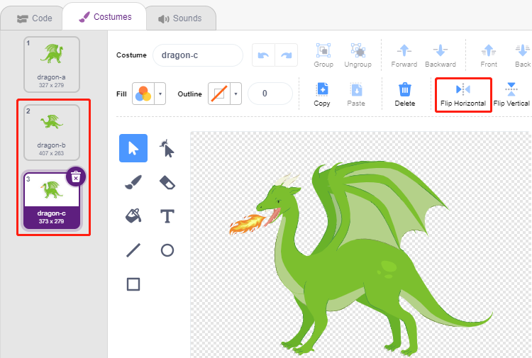

.. note::

    Ciao, benvenuto nella community di appassionati di SunFounder Raspberry Pi, Arduino e ESP32 su Facebook! Approfondisci le tue conoscenze su Raspberry Pi, Arduino ed ESP32 insieme ad altri appassionati.

    **Perché unirsi?**

    - **Supporto esperto**: Risolvi problemi post-vendita e sfide tecniche con l'aiuto della nostra community e del nostro team.
    - **Impara e condividi**: Scambia consigli e tutorial per migliorare le tue competenze.
    - **Anteprime esclusive**: Accedi in anteprima agli annunci dei nuovi prodotti e alle anticipazioni.
    - **Sconti speciali**: Goditi sconti esclusivi sui nostri prodotti più recenti.
    - **Promozioni e giveaway festivi**: Partecipa a giveaway e promozioni festive.

    👉 Pronto per esplorare e creare con noi? Clicca su [|link_sf_facebook|] e unisciti oggi stesso!

.. _sh_dragon:

2.20 GIOCO - Uccidi il Drago
=================================

Qui, utilizziamo il joystick per giocare a un gioco di uccisione del drago.

Quando clicchi sul verde, il drago fluttuerà su e giù sul lato destro e soffierà fuoco a intermittenza. Devi usare il joystick per controllare il movimento della bacchetta magica e lanciare attacchi stellari al drago, evitando allo stesso tempo le fiamme che spara, e infine sconfiggerlo.

Componenti Necessari
-------------------------

In questo progetto, abbiamo bisogno dei seguenti componenti.

È sicuramente conveniente acquistare un kit completo, ecco il link:

.. list-table::
    :widths: 20 20 20
    :header-rows: 1

    *   - Nome
        - OGGETTI IN QUESTO KIT
        - LINK
    *   - Kit di avvio ESP32
        - 320+
        - |link_esp32_starter_kit|

Puoi anche acquistarli separatamente dai link qui sotto.

.. list-table::
    :widths: 30 20
    :header-rows: 1

    *   - INTRODUZIONE AL COMPONENTE
        - LINK PER L'ACQUISTO

    *   - :ref:`cpn_esp32_wroom_32e`
        - |link_esp32_wroom_32e_buy|
    *   - :ref:`cpn_esp32_camera_extension`
        - |link_esp32_extension_board|
    *   - :ref:`cpn_wires`
        - |link_wires_buy|
    *   - :ref:`cpn_joystick`
        - |link_joystick_buy|

Costruisci il Circuito
---------------------------------

Un joystick è un dispositivo di input costituito da un bastone che ruota su una base e riporta il suo angolo o direzione al dispositivo che sta controllando. I joystick sono spesso utilizzati per controllare videogiochi e robot.

Per comunicare una gamma completa di movimenti al computer, un joystick deve misurare la posizione del bastone su due assi: l'asse X (da sinistra a destra) e l'asse Y (da sopra a sotto).

Le coordinate di movimento del joystick sono mostrate nella figura seguente.

.. note::

    * La coordinata x va da sinistra a destra, con un intervallo da 0 a 1023.
    * La coordinata y va da sopra a sotto, con un intervallo da 0 a 1023.

.. image:: img/16_joystick.png

Ora costruisci il circuito secondo lo schema seguente.

.. image:: img/circuit/14_star_crossed_bb.png

Programmazione
-------------------------

**1. Drago**

Aggiungi lo sfondo **Woods** tramite il pulsante **Scegli uno Sfondo**.

.. image:: img/19_dragon01.png

* Elimina lo sprite predefinito e aggiungi lo sprite **Dragon**.

.. image:: img/19_dragon0.png

* Vai alla pagina **Costumi** e capovolgi orizzontalmente i costumi dragon-b e dragon-c.

* Imposta la dimensione al 50%.

.. image:: img/19_dragon3.png

* Ora crea una variabile - **dragon** per registrare i punti vita del drago, e imposta il valore iniziale a 50.

.. image:: img/19_dragon2.png

* Successivamente, cambia il costume dello sprite in **dragon-b** e fai in modo che lo sprite **Dragon** si muova su e giù in un intervallo.

.. image:: img/19_dragon4.png

* Aggiungi uno sprite **Lightning** come il fuoco soffiato dallo sprite **Dragon**. Devi ruotarlo di 90° in senso orario nella pagina Costumi, per far sì che lo sprite **Lightning** si muova nella direzione corretta.

.. note::
    Quando regoli il costume dello sprite **Lightning**, potresti spostarlo fuori centro, cosa che deve essere evitata! Il punto centrale deve essere esattamente al centro dello sprite!

.. image:: img/19_lightning1.png

* Quindi, regola il costume **dragon-c** dello sprite **Dragon** in modo che il suo punto centrale sia sulla coda del fuoco. Questo renderà corretta la posizione degli sprite **Dragon** e **Lightning**, e impedirà a **Lightning** di lanciarsi dai piedi del drago.

.. image:: img/19_dragon5.png

* Di conseguenza, **dragon-b** deve far coincidere la testa del drago con il punto centrale.

.. image:: img/19_dragon5.png

* Regola la dimensione e l'orientamento dello sprite **Lightning** per rendere l'immagine più armoniosa.

.. image:: img/19_lightning3.png

* Ora scriptiamo lo sprite **Lightning**. È semplice, basta farlo seguire lo sprite **Dragon** tutto il tempo. A questo punto, clicca sulla bandiera verde e vedrai **Dragon** muoversi con il fulmine in bocca.

.. image:: img/19_lightning4.png

* Torna allo sprite **Dragon**, ora fai soffiare fuoco, stando attento a non far uscire il fuoco dalla sua bocca, ma a creare un clone per lo sprite **Lightning**.

.. image:: img/19_dragon6.png

* Clicca sullo sprite **Lightning** e fai sì che il clone di **Lightning** spari ad un angolo casuale, rimbalzi sul muro e scompaia dopo un certo tempo.

.. image:: img/19_lightning5.png

* Nello sprite **Lightning**, nascondi il corpo e mostra il clone.

.. image:: img/19_lightning6.png

Ora il drago può muoversi su e giù e soffiare fuoco.

**2. Bacchetta Magica**

* Crea uno sprite **Wand** e ruota la sua direzione a 180 gradi per puntare a destra.

.. image:: img/19_wand1.png

* Ora crea una variabile **hp** per registrare il suo valore di vita, impostato inizialmente a 3. Quindi, leggi il valore del joystick, che viene utilizzato per controllare il movimento della bacchetta.

.. image:: img/19_wand2.png

* Il drago ha il fulmine, e la bacchetta che lo schiaccia ha il suo "proiettile magico"! Crea uno sprite **Star**, ridimensiona e scriptalo in modo che segua sempre lo sprite **Wand**, e limita il numero di stelle a tre.

.. image:: img/19_star2.png

* Fai in modo che lo sprite **Wand** spari automaticamente le stelle. Lo sprite **Wand** spara le stelle allo stesso modo in cui il drago soffia fuoco, creando cloni.

.. image:: img/19_wand3.png

* Torna allo sprite **Star** e scriptalo in modo che il clone giri e spari verso destra, scomparendo dopo essere uscito dal palco e ripristinando il numero di stelle. Come lo sprite **Lightning**, nascondi il corpo e mostra il clone.

.. image:: img/19_star3.png

Ora abbiamo una bacchetta che spara proiettili stellari.

**3. Combattimento!**

La bacchetta e il drago sono attualmente ancora in disaccordo, e ora li faremo combattere. Il drago è forte, e la bacchetta è il coraggioso che lo combatte. L'interazione tra loro consiste nelle seguenti parti:

1. Se la bacchetta tocca il drago, verrà respinta e perderà punti vita.
2. Se il fulmine colpisce la bacchetta, la bacchetta perderà punti vita.
3. Se il proiettile stellare colpisce il drago, il drago perderà punti vita.

Una volta chiariti questi punti, procediamo a modificare gli script per ciascuno sprite.

* Se la **Bacchetta** colpisce il **Drago**, verrà respinta e perderà punti vita.

.. image:: img/19_wand4.png

* Se **Lightning** (un clone dello sprite **Lightning**) colpisce lo sprite **Wand**, farà un suono pop e scomparirà, e la **Bacchetta** perderà punti vita.

.. image:: img/19_lightning7.png

* Se una **Star** (clone dello sprite **Star**) colpisce il **Drago**, emetterà un suono di raccolta e scomparirà, ripristinando il numero di **Star**, e il **Drago** perderà punti vita.

.. image:: img/19_star4.png

**4. Palco**

La battaglia tra la **Bacchetta** e il **Drago** alla fine decreterà vincitori e vinti, che rappresenteremo con il palco.

* Aggiungi lo sfondo **Blue Sky**, e scrivi il carattere "WIN!" su di esso per rappresentare che il drago è stato sconfitto e che l'alba è arrivata.

.. image:: img/19_sky0.png

* E modifica lo sfondo vuoto come segue, per rappresentare che il gioco è fallito e tutto sarà nell'oscurità.

.. image:: img/19_night.png

* Ora scrivi uno script per cambiare questi sfondi, quando la bandiera verde è cliccata, cambia lo sfondo in **Woods**; se i punti vita del drago sono inferiori a 1, allora il gioco ha successo e cambia lo sfondo in **Blue Sky**; se il valore dei punti vita della **Bacchetta** è inferiore a 1, allora cambia lo sfondo in **Night** e il gioco fallisce.

.. image:: img/19_sky1.png
