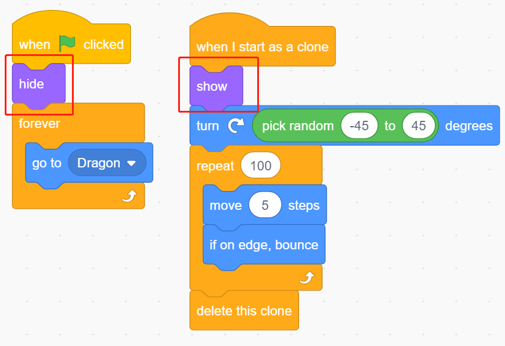

.. _sh_dragon:

2.20 GAME - ドラゴン討伐
============================

ここではジョイスティックを使用してドラゴン討伐ゲームを楽しみます。

緑のフラグをクリックすると、ドラゴンは右側で上下に浮かび、断続的に火を吹きます。ジョイスティックを使って魔法の杖の動きを制御し、ドラゴンに星の攻撃を発射しながら、それが放つ炎を避けて、最終的に倒す必要があります。

.. image:: img/19_dragon.png

必要な部品
---------------------

このプロジェクトには以下のコンポーネントが必要です。

全キットを購入することは確かに便利です。こちらがリンクです：

.. list-table::
    :widths: 20 20 20
    :header-rows: 1

    *   - 名前
        - このキットのアイテム
        - リンク
    *   - ESP32 Starter Kit
        - 320+
        - |link_esp32_starter_kit|

また、以下のリンクから個別に購入することもできます。

.. list-table::
    :widths: 30 20
    :header-rows: 1

    *   - コンポーネントの紹介
        - 購入リンク

    *   - :ref:`cpn_esp32_wroom_32e`
        - |link_esp32_wroom_32e_buy|
    *   - :ref:`cpn_esp32_camera_extension`
        - \-
    *   - :ref:`cpn_wires`
        - |link_wires_buy|
    *   - :ref:`cpn_joystick`
        - |link_joystick_buy|

回路の構築
-----------------------

ジョイスティックは、基部でピボットするスティックからなる入力装置であり、その角度や方向を制御しているデバイスに報告します。ジョイスティックはしばしばビデオゲームやロボットの制御に使われます。

コンピュータに完全な動きを伝えるために、ジョイスティックは2つの軸 - X軸（左右）とY軸（上下）のスティックの位置を測定する必要があります。

ジョイスティックの動きの座標は、以下の図に示されています。

.. note::

    * x座標は左から右へ、範囲は0-1023です。
    * y座標は上から下へ、範囲は0-1023です。

.. image:: img/16_joystick.png

以下の図に従って回路を構築してください。

.. image:: img/circuit/14_star_crossed_bb.png

プログラミング
------------------

**1. ドラゴン**

**Choose a Backdrop** ボタンを使用して **Woods** 背景を追加しました。

.. image:: img/19_dragon01.png

* デフォルトのスプライトを削除し、 **Dragon** スプライトを追加します。

.. image:: img/19_dragon0.png

* **Costumes** ページに移動し、dragon-bとdragon-cを水平に反転させます。

.. image:: img/19_dragon1.png

* サイズを50%に設定します。

.. image:: img/19_dragon3.png

* 次に変数 - **dragon** を作成してドラゴンのライフポイントを記録し、初期値を50に設定します。

* 次に、スプライトのコスチュームを **dragon-b** に切り替えて、 **Dragon** スプライトが範囲内で上下に動くようにします。

.. image:: img/19_dragon4.png

* **Lightning** スプライトを **Dragon** スプライトが吹き出す火として追加します。コスチュームページで90°時計回りに回転させる必要があります。これは **Lightning** スプライトが正しい方向に移動するためです。

.. note::
    **Lightning** スプライトのコスチュームを調整する際、中心から外れることがありますが、これは避けるべきです！中心点はスプライトの真ん中になければなりません！

.. image:: img/19_lightning1.png

* 次に、 **Dragon** スプライトの **dragon-c** コスチュームを調整して、その中心点が火の尾部になるようにします。これにより、 **Dragon** スプライトと **Lightning** スプライトの位置が正しくなり、 **Lightning** がドラゴンの足元から発射されるのを防ぎます。

.. image:: img/19_dragon5.png

* 対応する **dragon-b** では、ドラゴンの頭が中心点と一致するようにする必要があります。

.. image:: img/19_dragon5.png

* **Lightning** スプライトのサイズと方向を調整して、画像がより調和するようにします。

.. image:: img/19_lightning3.png

* 今度は **Lightning** スプライトをスクリプトします。これは簡単で、常に **Dragon** スプライトに追従させるだけです。この時点で緑の旗をクリックすると、口に雷を咥えた **Dragon** が動き回るのを見ることができます。

.. image:: img/19_lightning4.png

* **Dragon** スプライトに戻り、今度は火を吹き出させます。口の中の火が発射されないように注意し、 **Lightning** スプライトのクローンを作成します。

.. image:: img/19_dragon6.png

* **Lightning** スプライトをクリックし、 **Lightning** のクローンがランダムな角度で発射されるようにします。壁から跳ね返って一定時間後に消えます。

.. image:: img/19_lightning5.png

* **Lightning** スプライトでは、本体を隠し、クローンを表示します。

これでドラゴンは上下に動き、火を吹き出すことができます。

**2.魔法の杖**

* **Wand** スプライトを作り、向きを180度に設定して右を指すようにします。

* 次に、その生命値を記録する変数 **hp** を作成し、初期値を3に設定します。そして、ジョイスティックの値を読み取り、杖の動きを制御するのに使用します。

.. image:: img/19_wand2.png

* ドラゴンには雷があり、それを打ち砕く杖には「魔法の弾丸」があります！ **Star** スプライトを作成し、サイズを変更し、常に **Wand** スプライトに追従するようにスクリプトを書き、星の数を三つに制限します。

.. image:: img/19_star2.png

* **Wand** スプライトが自動的に星を撃つようにします。 **Wand** スプライトは、クローンを作成することで、ドラゴンが火を吹くのと同じ方法で星を撃ちます。

.. image:: img/19_wand3.png

* **Star** スプライトに戻り、そのクローンが回転して右に向かって撃ち、ステージを越えたら消え、星の数を復元するようにスクリプトします。 **Lightning** スプライトと同じように、本体を隠してクローンを表示します。

これで、星弾を撃つ杖ができました。

**3. 戦い！**

現在、杖とドラゴンはまだ互いに対立していますが、彼らを戦わせることにします。ドラゴンは強く、杖はドラゴンに対抗する勇敢な男です。彼らの間の相互作用は以下の部分から成り立っています。

1. 杖がドラゴンに触れると、弾き飛ばされて生命点を失います。
2. 雷が杖に当たると、杖は生命点を失います。
3. 星の弾丸がドラゴンに当たると、ドラゴンは生命点を失います。

これが整理されたら、各スプライトのスクリプトを変更しましょう。

* **Wand** が **Dragon** に当たると、弾き飛ばされて生命点を失います。

* **Lightning** （ **Lightning** スプライトのクローン）が **Wand** スプライトに当たると、ポップ音を出して消え、 **Wand** は生命点を失います。

.. image:: img/19_lightning7.png

* **Star** （ **Star** スプライトのクローン）が **Dragon** に当たると、集音音を出して消え、 **Star** の数を復元し、 **Dragon** は生命点を失います。

.. image:: img/19_star4.png

**4. ステージ**

**Wand** と **Dragon** の戦いは最終的に勝者と敗者に分かれますが、それをステージで表現します。

* **Blue Sky** の背景を追加し、「WIN!」という文字を書いて、ドラゴンが倒され、夜明けが来たことを表します。

.. image:: img/19_sky0.png

* そして、以下のように空白の背景を変更して、ゲームに失敗し、すべてが暗闇に包まれることを表します。

.. image:: img/19_night.png

* これらの背景を切り替えるスクリプトを書きます。緑の旗がクリックされたときに **Woods** の背景に切り替えます。ドラゴンの生命点が1未満の場合、ゲームに成功し、背景を **Blue Sky** に切り替えます。 **Wand** の生命値が1未満の場合は、背景を **Night** に切り替えてゲームに失敗します。

.. image:: img/19_sky1.png
