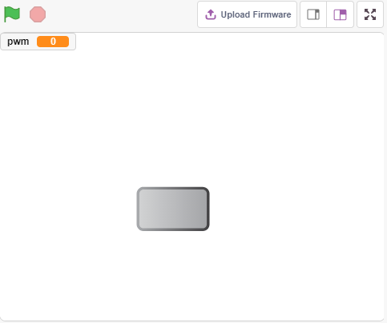
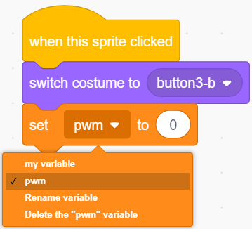
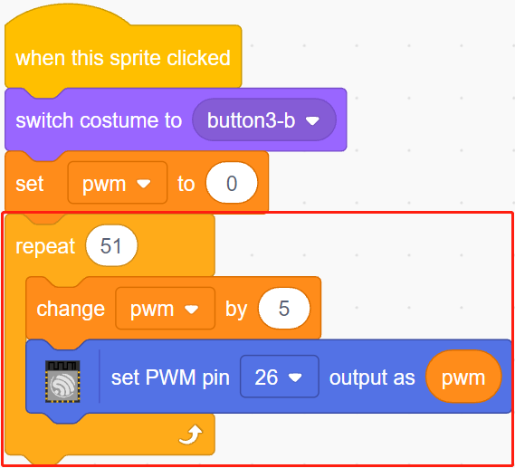
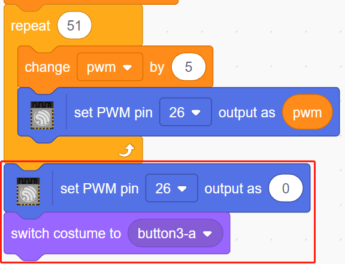

.. note::

    こんにちは、SunFounderのRaspberry Pi & Arduino & ESP32愛好家コミュニティへようこそ！Facebook上でRaspberry Pi、Arduino、ESP32についてもっと深く掘り下げ、他の愛好家と交流しましょう。

    **参加する理由は？**

    - **エキスパートサポート**：コミュニティやチームの助けを借りて、販売後の問題や技術的な課題を解決します。
    - **学び＆共有**：ヒントやチュートリアルを交換してスキルを向上させましょう。
    - **独占的なプレビュー**：新製品の発表や先行プレビューに早期アクセスしましょう。
    - **特別割引**：最新製品の独占割引をお楽しみください。
    - **祭りのプロモーションとギフト**：ギフトや祝日のプロモーションに参加しましょう。

    👉 私たちと一緒に探索し、創造する準備はできていますか？[|link_sf_facebook|]をクリックして今すぐ参加しましょう！

.. _sh_breathing_led:

2.2 ブレシングLED
========================

今回は別の方法でLEDの明るさを制御します。前のプロジェクトとは異なり、ここではLEDの明るさが徐々に減少し、最終的には消えるようにしています。

ステージ上のスプライトをクリックすると、LEDの明るさが徐々に増加し、その後すぐに消灯します。

必要な部品
---------------------

このプロジェクトには、以下のコンポーネントが必要です。

全キットを購入すると便利です。こちらがリンクです:

.. list-table::
    :widths: 20 20 20
    :header-rows: 1

    *   - 名前
        - このキットのアイテム
        - リンク
    *   - ESP32 Starter Kit
        - 320+
        - |link_esp32_starter_kit|

下記のリンクから個別に購入することもできます。

.. list-table::
    :widths: 30 20
    :header-rows: 1

    *   - コンポーネントの紹介
        - 購入リンク

    *   - :ref:`cpn_esp32_wroom_32e`
        - |link_esp32_wroom_32e_buy|
    *   - :ref:`cpn_esp32_camera_extension`
        - |link_esp32_extension_board|
    *   - :ref:`cpn_breadboard`
        - |link_breadboard_buy|
    *   - :ref:`cpn_wires`
        - |link_wires_buy|
    *   - :ref:`cpn_resistor`
        - |link_resistor_buy|
    *   - :ref:`cpn_led`
        - |link_led_buy|

学べること
---------------------

- PWMピンの出力値を設定する
- 変数を作成する
- スプライトの明るさを変える

回路の構築
-----------------------

このプロジェクトは前のプロジェクト :ref:`sh_table_lamp` と同じ回路を使用しますが、LEDを点灯させたり消したりするためにHIGH/LOWを使用する代わりに、 `PWM - Wikipedia <https://en.wikipedia.org/wiki/Pulse-width_modulation>`_ シグナルを使用してLEDをゆっくりと点灯させたり暗くしたりします。

PWM信号の範囲は0-255で、ESP32ボードでは、2, 5, 12~15, 18, 19, 21, 22, 25, 26, 27がPWM信号を出力することができます。

.. image:: img/circuit/1_hello_led_bb.png

プログラミング
------------------

**1. スプライトの選択**

デフォルトのスプライトを削除し、スプライトエリアの右下隅にある **Choose a Sprite** ボタンをクリックし、検索ボックスに **button3** を入力してからクリックして追加します。

.. image:: img/3_sprite.png

**2. 変数の作成**。

**pwm** という名前の変数を作成して、pwmの変化の値を格納します。

**Variables** パレットで **Make a Variable** を選択します。

.. image:: img/3_ap_va.png

変数の名前を入力します。任意の名前でかまいませんが、その機能を説明することをお勧めします。データタイプは数値で、すべてのスプライト用です。

.. image:: img/3_ap_pwm.png

作成すると、 **Variables** パレット内に **pwm** が表示され、チェック状態になります。これは、この変数がステージ上に表示されることを意味します。チェックを外すと、ステージ上にpwmがまだ存在するかどうかを確認できます。

.. image:: img/3_ap_0.png

**3. 初期状態の設定**

**button3** スプライトがクリックされたとき、コスチュームを **button-b** （クリック状態）に切り替え、変数 **pwm** の初期値を0に設定します。

* [set pwm to 0]: **Variables** パレットから、変数の値を設定するために使用します。

**4. LEDを徐々に明るくする**

pwmの範囲が255であるため、[repeat]ブロックにより、変数 **pwm** を5ずつ255まで蓄積し、[set PWM pin]ブロックに入れると、LEDがゆっくりと点灯するのが見えます。

* [change pwm by 5]: **Variables** パレットから、毎回特定の数だけ変数を変更するために使用します。プラスまたはマイナスの数値が可能で、プラスは毎回増加、マイナスは毎回減少を意味します。例えば、ここでは変数pwmが毎回5ずつ増加します。
* [set PWM pin]: **ESP32** パレットから、pwmピンの出力値を設定するために使用します。

最後に、button3のコスチュームを **button-a** に戻し、PWMピンの値を0にすることで、LEDがゆっくりと点灯してから再び消灯します。

