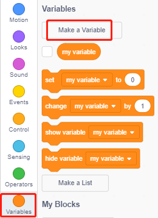
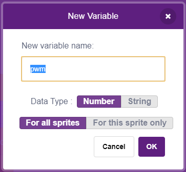

.. _sh_breathing_led:

2.2 LED Respirando
========================

Ahora usaremos otro método para controlar el brillo del LED. A diferencia del proyecto anterior, aquí el brillo del LED disminuye lentamente hasta desaparecer.

Cuando se hace clic en el sprite en el escenario, el brillo del LED aumenta lentamente y luego se apaga instantáneamente.

.. image:: img/3_ap.png

Componentes Necesarios
--------------------------

Para este proyecto, necesitaremos los siguientes componentes.

Definitivamente es conveniente comprar un kit completo, aquí está el enlace:

.. list-table::
    :widths: 20 20 20
    :header-rows: 1

    *   - Nombre	
        - ELEMENTOS EN ESTE KIT
        - ENLACE
    *   - Kit de Inicio ESP32
        - 320+
        - |link_esp32_starter_kit|

También puedes comprarlos por separado en los enlaces a continuación.

.. list-table::
    :widths: 30 20
    :header-rows: 1

    *   - INTRODUCCIÓN DEL COMPONENTE
        - ENLACE DE COMPRA

    *   - :ref:`cpn_esp32_wroom_32e`
        - |link_esp32_wroom_32e_buy|
    *   - :ref:`cpn_esp32_camera_extension`
        - \-
    *   - :ref:`cpn_breadboard`
        - |link_breadboard_buy|
    *   - :ref:`cpn_wires`
        - |link_wires_buy|
    *   - :ref:`cpn_resistor`
        - |link_resistor_buy|
    *   - :ref:`cpn_led`
        - |link_led_buy|

Lo Que Aprenderás
---------------------

- Establecer el valor de salida del pin PWM
- Crear variables
- Cambiar el brillo del sprite

Construir el Circuito
-----------------------

Este proyecto utiliza el mismo circuito que el proyecto anterior :ref:`sh_table_lamp`, pero en lugar de usar ALTO/BAJO para encender o apagar los LEDs, este proyecto utiliza la señal `PWM - Wikipedia <https://en.wikipedia.org/wiki/Pulse-width_modulation>`_ para iluminar o atenuar lentamente el LED.

El rango de señal PWM es 0-255, en la placa ESP32, los pines 2, 5, 12~15, 18, 19, 21, 22, 25, 26 y 27 pueden emitir señal PWM.

.. image:: img/circuit/1_hello_led_bb.png

Programación
------------------

**1. Seleccionar un sprite**

Elimina el sprite predeterminado, haz clic en el botón **Elegir un Sprite** en la esquina inferior derecha del área de sprite, introduce **button3** en el cuadro de búsqueda y luego haz clic para añadirlo.

.. image:: img/3_sprite.png

**2. Crear una variable**.

Crea una variable llamada **pwm** para almacenar el valor del cambio de pwm.

Haz clic en la paleta **Variables** y selecciona **Crear una Variable**.

Introduce el nombre de la variable, puede ser cualquier nombre, pero se recomienda describir su función. El tipo de dato es número y Para todos los sprites.

Una vez creada, verás **pwm** dentro de la paleta **Variables** y en estado marcado, lo que significa que esta variable aparecerá en el escenario. Puedes intentar desmarcarla para ver si pwm sigue presente en el escenario.

.. image:: img/3_ap_0.png

**3. Establecer el estado inicial**

Cuando se hace clic en el sprite **button3**, cambia el disfraz a **button-b** (estado de clic), y establece el valor inicial de la variable **pwm** en 0.

* [establecer pwm a 0]: de la paleta **Variables**, usado para establecer el valor de la variable.

.. image:: img/3_ap_brightness.png

**4. Hacer que el LED brille más y más**

Dado que el rango de pwm es 255, mediante el bloque [repetir], la variable **pwm** se incrementa en 5 hasta alcanzar 255, y luego se introduce en el bloque [establecer pin PWM], de modo que se puede observar cómo el LED se ilumina lentamente.

* [incrementar pwm en 5]: desde la paleta **Variables**, permite que la variable cambie un número específico cada vez. Puede ser un número positivo o negativo, siendo positivo el incremento en cada ocasión, y negativo la disminución, por ejemplo, aquí la variable pwm se incrementa en 5 en cada ocasión.
* [establecer pin PWM]: desde la paleta **ESP32**, se utiliza para definir el valor de salida del pin pwm.

.. image:: img/3_ap_1.png

Finalmente, cambia el disfraz del botón3 de nuevo a **botón-a** y haz que el valor del pin PWM sea 0, para que el LED se ilumine lentamente y luego se apague de nuevo.

.. image:: img/3_ap_2.png

