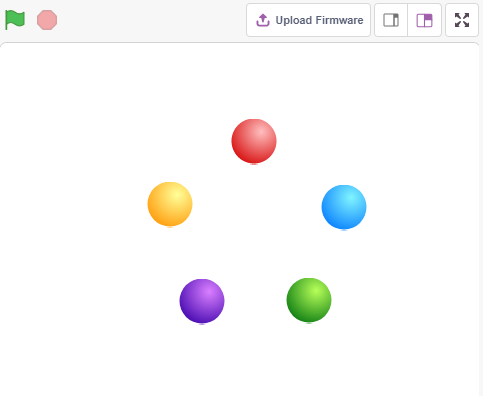
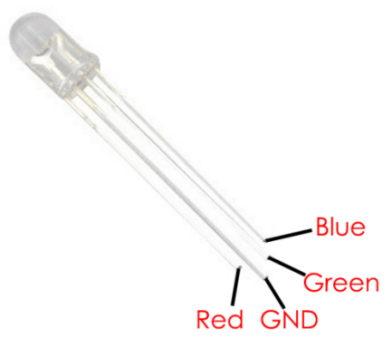
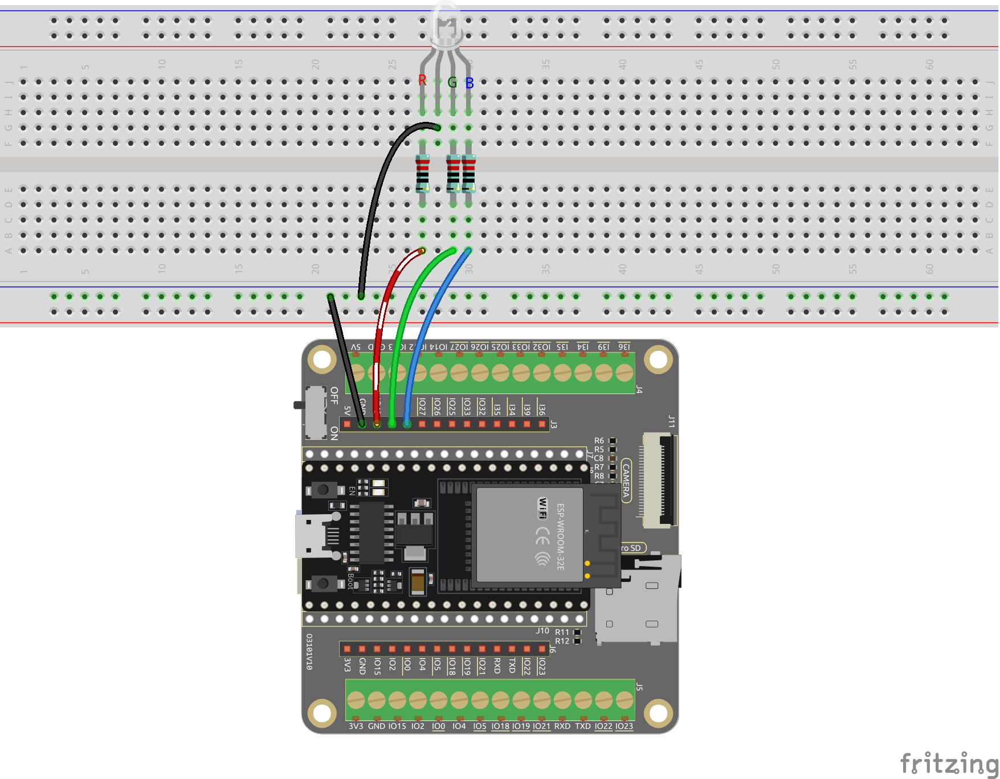
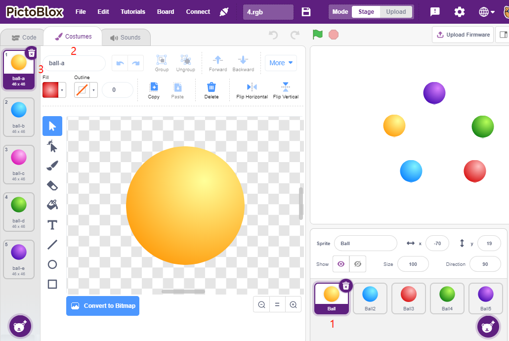
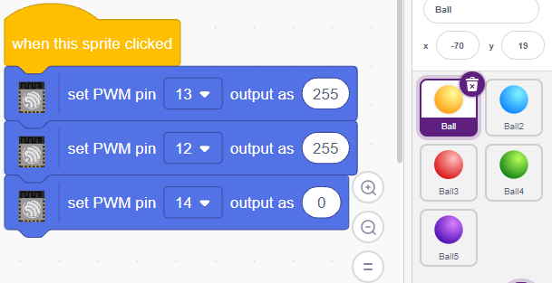
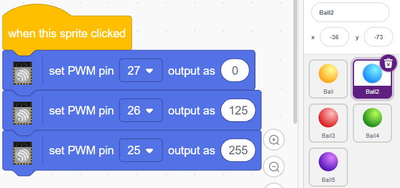
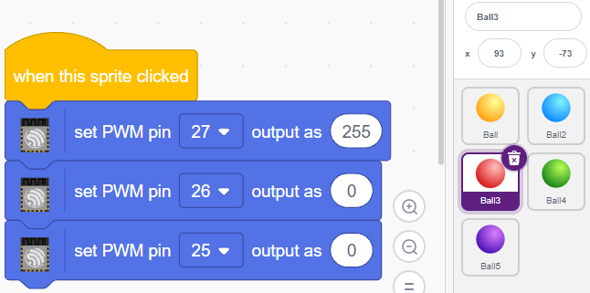
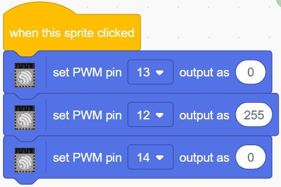
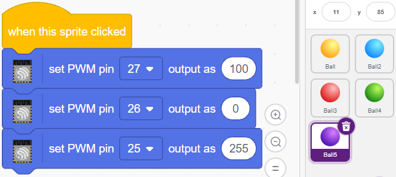

.. note::

    Hallo und willkommen in der SunFounder Raspberry Pi & Arduino & ESP32 Enthusiasten-Gemeinschaft auf Facebook! Tauchen Sie tiefer ein in die Welt von Raspberry Pi, Arduino und ESP32 mit anderen Enthusiasten.

    **Warum beitreten?**

    - **Expertenunterstützung**: Lösen Sie Nachverkaufsprobleme und technische Herausforderungen mit Hilfe unserer Gemeinschaft und unseres Teams.
    - **Lernen & Teilen**: Tauschen Sie Tipps und Anleitungen aus, um Ihre Fähigkeiten zu verbessern.
    - **Exklusive Vorschauen**: Erhalten Sie frühzeitigen Zugang zu neuen Produktankündigungen und exklusiven Einblicken.
    - **Spezialrabatte**: Genießen Sie exklusive Rabatte auf unsere neuesten Produkte.
    - **Festliche Aktionen und Gewinnspiele**: Nehmen Sie an Gewinnspielen und Feiertagsaktionen teil.

    👉 Sind Sie bereit, mit uns zu erkunden und zu erschaffen? Klicken Sie auf [|link_sf_facebook|] und treten Sie heute bei!

.. _sh_colorful_ball:

2.3 Farbenfrohe Bälle
=====================

In diesem Projekt werden wir die RGB-LEDs dazu bringen, verschiedene Farben anzuzeigen.

Durch Klicken auf unterschiedlich gefärbte Bälle im Bühnenbereich wird die RGB-LED in verschiedenen Farben leuchten.

Benötigte Komponenten
------------------------

Für dieses Projekt benötigen wir die folgenden Komponenten.

Es ist definitiv praktisch, ein ganzes Set zu kaufen. Hier ist der Link:

.. list-table::
    :widths: 20 20 20
    :header-rows: 1

    *   - Name	
        - ARTIKEL IN DIESEM KIT
        - LINK
    *   - ESP32 Starter Kit
        - 320+
        - |link_esp32_starter_kit|

Sie können sie auch separat über die untenstehenden Links kaufen.

.. list-table::
    :widths: 30 20
    :header-rows: 1

    *   - KOMPONENTENBESCHREIBUNG
        - KAUF-LINK

    *   - :ref:`cpn_esp32_wroom_32e`
        - |link_esp32_wroom_32e_buy|
    *   - :ref:`cpn_esp32_camera_extension`
        - \-
    *   - :ref:`cpn_breadboard`
        - |link_breadboard_buy|
    *   - :ref:`cpn_wires`
        - |link_wires_buy|
    *   - :ref:`cpn_resistor`
        - |link_resistor_buy|
    *   - :ref:`cpn_rgb`
        - |link_rgb_led_buy|

Was Sie Lernen Werden
---------------------

- Das Prinzip der RGB-LED
- Kopieren von Sprites und Auswahl verschiedener Kostüme
- Überlagerung der drei Grundfarben

Schaltung Aufbauen
---------------------

Eine RGB-LED beinhaltet drei LEDs in den Farben Rot, Grün und Blau in einer transparenten oder halbtransparenten Kunststoffhülle. Sie kann verschiedene Farben anzeigen, indem die Eingangsspannung an den drei Pins geändert und diese überlagert werden, was laut Statistik 16.777.216 verschiedene Farben erzeugen kann.

Programmierung
------------------

**1. Wähle ein Sprite aus**

Lösche das Standard-Sprite und wähle das **Ball**-Sprite aus.

.. image:: img/4_ball.png

Und dupliziere es 5 Mal.

.. image:: img/4_duplicate_ball.png

Wähle unterschiedliche Kostüme für diese 5 **Ball**-Sprites aus und verschiebe sie an die entsprechenden Positionen.

.. note::

    Die Kostümfarbe des **Ball3**-Sprites muss manuell in Rot geändert werden.

**2. RGB-LEDs in der entsprechenden Farbe leuchten lassen**

Bevor wir den Code verstehen, müssen wir das `RGB-Farbmodell <https://en.wikipedia.org/wiki/RGB_color_model>`_ verstehen.

Das RGB-Farbmodell ist ein additives Farbmodell, bei dem Rot-, Grün- und Blaulicht auf verschiedene Weise zusammengefügt werden, um ein breites Spektrum an Farben zu erzeugen.

Additive Farbmischung: Rot und Grün ergeben Gelb; Grün und Blau ergeben Cyan; Blau und Rot ergeben Magenta; alle drei Grundfarben zusammen ergeben Weiß.

.. image:: img/4_rgb_addition.png
  :width: 400

Der Code, um die RGB-LED gelb leuchten zu lassen, lautet daher wie folgt.

Wenn das Ball-Sprite (gelber Ball) angeklickt wird, setzen wir Pin 27 auf hoch (rote LED an), Pin 26 auf hoch (grüne LED an) und Pin 25 auf niedrig (blaue LED aus), sodass die RGB-LED gelb leuchtet.

Sie können für andere Sprites auf die gleiche Weise Codes schreiben, um die RGB-LEDs in den entsprechenden Farben leuchten zu lassen.

**3. Ball2-Sprite (hellblau)**

**4. Ball3-Sprite (rot)**

**5. Ball4-Sprite (grün)**

**6. Ball5-Sprite (lila)**

