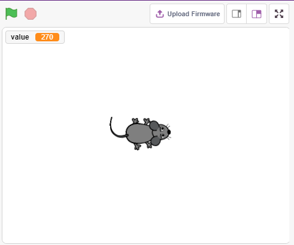
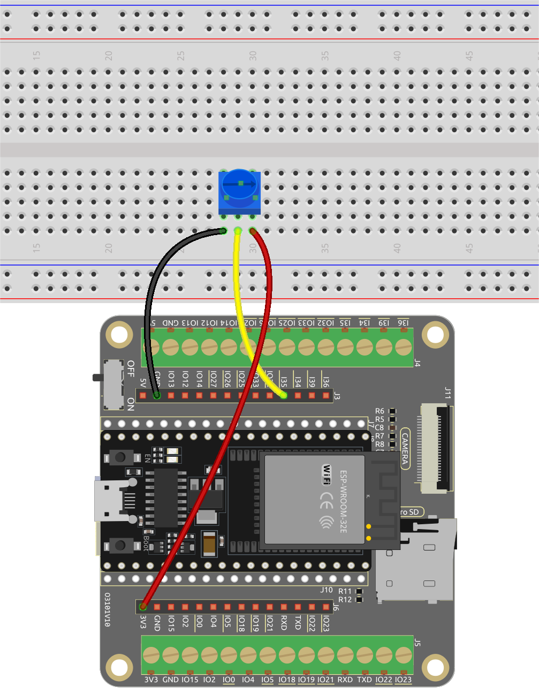
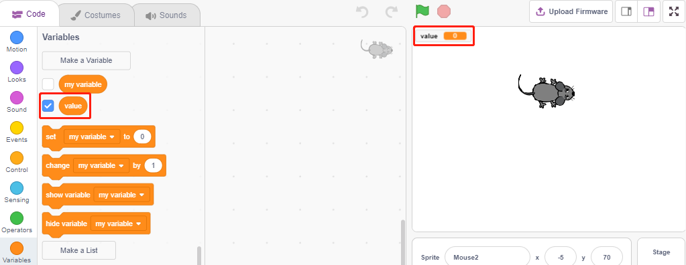
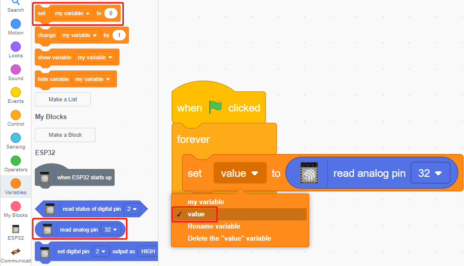
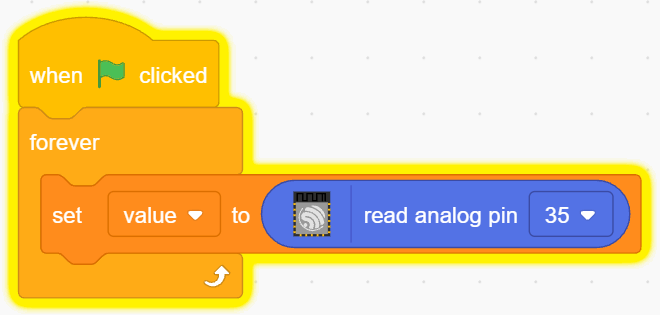
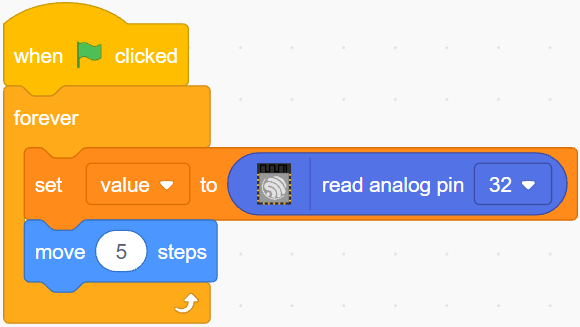
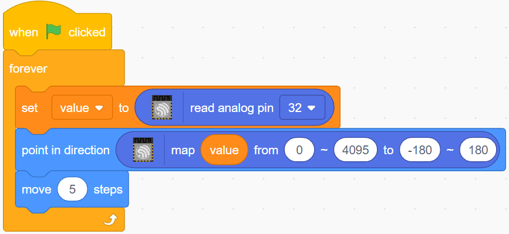

.. _sh_moving_mouse:

2.4 Moving Mouse
===================

Today we are going to make a mouse toy controlled by a potentiometer.

When the green flag is clicked, the mouse on the stage moves forward, and when you rotate the potentiometer, the mouse will change the direction of movement.

You Will Learn
---------------------

- Potentiometer principle
- Read analog pin and ranges
- Mapping one range to another
- Moving and changing the direction of sprite

Build the Circuit
-----------------------

The potentiometer is a resistive element with 3 terminals, the 2 side pins are connected to 5V and GND, and the middle pin is connected to pin35. After conversion by the ADC converter of the ESP32, the value range is 0-4095.

* :ref:`cpn_esp32_wroom_32e`
* :ref:`cpn_esp32_camera_extension`
* :ref:`cpn_breadboard`
* :ref:`cpn_pot`

Programming
------------------

**1. Choose a sprite**

Delete the default sprite, click the **Choose a Sprite** button in the lower right corner of the sprite area, enter **mouse** in the search box, and then click to add it.

.. image:: img/6_sprite.png

**2. Creating a variable**.

Create a variable called **value** to store the value of the potentiometer read.

Once created, you will see **value** appear inside the **Variables** palette and in the checked state, which means this variable will appear on the stage.

**3. Read the value of pin35**

Store the value of pin35 read into the variable **value**.

* [set my variable to 0]: Set the value of the variable.
* [read analog pin ()]: Read the value of pins in the range of 0-4095.

To be able to read all the way through, you need to use the [forever] block. Click on this script to run it, rotate the potentiometer in both directions, and you will see that the value range is 0-1023.

**4. Move the sprite**

Use the [move steps] block to move the sprite, run the script and you will see the sprite move from the middle to the right.

**5. Changing the sprite's direction**

Now change the direction of the sprite's movement by the value of pin35. Since the value of pin35 ranges from 0-4095, but the sprite's rotation direction is -180~180, a [map] block needs to be used.

Also add [when green flag clicked] at the beginning to start the script.

* [`point in direction <https://en.scratch-wiki.info/wiki/Point_in_Direction_()_(block)>`_]: Set the steering angle of the sprite, from **Motion** palette.
* [map from to]: Map a range to another range.

