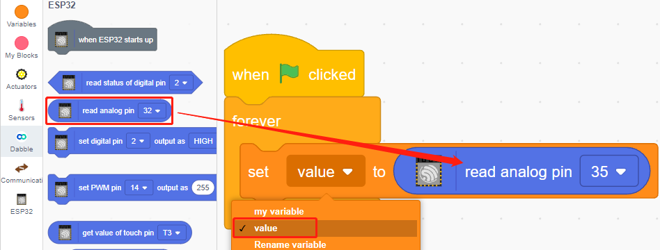

.. note::

    ¡Hola, bienvenido a la Comunidad de Aficionados a Raspberry Pi, Arduino y ESP32 de SunFounder en Facebook! Profundiza en Raspberry Pi, Arduino y ESP32 con otros entusiastas.

    **¿Por qué unirse?**

    - **Soporte de expertos**: Resuelve problemas posventa y desafíos técnicos con ayuda de nuestra comunidad y equipo.
    - **Aprender y compartir**: Intercambia consejos y tutoriales para mejorar tus habilidades.
    - **Vistas previas exclusivas**: Obtén acceso anticipado a anuncios de nuevos productos y avances.
    - **Descuentos especiales**: Disfruta de descuentos exclusivos en nuestros productos más nuevos.
    - **Promociones festivas y sorteos**: Participa en sorteos y promociones de fiestas.

     👉 ¿Listo para explorar y crear con nosotros? Haz clic en [|link_sf_facebook|] y únete hoy!

.. _sh_moving_mouse:

2.4 Ratón en Movimiento
=====================================

Hoy vamos a hacer un juguete de ratón controlado por un potenciómetro.

Cuando se hace clic en la bandera verde, el ratón en el escenario se mueve hacia adelante, y al girar el potenciómetro, el ratón cambiará la dirección de movimiento.

.. image:: img/6_mouse.png

Componentes necesarios
------------------------------

En este proyecto, necesitamos los siguientes componentes.

Definitivamente es conveniente comprar un kit completo, aquí está el enlace:

.. list-table::
    :widths: 20 20 20
    :header-rows: 1

    *   - Nombre	
        - ELEMENTOS EN ESTE KIT
        - ENLACE
    *   - Kit de inicio ESP32
        - 320+
        - |link_esp32_starter_kit|

También puedes comprarlos por separado en los enlaces a continuación.

.. list-table::
    :widths: 30 20
    :header-rows: 1

    *   - INTRODUCCIÓN DEL COMPONENTE
        - ENLACE DE COMPRA

    *   - :ref:`cpn_esp32_wroom_32e`
        - |link_esp32_wroom_32e_buy|
    *   - :ref:`cpn_esp32_camera_extension`
        - |link_esp32_extension_board|
    *   - :ref:`cpn_breadboard`
        - |link_breadboard_buy|
    *   - :ref:`cpn_wires`
        - |link_wires_buy|
    *   - :ref:`cpn_pot`
        - |link_potentiometer_buy|

Lo que aprenderás
---------------------

- Principio del potenciómetro
- Leer pin analógico y rangos
- Mapear un rango a otro
- Mover y cambiar la dirección del sprite

Construir el circuito
-----------------------

El potenciómetro es un elemento resistivo con 3 terminales, los pines laterales están conectados a 5V y GND, y el pin del medio está conectado al pin35. Después de la conversión por el convertidor ADC del ESP32, el rango de valores es 0-4095.

.. image:: img/circuit/5_moving_mouse_bb.png

Programación
------------------

**1. Elegir un sprite**

Elimina el sprite predeterminado, haz clic en el botón **Elegir un Sprite** en la esquina inferior derecha del área de sprites, ingresa **ratón** en la caja de búsqueda y luego haz clic para añadirlo.

.. image:: img/6_sprite.png

**2. Crear una variable**.

Crea una variable llamada **valor** para almacenar el valor leído del potenciómetro.

Una vez creada, verás **valor** aparecer dentro de la paleta **Variables** y en estado marcado, lo que significa que esta variable aparecerá en el escenario.

.. image:: img/6_value.png

**3. Leer el valor del pin35**

Almacena el valor leído del pin35 en la variable **valor**.

* [establecer mi variable a 0]: Establece el valor de la variable.
* [leer pin analógico ()]: Lee el valor de los pines en el rango de 0-4095.

Para poder leer de manera continua, necesitas usar el bloque [siempre]. Haz clic en este script para ejecutarlo, gira el potenciómetro en ambas direcciones y verás que el rango de valores es 0-1023.

.. image:: img/6_1023.png

**4. Mover el sprite**

Usa el bloque [mover pasos] para mover el sprite, ejecuta el script y verás que el sprite se mueve del medio hacia la derecha.

.. image:: img/6_move.png

**5. Cambiar la dirección del movimiento del sprite**

Ahora cambia la dirección del movimiento del sprite por el valor del pin35. Dado que el valor del pin35 varía de 0-4095, pero la dirección de rotación del sprite es de -180~180, se necesita usar un bloque [mapear].

También agrega [cuando se hace clic en la bandera verde] al principio para iniciar el script.

* [`apuntar en dirección <https://en.scratch-wiki.info/wiki/Point_in_Direction_()_(block)>`_]: Establece el ángulo de dirección del sprite, desde la paleta **Movimiento**.
* [mapear de a]: Mapea un rango a otro rango.

.. image:: img/6_direction.png

