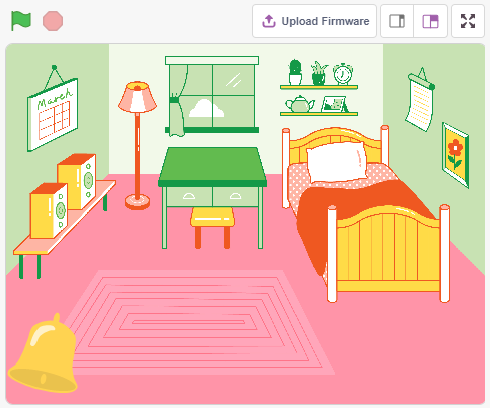
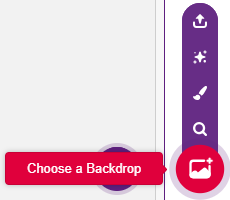
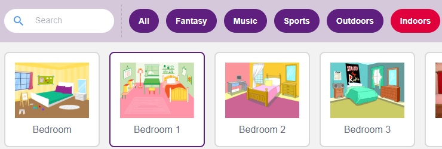
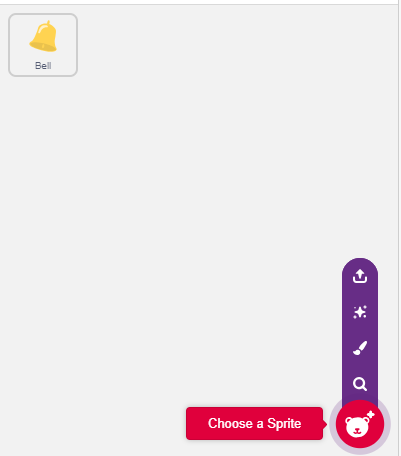
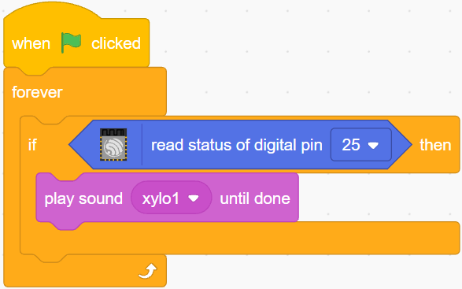

.. note::

    ¡Hola, bienvenido a la Comunidad de Aficionados a Raspberry Pi, Arduino y ESP32 de SunFounder en Facebook! Profundiza en Raspberry Pi, Arduino y ESP32 con otros entusiastas.

    **¿Por qué unirse?**

    - **Soporte de expertos**: Resuelve problemas posventa y desafíos técnicos con ayuda de nuestra comunidad y equipo.
    - **Aprender y compartir**: Intercambia consejos y tutoriales para mejorar tus habilidades.
    - **Vistas previas exclusivas**: Obtén acceso anticipado a anuncios de nuevos productos y avances.
    - **Descuentos especiales**: Disfruta de descuentos exclusivos en nuestros productos más nuevos.
    - **Promociones festivas y sorteos**: Participa en sorteos y promociones de fiestas.

    👉 ¿Listo para explorar y crear con nosotros? Haz clic en [|link_sf_facebook|] y únete hoy!

.. _sh_doorbell:

2.5 Timbre
======================

Aquí, usaremos el botón y la campana en el escenario para hacer un timbre.

Después de hacer clic en la bandera verde, puedes presionar el botón y la campana en el escenario emitirá un sonido.

Componentes necesarios
--------------------------

En este proyecto, necesitamos los siguientes componentes.

Definitivamente es conveniente comprar un kit completo, aquí está el enlace:

.. list-table::
    :widths: 20 20 20
    :header-rows: 1

    *   - Nombre	
        - ELEMENTOS EN ESTE KIT
        - ENLACE
    *   - Kit de inicio ESP32
        - 320+
        - |link_esp32_starter_kit|

También puedes comprarlos por separado en los enlaces a continuación.

.. list-table::
    :widths: 30 20
    :header-rows: 1

    *   - INTRODUCCIÓN DEL COMPONENTE
        - ENLACE DE COMPRA

    *   - :ref:`cpn_esp32_wroom_32e`
        - |link_esp32_wroom_32e_buy|
    *   - :ref:`cpn_esp32_camera_extension`
        - |link_esp32_extension_board|
    *   - :ref:`cpn_breadboard`
        - |link_breadboard_buy|
    *   - :ref:`cpn_wires`
        - |link_wires_buy|
    *   - :ref:`cpn_resistor`
        - |link_resistor_buy|
    *   - :ref:`cpn_button`
        - |link_button_buy|

Lo que aprenderás
---------------------

- Cómo funciona el botón
- Leyendo el pin digital y sus rangos
- Creando un bucle condicional
- Añadiendo un fondo
- Reproduciendo sonido

Construir el circuito
-----------------------

El botón es un dispositivo de 4 pines, ya que el pin 1 está conectado al pin 2, y el pin 3 al pin 4, cuando se presiona el botón, los 4 pines se conectan, cerrando así el circuito.

.. image:: img/5_buttonc.png

Construye el circuito según el siguiente diagrama.

* Conecta uno de los pines del lado izquierdo del botón al pin14, que está conectado a una resistencia de pull-down y un capacitor de 0.1uF (104) (para eliminar el jitter y emitir un nivel estable cuando el botón está funcionando).
* Conecta el otro extremo de la resistencia y el capacitor a GND, y uno de los pines del lado derecho del botón a 5V.

.. image:: img/circuit/6_doorbel_bb.png

Programación
------------------

**1. Añadir un fondo**

Haz clic en el botón **Elegir un fondo** en la esquina inferior derecha.

Elige **Dormitorio 1**.

**2. Seleccionar el sprite**

Elimina el sprite predeterminado, haz clic en el botón **Elegir un Sprite** en la esquina inferior derecha del área de sprites, ingresa **campana** en la caja de búsqueda y luego haz clic para añadirla.

Luego selecciona el sprite **campana** en el escenario y muévelo a la posición correcta.

**3. Presionar el botón y la campana hace un sonido**

Usa [si entonces] para hacer una declaración condicional que cuando el valor del pin14 leído sea igual a 1 (el botón está presionado), se reproducirá el sonido **xylo1**.

* [leer estado de pin digital]: Este bloque es de la paleta **ESP32** y se usa para leer el valor de un pin digital, el resultado es 0 o 1.
* [`si entonces <https://en.scratch-wiki.info/wiki/If_()_Then_(block)>`_]: Este bloque es un bloque de control y de la paleta **Control**. Si su condición booleana es verdadera, los bloques que contiene se ejecutarán, y luego el script involucrado continuará. Si la condición es falsa, los scripts dentro del bloque serán ignorados. La condición solo se verifica una vez; si la condición se vuelve falsa mientras el script dentro del bloque se está ejecutando, seguirá ejecutándose hasta que haya terminado.
* [reproducir sonido hasta que termine]: Este bloque es de la paleta de Sonido, usado para reproducir sonidos específicos.

