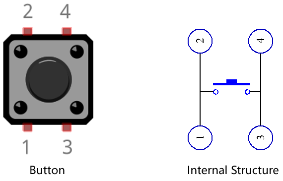

.. note::

    Hallo und willkommen in der SunFounder Raspberry Pi & Arduino & ESP32 Enthusiasten-Gemeinschaft auf Facebook! Tauchen Sie tiefer ein in die Welt von Raspberry Pi, Arduino und ESP32 mit anderen Enthusiasten.

    **Warum beitreten?**

    - **Expertenunterstützung**: Lösen Sie Nachverkaufsprobleme und technische Herausforderungen mit Hilfe unserer Gemeinschaft und unseres Teams.
    - **Lernen & Teilen**: Tauschen Sie Tipps und Anleitungen aus, um Ihre Fähigkeiten zu verbessern.
    - **Exklusive Vorschauen**: Erhalten Sie frühzeitigen Zugang zu neuen Produktankündigungen und exklusiven Einblicken.
    - **Spezialrabatte**: Genießen Sie exklusive Rabatte auf unsere neuesten Produkte.
    - **Festliche Aktionen und Gewinnspiele**: Nehmen Sie an Gewinnspielen und Feiertagsaktionen teil.

    👉 Sind Sie bereit, mit uns zu erkunden und zu erschaffen? Klicken Sie auf [|link_sf_facebook|] und treten Sie heute bei!

.. _sh_doorbell:

2.5 Türklingel
======================

Hier werden wir den Knopf und die Glocke auf der Bühne verwenden, um eine Türklingel zu machen.

Nachdem die grüne Flagge angeklickt wurde, können Sie den Knopf drücken und die Glocke auf der Bühne wird einen Ton machen.

.. image:: img/7_doorbell.png

Benötigte Komponenten
---------------------

Für dieses Projekt benötigen wir die folgenden Komponenten.

Es ist definitiv praktisch, ein ganzes Set zu kaufen. Hier ist der Link:

.. list-table::
    :widths: 20 20 20
    :header-rows: 1

    *   - Name	
        - ARTIKEL IN DIESEM KIT
        - LINK
    *   - ESP32 Starter Kit
        - 320+
        - |link_esp32_starter_kit|

Sie können sie auch separat über die untenstehenden Links kaufen.

.. list-table::
    :widths: 30 20
    :header-rows: 1

    *   - KOMPONENTENBESCHREIBUNG
        - KAUF-LINK

    *   - :ref:`cpn_esp32_wroom_32e`
        - |link_esp32_wroom_32e_buy|
    *   - :ref:`cpn_esp32_camera_extension`
        - |link_esp32_extension_board|
    *   - :ref:`cpn_breadboard`
        - |link_breadboard_buy|
    *   - :ref:`cpn_wires`
        - |link_wires_buy|
    *   - :ref:`cpn_resistor`
        - |link_resistor_buy|
    *   - :ref:`cpn_button`
        - |link_button_buy|

Was Sie Lernen Werden
---------------------

- Funktionsweise des Knopfes
- Digitalen Pin lesen und Bereich verstehen
- Erstellung einer bedingten Schleife
- Hinzufügen eines Hintergrunds
- Ton abspielen

Schaltung Aufbauen
-----------------------

Der Knopf ist ein 4-poliges Gerät, da Pin 1 mit Pin 2 verbunden ist und Pin 3 mit Pin 4, wenn der Knopf gedrückt wird, sind die 4 Pins verbunden, wodurch der Stromkreis geschlossen wird.

Bauen Sie die Schaltung gemäß dem folgenden Diagramm auf.

* Verbinden Sie einen der Pins auf der linken Seite des Knopfes mit Pin14, der mit einem Pull-Down-Widerstand und einem 0,1uF (104) Kondensator verbunden ist (um Schwankungen zu eliminieren und ein stabiles Level auszugeben, wenn der Knopf betätigt wird).
* Verbinden Sie das andere Ende des Widerstands und des Kondensators mit GND und einen der Pins auf der rechten Seite des Knopfes mit 5V.

.. image:: img/circuit/6_doorbel_bb.png

Programmierung
------------------

**1. Hintergrund hinzufügen**

Klicke auf den **Choose a Backdrop**-Button in der unteren rechten Ecke.

.. image:: img/7_backdrop.png

Wähle **Bedroom 1**.

.. image:: img/7_bedroom2.png

**2. Wähle ein Sprite aus**

Lösche das Standard-Sprite, klicke auf den **Choose a Sprite**-Button in der unteren rechten Ecke des Sprite-Bereichs, gib **bell** in das Suchfeld ein und klicke dann darauf, um es hinzuzufügen.

.. image:: img/7_sprite.png

Wähle dann das **bell**-Sprite auf der Bühne aus und verschiebe es an die richtige Position.

.. image:: img/7_doorbell.png

**3. Drücke den Knopf und die Glocke macht einen Ton**

Verwende [if then] um eine bedingte Aussage zu machen, dass wenn der Wert von Pin14 gelesen gleich 1 ist (der Knopf ist gedrückt), wird der Ton **xylo1** gespielt.

* [read status of digital pin]: Dieser Block stammt aus der **ESP32**-Palette und wird verwendet, um den Wert eines digitalen Pins zu lesen, das Ergebnis ist 0 oder 1.
* [`if then <https://en.scratch-wiki.info/wiki/If_()_Then_(block)>`_]: Dieser Block ist ein Steuerungsblock und stammt aus der **Control**-Palette. Wenn seine boolesche Bedingung wahr ist, werden die darin enthaltenen Blöcke ausgeführt und das beteiligte Skript wird fortgesetzt. Ist die Bedingung falsch, werden die Skripte im Block ignoriert. Die Bedingung wird nur einmal geprüft; wenn die Bedingung während des Laufens des Skripts im Block auf falsch wechselt, wird es weiterlaufen, bis es beendet ist.
* [play sound until done]: Dieser Block stammt aus der Ton-Palette und wird verwendet, um bestimmte Töne abzuspielen.

.. image:: img/7_bell.png
