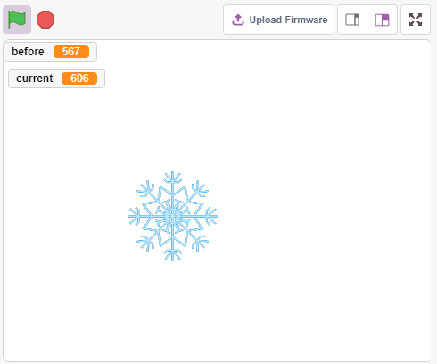
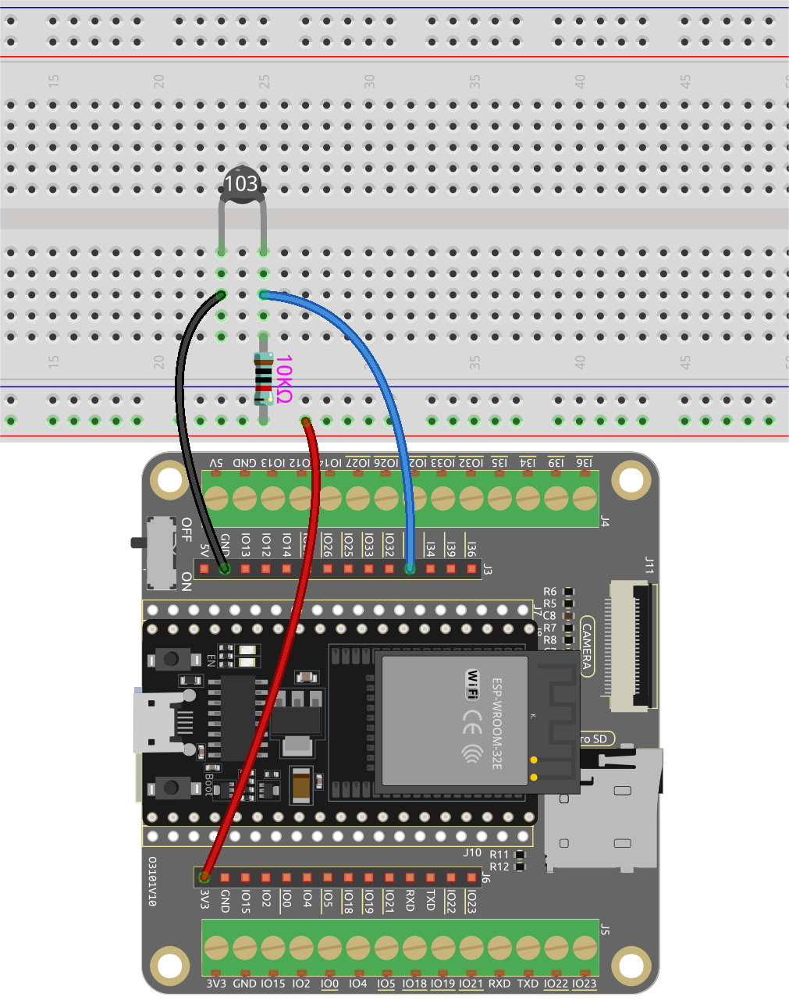
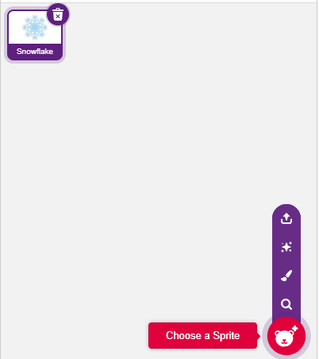
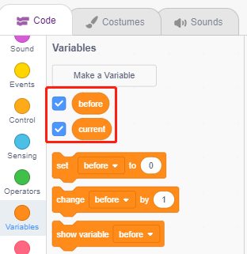
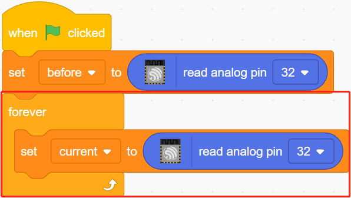
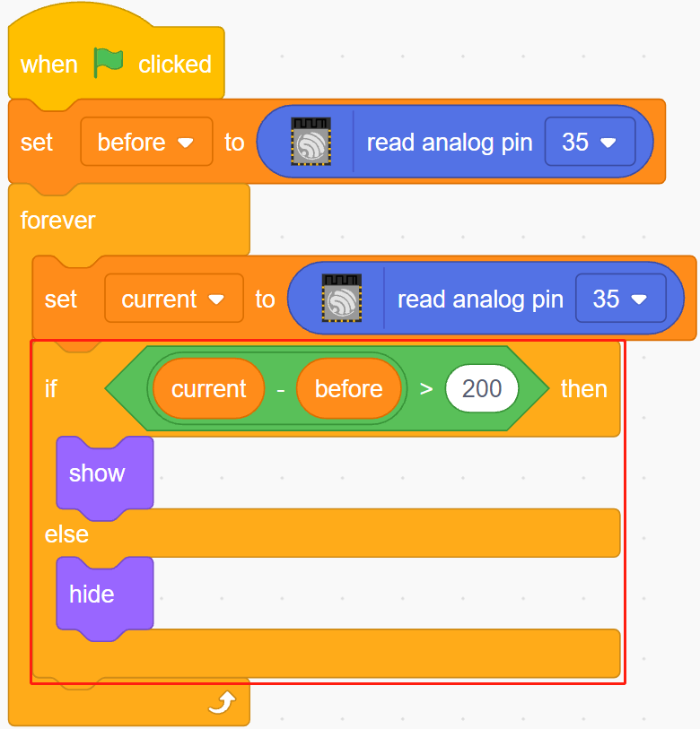

.. note::

    こんにちは、SunFounderのRaspberry Pi & Arduino & ESP32愛好家コミュニティへようこそ！Facebook上でRaspberry Pi、Arduino、ESP32についてもっと深く掘り下げ、他の愛好家と交流しましょう。

    **参加する理由は？**

    - **エキスパートサポート**：コミュニティやチームの助けを借りて、販売後の問題や技術的な課題を解決します。
    - **学び＆共有**：ヒントやチュートリアルを交換してスキルを向上させましょう。
    - **独占的なプレビュー**：新製品の発表や先行プレビューに早期アクセスしましょう。
    - **特別割引**：最新製品の独占割引をお楽しみください。
    - **祭りのプロモーションとギフト**：ギフトや祝日のプロモーションに参加しましょう。

    👉 私たちと一緒に探索し、創造する準備はできていますか？[|link_sf_facebook|]をクリックして今すぐ参加しましょう！

.. _sh_low_temperature:

2.6 低温アラーム
=========================

このプロジェクトでは、温度が閾値以下になると、ステージ上に **Snowflake** スプライトが現れる低温アラームシステムを作ります。

必要な部品
---------------------

このプロジェクトには、以下のコンポーネントが必要です。

全キットを購入すると便利です。こちらがリンクです:

.. list-table::
    :widths: 20 20 20
    :header-rows: 1

    *   - 名前	
        - このキットのアイテム
        - リンク
    *   - ESP32 Starter Kit
        - 320+
        - |link_esp32_starter_kit|

下記のリンクから個別に購入することもできます。

.. list-table::
    :widths: 30 20
    :header-rows: 1

    *   - コンポーネントの紹介
        - 購入リンク

    *   - :ref:`cpn_esp32_wroom_32e`
        - |link_esp32_wroom_32e_buy|
    *   - :ref:`cpn_esp32_camera_extension`
        - |link_esp32_extension_board|
    *   - :ref:`cpn_breadboard`
        - |link_breadboard_buy|
    *   - :ref:`cpn_wires`
        - |link_wires_buy|
    *   - :ref:`cpn_resistor`
        - |link_resistor_buy|
    *   - :ref:`cpn_thermistor`
        - |link_thermistor_buy|

学べること
---------------------

- サーミスターの原理
- 複数変数と減算操作

回路の構築
-----------------------

サーミスターは、標準の抵抗器よりも温度に強く依存する抵抗器であり、PTC（温度が上がると抵抗が上がる）とPTC（温度が上がると抵抗が下がる）の2種類があります。

以下の図に従って回路を組み立ててください。

サーミスターの一端をGNDに、もう一端をピン35に接続し、10K抵抗を5Vに直列に接続します。

ここで使用されるNTCサーミスターは、温度が上昇するとサーミスターの抵抗が下がり、ピン35の電圧分割が下がり、ピン35から得られる値が下がり、逆に上がります。

プログラミング
------------------

**1. スプライトを選択**

デフォルトのスプライトを削除し、スプライトエリアの右下にある **Choose a Sprite** ボタンをクリックし、検索ボックスに **Snowflake** と入力してからクリックして追加します。

**2. 2つの変数を作成**

**before** と **current** の2つの変数を作成し、異なるケースのピン35の値を保存します。

**3. ピン35の値を読む**

緑の旗がクリックされたら、ピン35の値を読み取って変数 **before** に保存します。

**4. ピン35の値を再度読む**

[forever]でピン35の値を再度読み取り、変数 **current** に保存します。

**5. 温度変化を判断する**

[if else] ブロックを使用して、ピン35の現在の値がbeforeより200以上かどうかを判断し、温度が下がったことを表します。この場合は **Snowflake** スプライトを表示し、そうでない場合は隠します。

* [-] & [>]: **Operators** パレットからの減算および比較演算子。

