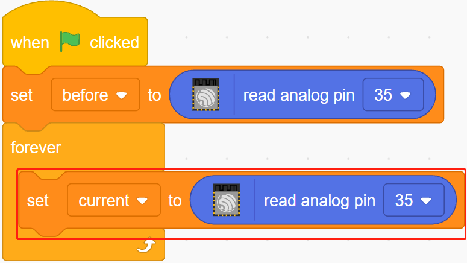

.. note::

    Ciao, benvenuto nella SunFounder Raspberry Pi & Arduino & ESP32 Enthusiasts Community su Facebook! Approfondisci Raspberry Pi, Arduino ed ESP32 insieme ad altri appassionati.

    **Perché unirti a noi?**

    - **Supporto esperto**: Risolvi problemi post-vendita e sfide tecniche con l'aiuto della nostra comunità e del nostro team.
    - **Impara e condividi**: Scambia suggerimenti e tutorial per migliorare le tue competenze.
    - **Anteprime esclusive**: Ottieni accesso anticipato agli annunci di nuovi prodotti e anteprime.
    - **Sconti speciali**: Approfitta di sconti esclusivi sui nostri prodotti più recenti.
    - **Promozioni e omaggi festivi**: Partecipa a omaggi e promozioni durante le festività.

    👉 Pronto a esplorare e creare con noi? Clicca su [|link_sf_facebook|] e unisciti oggi stesso!

.. _sh_low_temperature:

2.6 Allarme Bassa Temperatura
==================================

In questo progetto, realizzeremo un sistema di allarme per bassa temperatura: quando la temperatura scende sotto la soglia, lo sprite **Fiocco di Neve** apparirà sul palco.

.. image:: img/9_tem.png

Componenti Necessari
------------------------

In questo progetto, avremo bisogno dei seguenti componenti.

È sicuramente conveniente acquistare un kit completo, ecco il link:

.. list-table::
    :widths: 20 20 20
    :header-rows: 1

    *   - Nome	
        - ELEMENTI IN QUESTO KIT
        - LINK
    *   - ESP32 Starter Kit
        - 320+
        - |link_esp32_starter_kit|

Puoi anche acquistarli separatamente dai link qui sotto.

.. list-table::
    :widths: 30 20
    :header-rows: 1

    *   - INTRODUZIONE AI COMPONENTI
        - LINK PER L'ACQUISTO

    *   - :ref:`cpn_esp32_wroom_32e`
        - |link_esp32_wroom_32e_buy|
    *   - :ref:`cpn_esp32_camera_extension`
        - |link_esp32_extension_board|
    *   - :ref:`cpn_breadboard`
        - |link_breadboard_buy|
    *   - :ref:`cpn_wires`
        - |link_wires_buy|
    *   - :ref:`cpn_resistor`
        - |link_resistor_buy|
    *   - :ref:`cpn_thermistor`
        - |link_thermistor_buy|

Cosa Imparerai
---------------------

- Principio di funzionamento del termistore
- Operazioni multivariabili e sottrattive

Costruire il Circuito
-------------------------

Un termistore è un tipo di resistore la cui resistenza dipende fortemente dalla temperatura, molto più che nei resistori standard. Esistono due tipi di resistori: PTC (la resistenza aumenta con l'aumentare della temperatura) e NTC (la resistenza diminuisce con l'aumentare della temperatura).

Costruisci il circuito seguendo il diagramma seguente.

Un'estremità del termistore è collegata a GND, l'altra estremità è collegata al pin 35 e una resistenza da 10K è collegata in serie a 5V.

Qui viene utilizzato un termistore NTC, quindi quando la temperatura aumenta, la resistenza del termistore diminuisce, la divisione di tensione del pin 35 diminuisce e il valore ottenuto dal pin 35 diminuisce, e viceversa aumenta.

.. image:: img/circuit/7_low_temp_bb.png

Programmazione
----------------------

**1. Seleziona uno sprite**

Elimina lo sprite predefinito, fai clic sul pulsante **Scegli uno Sprite** nell'angolo in basso a destra dell'area degli sprite, inserisci **Fiocco di Neve** nella casella di ricerca e poi clicca per aggiungerlo.

.. image:: img/9_snow.png

**2. Crea 2 variabili**

Crea due variabili, **prima** e **attuale**, per memorizzare il valore del pin 35 in diverse situazioni.

.. image:: img/9_va.png

**3. Leggi il valore del pin 35**

Quando viene cliccata la bandiera verde, il valore del pin 35 viene letto e memorizzato nella variabile **prima**.

.. image:: img/9_before.png

**4. Leggi di nuovo il valore del pin 35**

In [per sempre], leggi di nuovo il valore del pin 35 e memorizzalo nella variabile **attuale**.

**5. Determinare i cambiamenti di temperatura**

Utilizzando il blocco [se altrimenti], determina se il valore attuale del pin 35 è superiore di 200 rispetto a prima, il che rappresenta una diminuzione della temperatura. A questo punto, fai apparire lo sprite **Fiocco di Neve**, altrimenti nascondilo.

* [-] & [>]: operatori di sottrazione e confronto dalla tavolozza **Operatori**.

