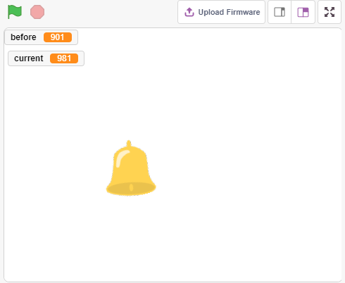
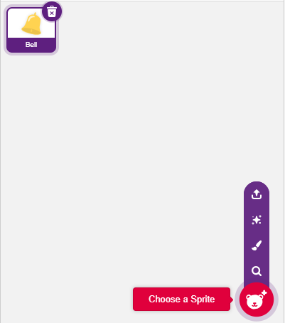
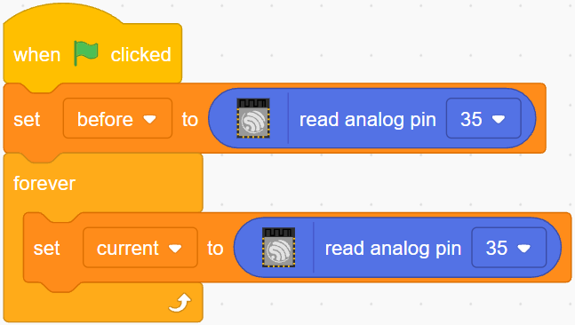
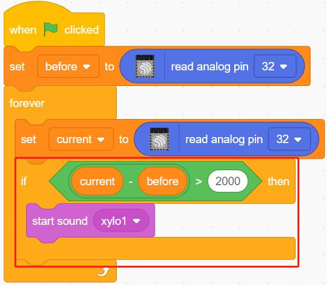
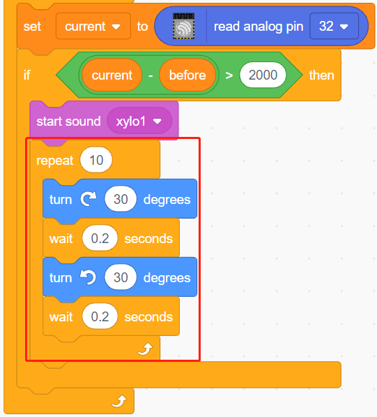
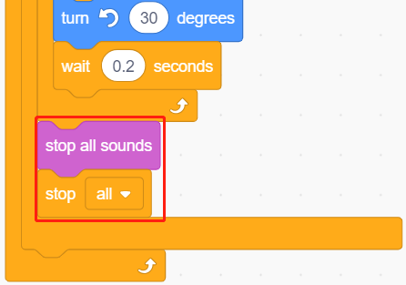

.. _sh_light_alarm:

2.7 光で制御する目覚まし時計
=============================

日常生活には様々な種類のアラーム時計がありますが、今回は光を感知して作動するアラーム時計を作ってみましょう。朝になり光の明るさが増すと、この光で制御するアラーム時計が時間になったことを知らせてくれます。

必要な部品
---------------------

このプロジェクトには、以下のコンポーネントが必要です。

全キットを購入すると便利です。こちらがリンクです:

.. list-table::
    :widths: 20 20 20
    :header-rows: 1

    *   - 名前
        - このキットのアイテム
        - リンク
    *   - ESP32 Starter Kit
        - 320+
        - |link_esp32_starter_kit|

下記のリンクから個別に購入することもできます。

.. list-table::
    :widths: 30 20
    :header-rows: 1

    *   - コンポーネントの紹介
        - 購入リンク

    *   - :ref:`cpn_esp32_wroom_32e`
        - |link_esp32_wroom_32e_buy|
    *   - :ref:`cpn_esp32_camera_extension`
        - \-
    *   - :ref:`cpn_breadboard`
        - |link_breadboard_buy|
    *   - :ref:`cpn_wires`
        - |link_wires_buy|
    *   - :ref:`cpn_resistor`
        - |link_resistor_buy|
    *   - :ref:`cpn_photoresistor`
        - |link_photoresistor_buy|

学べること
---------------------

- フォトレジスタの原理
- 音声再生の停止とスクリプトの実行停止

回路の構築
-----------------------

フォトレジスタまたはフォトセルは、光によって変化する可変抵抗器です。光の強さが増すとフォトレジスタの抵抗値は減少します。

以下の図に従って回路を組み立ててください。

フォトレジスタの一端を5Vに、もう一端をピン35に接続し、この端に10Kの抵抗をGNDと直列に接続します。

したがって、光の強度が増すとフォトレジスタの抵抗値は減少し、10K抵抗の分圧は増加し、ピン35から得られる値は大きくなります。

.. image:: img/circuit/8_light_alarm_bb.png

プログラミング
------------------

**1. スプライトを選択**

デフォルトのスプライトを削除し、スプライトエリアの右下にある **Choose a Sprite** ボタンをクリックし、検索ボックスに **bell** を入力してからクリックして追加します。

**2. ピン35の値を読む**

**before** と **current** の2つの変数を作成します。緑の旗がクリックされたとき、ピン35の値を読み取り、基準値として変数 **before** に保存します。[forever]では、ピン35の値を再度読み取り、変数 **current** に保存します。

**3. 音を鳴らす**

現在のピン35の値が前回の50よりも大きい場合、つまり現在の光の強度が閾値よりも大きいことを表すため、スプライトに音を出させます。

**4. スプライトを回転させる**

[turn block]を使用して、 **bell** スプライトが左右に回転し、アラーム効果を実現します。

**5. すべてを止める**

アラームがしばらく鳴り続けた後に停止します。

