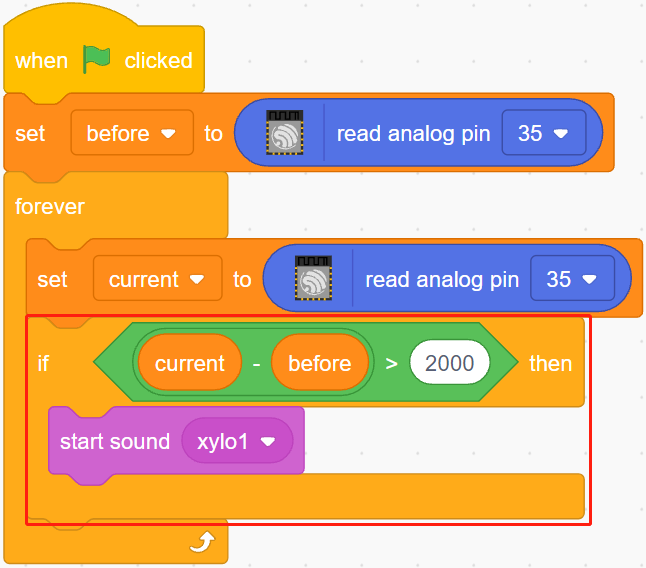

.. note::

    Hallo und willkommen in der SunFounder Raspberry Pi & Arduino & ESP32 Enthusiasten-Gemeinschaft auf Facebook! Tauchen Sie tiefer ein in die Welt von Raspberry Pi, Arduino und ESP32 mit anderen Enthusiasten.

    **Warum beitreten?**

    - **Expertenunterstützung**: Lösen Sie Nachverkaufsprobleme und technische Herausforderungen mit Hilfe unserer Gemeinschaft und unseres Teams.
    - **Lernen & Teilen**: Tauschen Sie Tipps und Anleitungen aus, um Ihre Fähigkeiten zu verbessern.
    - **Exklusive Vorschauen**: Erhalten Sie frühzeitigen Zugang zu neuen Produktankündigungen und exklusiven Einblicken.
    - **Spezialrabatte**: Genießen Sie exklusive Rabatte auf unsere neuesten Produkte.
    - **Festliche Aktionen und Gewinnspiele**: Nehmen Sie an Gewinnspielen und Feiertagsaktionen teil.

    👉 Sind Sie bereit, mit uns zu erkunden und zu erschaffen? Klicken Sie auf [|link_sf_facebook|] und treten Sie heute bei!

.. _sh_light_alarm:

2.7 Lichtwecker
======================

Im Alltag gibt es verschiedene Arten von Zeitweckern. Jetzt wollen wir einen lichtgesteuerten Wecker bauen. Wenn der Morgen kommt und die Helligkeit des Lichts zunimmt, wird dieser lichtgesteuerte Wecker Sie daran erinnern, dass es Zeit ist, aufzustehen.

.. image:: img/10_clock.png

Benötigte Komponenten
---------------------

Für dieses Projekt benötigen wir die folgenden Komponenten.

Es ist definitiv praktisch, ein ganzes Set zu kaufen. Hier ist der Link:

.. list-table::
    :widths: 20 20 20
    :header-rows: 1

    *   - Name	
        - ARTIKEL IN DIESEM KIT
        - LINK
    *   - ESP32 Starter Kit
        - 320+
        - |link_esp32_starter_kit|

Sie können sie auch separat über die untenstehenden Links kaufen.

.. list-table::
    :widths: 30 20
    :header-rows: 1

    *   - KOMPONENTENBESCHREIBUNG
        - KAUF-LINK

    *   - :ref:`cpn_esp32_wroom_32e`
        - |link_esp32_wroom_32e_buy|
    *   - :ref:`cpn_esp32_camera_extension`
        - \-
    *   - :ref:`cpn_breadboard`
        - |link_breadboard_buy|
    *   - :ref:`cpn_wires`
        - |link_wires_buy|
    *   - :ref:`cpn_resistor`
        - |link_resistor_buy|
    *   - :ref:`cpn_photoresistor`
        - |link_photoresistor_buy|

Was Sie Lernen Werden
---------------------

- Funktionsprinzip des Fotowiderstands
- Beenden der Tonwiedergabe und Beenden der Ausführung von Skripten

Schaltung Aufbauen
-----------------------

Ein Fotowiderstand oder eine Fotodiode ist ein lichtgesteuerter variabler Widerstand. Der Widerstand eines Fotowiderstands nimmt mit zunehmender einfallender Lichtintensität ab.

Bauen Sie die Schaltung gemäß dem folgenden Diagramm auf.

Verbinden Sie ein Ende des Fotowiderstands mit 5V, das andere Ende mit Pin35 und schalten Sie einen 10K-Widerstand in Serie mit GND an diesem Ende.

Wenn also die Lichtintensität zunimmt, verringert sich der Widerstand des Fotowiderstands, die Spannungsteilung des 10K-Widerstands nimmt zu, und der von Pin35 erhaltene Wert wird größer.

.. image:: img/circuit/8_light_alarm_bb.png

Programmierung
------------------

**1. Wähle ein Sprite aus**

Lösche das Standard-Sprite, klicke auf den **Choose a Sprite**-Button in der unteren rechten Ecke des Sprite-Bereichs, gib **bell** in das Suchfeld ein und klicke dann darauf, um es hinzuzufügen.

.. image:: img/10_sprite.png

**2. Lies den Wert von Pin35**

Erstelle zwei Variablen **before** und **current**. Wenn die grüne Flagge angeklickt wird, lese den Wert von Pin35 und speichere ihn in der Variablen **before** als Referenzwert. In [forever], lese den Wert von Pin35 erneut, speichere ihn in der Variablen **current**.

.. image:: img/10_reada0.png

**3. Einen Ton machen**

Wenn der Wert des aktuellen Pin35 um mehr als 50 über dem vorherigen liegt, was bedeutet, dass die aktuelle Lichtintensität größer als der Schwellenwert ist, dann lasse das Sprite einen Ton machen.

**4. Das Sprite drehen**

Verwende [turn block], um das **bell**-Sprite nach links und rechts zu drehen, um den Weckeffekt zu erzielen.

.. image:: img/10_turn.png

**5. Alles stoppen**

Stoppt den Alarm, wenn er eine Weile geklingelt hat.

.. image:: img/10_stop.png
