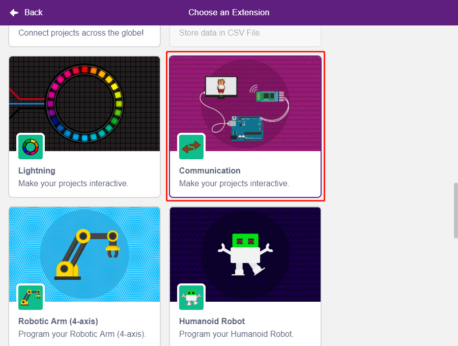
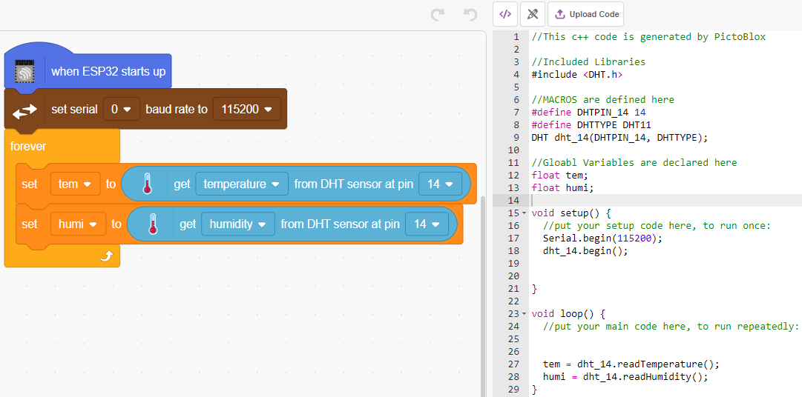
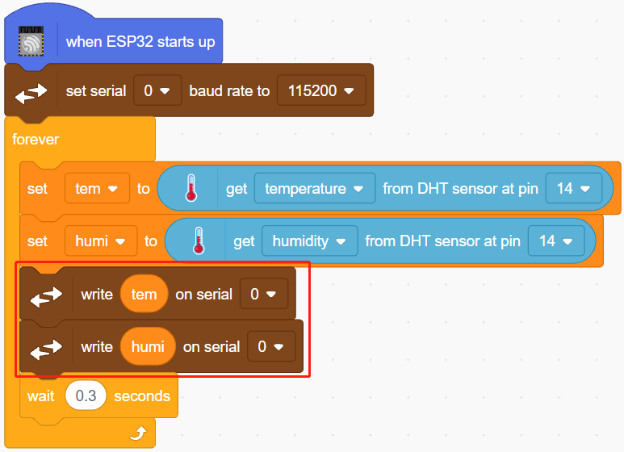

.. note::

    こんにちは、SunFounderのRaspberry Pi & Arduino & ESP32愛好家コミュニティへようこそ！Facebook上でRaspberry Pi、Arduino、ESP32についてもっと深く掘り下げ、他の愛好家と交流しましょう。

    **参加する理由は？**

    - **エキスパートサポート**：コミュニティやチームの助けを借りて、販売後の問題や技術的な課題を解決します。
    - **学び＆共有**：ヒントやチュートリアルを交換してスキルを向上させましょう。
    - **独占的なプレビュー**：新製品の発表や先行プレビューに早期アクセスしましょう。
    - **特別割引**：最新製品の独占割引をお楽しみください。
    - **祭りのプロモーションとギフト**：ギフトや祝日のプロモーションに参加しましょう。

    👉 私たちと一緒に探索し、創造する準備はできていますか？[|link_sf_facebook|]をクリックして今すぐ参加しましょう！

.. _sh_humiture:

2.8 温度と湿度の読み取り
=================================================

これまでのプロジェクトではステージモードを使用してきましたが、シリアル通信機能など、アップロードモードでのみ利用可能な機能があります。
このプロジェクトでは、 :ref:`アップロードモード` のシリアルモニターを使用して、DHT11の温度と湿度を印刷します。

.. image:: img/11_serial.png

必要な部品
---------------------

このプロジェクトには、以下のコンポーネントが必要です。

全キットを購入すると便利です。こちらがリンクです:

.. list-table::
    :widths: 20 20 20
    :header-rows: 1

    *   - 名前
        - このキットのアイテム
        - リンク
    *   - ESP32 Starter Kit
        - 320+
        - |link_esp32_starter_kit|

下記のリンクから個別に購入することもできます。

.. list-table::
    :widths: 30 20
    :header-rows: 1

    *   - コンポーネントの紹介
        - 購入リンク

    *   - :ref:`cpn_esp32_wroom_32e`
        - |link_esp32_wroom_32e_buy|
    *   - :ref:`cpn_esp32_camera_extension`
        - \-
    *   - :ref:`cpn_breadboard`
        - |link_breadboard_buy|
    *   - :ref:`cpn_wires`
        - |link_wires_buy|
    *   - :ref:`cpn_dht11`
        - |link_dht11_buy|

学べること
---------------------

- DHT11モジュールから温度と湿度を取得する
- :ref:`アップロードモード` のシリアルモニター
- 拡張機能の追加

回路の構築
-----------------------

デジタル温度と湿度センサーDHT11は、校正されたデジタル信号出力を持つ温度と湿度の複合センサーです。

以下の図に従って回路を組み立てます。

プログラミング
------------------

**1. 拡張機能の追加**

**Upload** モードに切り替え、左下隅の **Add Extension** ボタンをクリックしてから、 **Communication** を選択して追加します。すると、パレットエリアの最後に表示されます。

**2. ESP32とシリアルモニターの初期化**

**Upload** モードでESP32を起動し、その後シリアルポートのボーレートを設定します。

* [when ESP32 Starts up]: **Upload** モードでESP32を起動します。
* [set serial baud rate to]: **Communications** パレットから、シリアルポート0のボーレートを設定するために使用します。デフォルトは115200です。Mega2560を使用している場合は、シリアルポート0〜2のボーレートを設定することができます。

.. image:: img/11_init.png

**3. 温度と湿度を読み取る**

**tem** と **humi** という2つの変数を作成し、それぞれ温度と湿度を格納します。ブロックをドラッグアンドドロップすると、コードが右側に表示されます。

**4. シリアルモニターに表示する**

読み取った温度と湿度をシリアルモニターに書き込みます。PictoBloxがジャムを起こす原因となる過度な速度での転送を避けるために、[wait seconds]ブロックを使用し、次の印刷のための時間間隔を設けます。

**5. コードをアップロードする**

**Stage** モードとは異なり、 **Upload** モードのコードは、効果を確認するために **Upload Code** ボタンを使用してESP32ボードにアップロードする必要があります。これにより、USBケーブルを抜いてもプログラムが実行され続けます。

.. image:: img/11_upload.png

**6. シリアルモニターを開く**

今、 **Serial Monitor** を開いて温度と湿度を確認しましょう。

.. image:: img/11_serial.png
