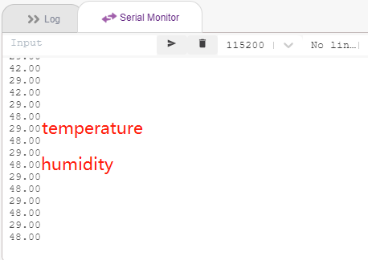

.. _sh_humiture:

2.8 Temperatur und Luftfeuchtigkeit lesen
=================================================

In vorherigen Projekten haben wir den Bühnenmodus verwendet, aber einige Funktionen sind nur im Upload-Modus verfügbar, wie zum Beispiel die serielle Kommunikationsfunktion.
In diesem Projekt werden wir die Temperatur und Luftfeuchtigkeit des DHT11 über den Serial Monitor im :ref:`upload_mode` ausgeben.

Benötigte Komponenten
---------------------

Für dieses Projekt benötigen wir die folgenden Komponenten.

Es ist definitiv praktisch, ein ganzes Set zu kaufen. Hier ist der Link:

.. list-table::
    :widths: 20 20 20
    :header-rows: 1

    *   - Name	
        - ARTIKEL IN DIESEM KIT
        - LINK
    *   - ESP32 Starter Kit
        - 320+
        - |link_esp32_starter_kit|

Sie können sie auch separat über die untenstehenden Links kaufen.

.. list-table::
    :widths: 30 20
    :header-rows: 1

    *   - KOMPONENTENBESCHREIBUNG
        - KAUF-LINK

    *   - :ref:`cpn_esp32_wroom_32e`
        - |link_esp32_wroom_32e_buy|
    *   - :ref:`cpn_esp32_camera_extension`
        - \-
    *   - :ref:`cpn_breadboard`
        - |link_breadboard_buy|
    *   - :ref:`cpn_wires`
        - |link_wires_buy|
    *   - :ref:`cpn_dht11`
        - |link_dht11_buy|

Was Sie Lernen Werden
---------------------

- Temperatur und Luftfeuchtigkeit vom DHT11-Modul erhalten
- Serial Monitor für :ref:`upload_mode`
- Erweiterung hinzufügen

Schaltung Aufbauen
-----------------------

Der digitale Temperatur- und Feuchtigkeitssensor DHT11 ist ein zusammengesetzter Sensor, der einen kalibrierten digitalen Signalausgang von Temperatur und Feuchtigkeit enthält.

Bauen Sie die Schaltung gemäß dem folgenden Diagramm auf.

.. image:: img/circuit/9_dht11_bb.png

Programmierung
------------------

**1. Erweiterungen hinzufügen**

Wechseln Sie in den **Upload**-Modus, klicken Sie auf den Button **Add Extension** in der unteren linken Ecke, wählen Sie dann **Communication** aus, um es hinzuzufügen, und es wird am Ende des Palettenbereichs erscheinen.

.. image:: img/11_addcom.png

**2. Initialisierung des ESP32 und des Serial Monitors**

Im **Upload**-Modus starten Sie den ESP32 und setzen dann die Baudrate des seriellen Ports.

* [when ESP32 Starts up]: Im **Upload**-Modus starten Sie den ESP32.
* [set serial baud rate to]: Aus der **Communications**-Palette, verwendet um die Baudrate von seriellen Port 0 zu setzen, Standard ist 115200. Wenn Sie Mega2560 verwenden, können Sie wählen, die Baudrate in seriellen Port 0~2 zu setzen.

.. image:: img/11_init.png

**3. Temperatur und Luftfeuchtigkeit lesen**

Erstellen Sie 2 Variablen **tem** und **humi** um die Temperatur und Luftfeuchtigkeit jeweils zu speichern, der Code erscheint auf der rechten Seite, während Sie den Block ziehen und ablegen.

.. image:: img/11_readtem.png

**4. Auf dem Serial Monitor ausgeben**

Schreiben Sie die gelesene Temperatur und Luftfeuchtigkeit auf den Serial Monitor. Um zu vermeiden, dass zu schnell übertragen wird und PictoBlox ins Stocken gerät, verwenden Sie den [wait seconds]-Block, um etwas Zeitintervall für die nächste Ausgabe hinzuzufügen.

.. image:: img/11_writeserial.png

**5. Code hochladen**

Im Gegensatz zum **Stage**-Modus muss der Code im **Upload**-Modus auf das ESP32-Board hochgeladen werden, um den Effekt zu sehen, indem Sie den Button **Upload Code** verwenden. So können Sie auch das USB-Kabel abziehen und das Programm weiterlaufen lassen.

.. image:: img/11_upload.png

**6. Serial Monitor öffnen**

Öffnen Sie jetzt den **Serial Monitor**, um die Temperatur und Luftfeuchtigkeit zu sehen.

