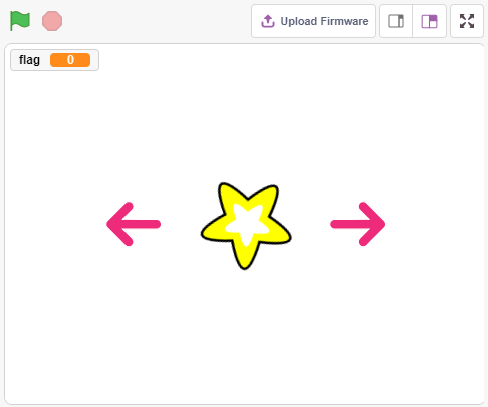
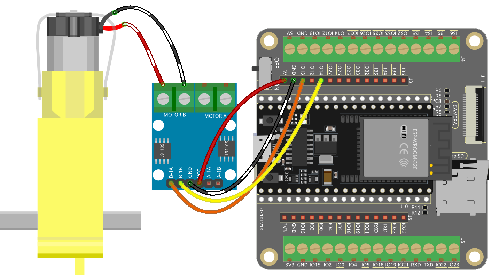
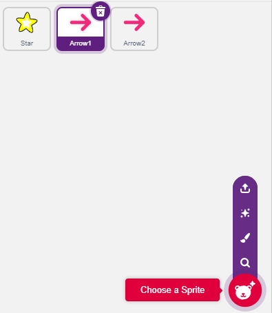
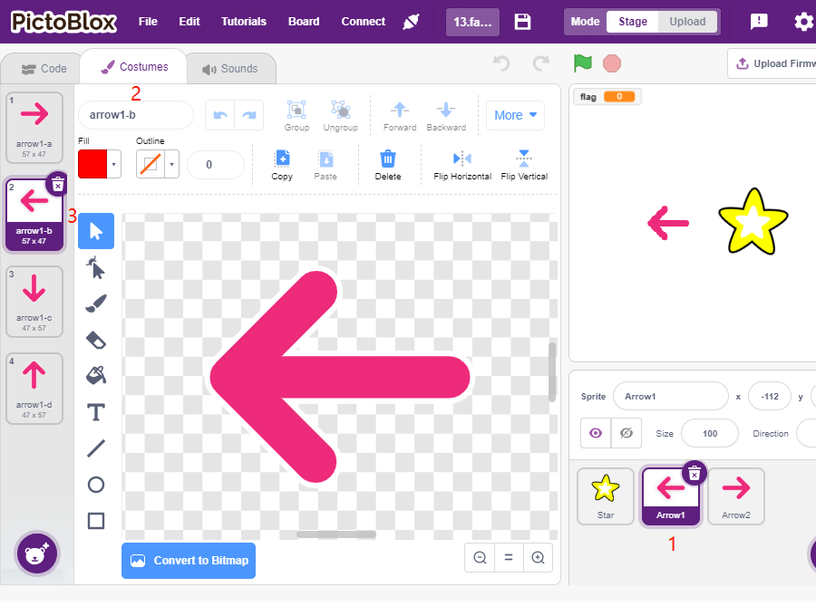
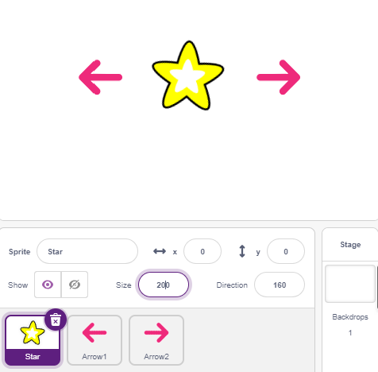
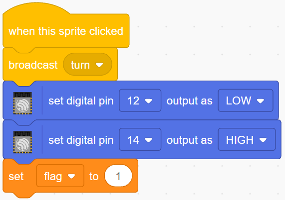
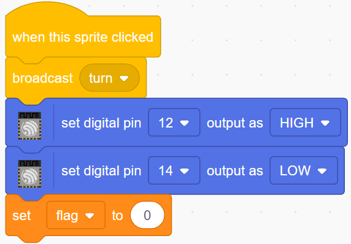
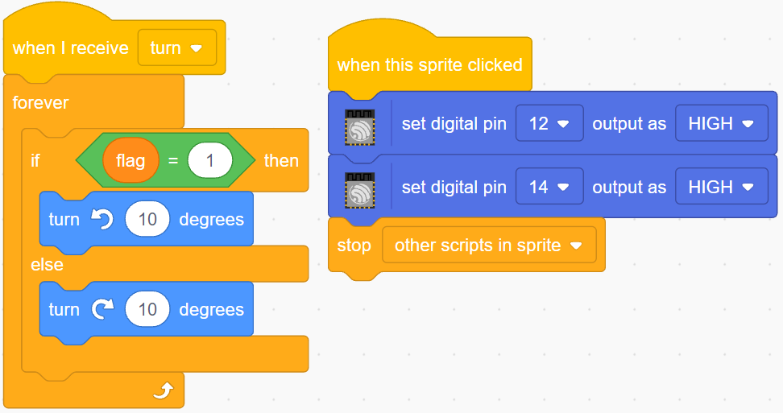

    Bonjour et bienvenue dans la communauté des passionnés de SunFounder Raspberry Pi, Arduino et ESP32 sur Facebook ! Plongez plus profondément dans Raspberry Pi, Arduino et ESP32 avec d'autres passionnés.

    **Pourquoi nous rejoindre ?**

    - **Support d'experts** : Résolvez les problèmes après-vente et les défis techniques avec l'aide de notre communauté et de notre équipe.
    - **Apprendre & Partager** : Échangez des astuces et des tutoriels pour améliorer vos compétences.
    - **Aperçus exclusifs** : Accédez en avant-première aux annonces de nouveaux produits et aux avant-premières.
    - **Réductions exclusives** : Profitez de réductions exclusives sur nos nouveaux produits.
    - **Promotions festives et cadeaux** : Participez à des cadeaux et à des promotions festives.

    👉 Prêt à explorer et créer avec nous ? Cliquez sur [|link_sf_facebook|] et rejoignez-nous dès aujourd'hui !

.. _sh_rotating_fan:

2.9 Ventilateur Rotatif
=============================

Dans ce projet, nous allons créer un sprite étoile tournante et un ventilateur.

En cliquant sur les sprites flèche gauche et flèche droite sur la scène, vous contrôlerez la rotation horaire et antihoraire du moteur et du sprite étoile. Cliquez sur le sprite étoile pour arrêter la rotation.

Composants nécessaires
--------------------------

Pour ce projet, nous avons besoin des composants suivants.

Il est certainement pratique d'acheter un kit complet, voici le lien : 

.. list-table::
    :widths: 20 20 20
    :header-rows: 1

    *   - Nom	
        - ARTICLES DANS CE KIT
        - LIEN
    *   - Kit de démarrage ESP32
        - 320+
        - |link_esp32_starter_kit|

Vous pouvez également les acheter séparément via les liens ci-dessous.

.. list-table::
    :widths: 30 20
    :header-rows: 1

    *   - INTRODUCTION DES COMPOSANTS
        - LIEN D'ACHAT

    *   - :ref:`cpn_esp32_wroom_32e`
        - |link_esp32_wroom_32e_buy|
    *   - :ref:`cpn_esp32_camera_extension`
        - |link_esp32_extension_board|
    *   - :ref:`cpn_breadboard`
        - |link_breadboard_buy|
    *   - :ref:`cpn_wires`
        - |link_wires_buy|
    *   - :ref:`cpn_motor`
        - |link_motor_buy|
    *   - :ref:`cpn_l293d`
        - \-

Ce que vous apprendrez
------------------------------

- Principe de fonctionnement du moteur
- Fonction de diffusion
- Arrêter les autres scripts dans le bloc de sprite

Construire le circuit
----------------------------

Programmation
-----------------

L'effet que nous voulons obtenir est d'utiliser 2 sprites flèche pour contrôler la rotation horaire et antihoraire du moteur et du sprite étoile respectivement. En cliquant sur le sprite étoile, vous arrêterez le moteur de tourner.

**1. Ajouter des sprites**

Supprimez le sprite par défaut, puis sélectionnez le sprite **Star** et le sprite **Arrow1**, et copiez **Arrow1** une fois.

Dans l'option **Costumes**, changez le costume du sprite **Arrow1** en une direction différente.

Ajustez la taille et la position du sprite de manière appropriée.

**2. Sprite flèche gauche**

Lorsque ce sprite est cliqué, il diffuse un message - tourner, puis règle la broche numérique 12 sur bas et la broche 14 sur haut, et définit la variable **flag** sur 1. Si vous cliquez sur le sprite flèche gauche, vous constaterez que le moteur tourne dans le sens antihoraire, si votre tour est horaire, alors vous inversez les positions des broches 12 et 14.

Il y a deux points à noter ici.

* `[broadcast <https://en.scratch-wiki.info/wiki/Broadcast>`_]: de la palette **Événements**, utilisé pour diffuser un message aux autres sprites. Lorsque les autres sprites reçoivent ce message, ils exécutent un événement spécifique. Par exemple, ici c'est **tourner**, lorsque le sprite **étoile** reçoit ce message, il exécute le script de rotation.
* Variable flag : La direction de rotation du sprite étoile est déterminée par la valeur de flag. Donc, lorsque vous créez la variable **flag**, vous devez la rendre applicable à tous les sprites.

**3. Sprite flèche droite**

Lorsque ce sprite est cliqué, il diffuse un message tourner, puis règle la broche numérique 12 sur haut et la broche 14 sur bas pour faire tourner le moteur dans le sens horaire et définit la variable **flag** sur 0.

**4. Sprite étoile**

Il y a deux événements inclus ici.

* Lorsque le sprite **étoile** reçoit le message diffusé tourner, il détermine la valeur de flag ; si flag est 1, il tourne de 10 degrés vers la gauche, sinon il inverse. Comme il est dans [FOREVER], il continuera à tourner.
* Lorsque ce sprite est cliqué, réglez les deux broches du moteur sur haut pour qu'il cesse de tourner et arrêtez les autres scripts dans ce sprite.

