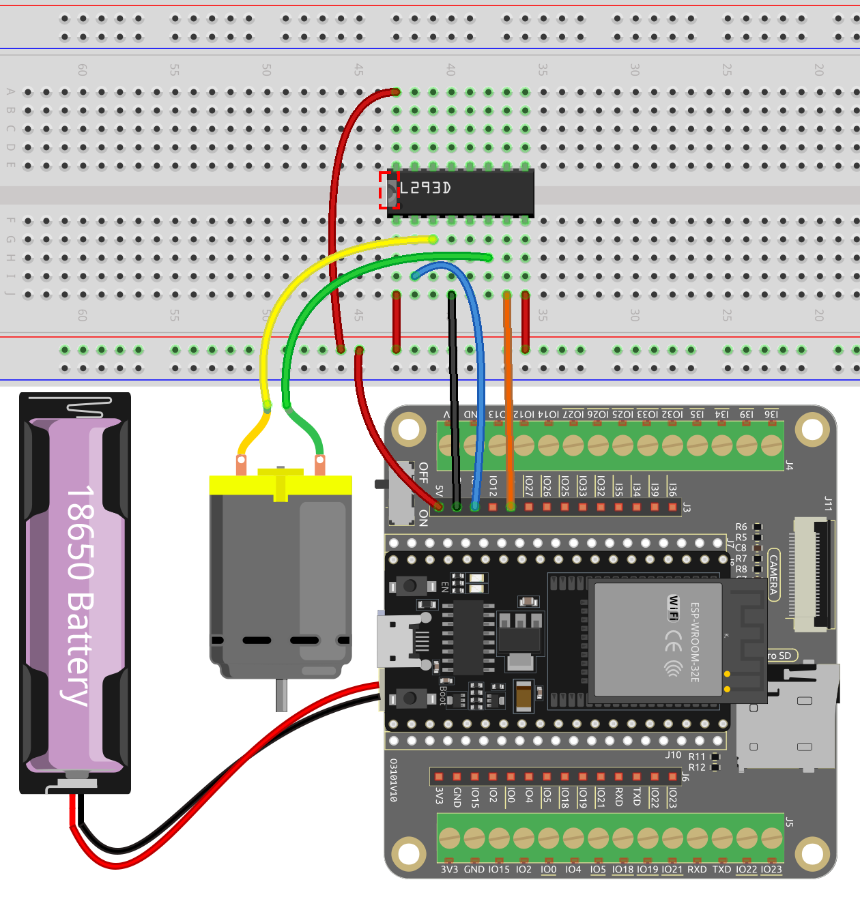
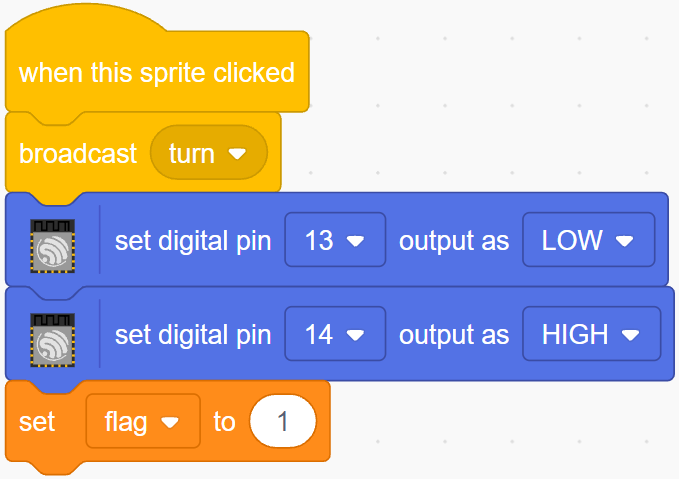

.. note::

    こんにちは、SunFounderのRaspberry Pi & Arduino & ESP32愛好家コミュニティへようこそ！Facebook上でRaspberry Pi、Arduino、ESP32についてもっと深く掘り下げ、他の愛好家と交流しましょう。

    **参加する理由は？**

    - **エキスパートサポート**：コミュニティやチームの助けを借りて、販売後の問題や技術的な課題を解決します。
    - **学び＆共有**：ヒントやチュートリアルを交換してスキルを向上させましょう。
    - **独占的なプレビュー**：新製品の発表や先行プレビューに早期アクセスしましょう。
    - **特別割引**：最新製品の独占割引をお楽しみください。
    - **祭りのプロモーションとギフト**：ギフトや祝日のプロモーションに参加しましょう。

    👉 私たちと一緒に探索し、創造する準備はできていますか？[|link_sf_facebook|]をクリックして今すぐ参加しましょう！

.. _sh_rotating_fan:

2.9 回転するファン
========================

このプロジェクトでは、回転する星のスプライトとファンを作ります。

ステージ上の左右の矢印スプライトをクリックすると、モーターと星スプライトの時計回りと反時計回りの回転が制御されます。星スプライトをクリックすると回転が停止します。

.. image:: img/13_fan.png

必要な部品
---------------------

このプロジェクトには、以下のコンポーネントが必要です。

全キットを購入すると便利です。こちらがリンクです:

.. list-table::
    :widths: 20 20 20
    :header-rows: 1

    *   - 名前
        - このキットのアイテム
        - リンク
    *   - ESP32 Starter Kit
        - 320+
        - |link_esp32_starter_kit|

下記のリンクから個別に購入することもできます。

.. list-table::
    :widths: 30 20
    :header-rows: 1

    *   - コンポーネントの紹介
        - 購入リンク

    *   - :ref:`cpn_esp32_wroom_32e`
        - |link_esp32_wroom_32e_buy|
    *   - :ref:`cpn_esp32_camera_extension`
        - |link_esp32_extension_board|
    *   - :ref:`cpn_breadboard`
        - |link_breadboard_buy|
    *   - :ref:`cpn_wires`
        - |link_wires_buy|
    *   - :ref:`cpn_motor`
        - |link_motor_buy|
    *   - :ref:`cpn_l293d`
        - \-

学べること
---------------------

- モーターの動作原理
- ブロードキャスト機能
- スプライト内の他のスクリプトを停止するブロック

回路の構築
-----------------------

プログラミング
------------------
私たちが達成したい効果は、ステージ上の2つの矢印スプライトを使って、それぞれモーターと星スプライトの時計回りと反時計回りの回転を制御することです。星スプライトをクリックするとモーターの回転が停止します。

**1. スプライトの追加**

デフォルトのスプライトを削除し、 **Star** スプライトと **Arrow1** スプライトを選択し、 **Arrow1** を一度コピーします。

.. image:: img/13_star.png

**Costumes** オプションで、 **Arrow1** スプライトを異なる方向のコスチュームに変更します。

.. image:: img/13_star1.png

スプライトのサイズと位置を適切に調整します。

.. image:: img/13_star2.png

**2. 左矢印スプライト**

このスプライトがクリックされたとき、メッセージ - 回転をブロードキャストし、デジタルピン12を低く、ピン14を高く設定し、変数 **flag** を1に設定します。左矢印スプライトをクリックすると、モーターが反時計回りに回転しますが、もしそれが時計回りに回転する場合は、ピン12とピン14の位置を交換します。

ここで注意すべき2点があります。

* `[broadcast <https://en.scratch-wiki.info/wiki/Broadcast>`_]: **Events** パレットから、他のスプライトにメッセージをブロードキャストするために使用されます。他のスプライトがこのメッセージを受信すると、特定のイベントが実行されます。 たとえば、 **turn** では、 **star** スプライトがこのメッセージを受信すると、回転スクリプトを実行します。
* 変数flag: 星スプライトの回転方向はflagの値によって決まります。ですので、 **flag** 変数を作成するときは、すべてのスプライトに適用するようにしてください。

**3. 右矢印スプライト**

このスプライトがクリックされたとき、メッセージturnをブロードキャストし、デジタルピン12を高く、ピン14を低く設定してモーターを時計回りに回転させ、変数 **flag** を0に設定します。

.. image:: img/13_right.png

**4. 星スプライト**

ここには2つのイベントが含まれています。

* **star** スプライトがブロードキャストされたメッセージ ターンを受信すると、フラグの値が決定されます。 flag が 1 の場合は左に 10 度回転し、それ以外の場合は反転します。[FOREVER]になっているので回り続けます。
* このスプライトがクリックされたとき、モーターの両方のピンを高く設定して回転を停止させ、このスプライト内の他のスクリプトを停止します。

.. image:: img/13_broadcast.png

