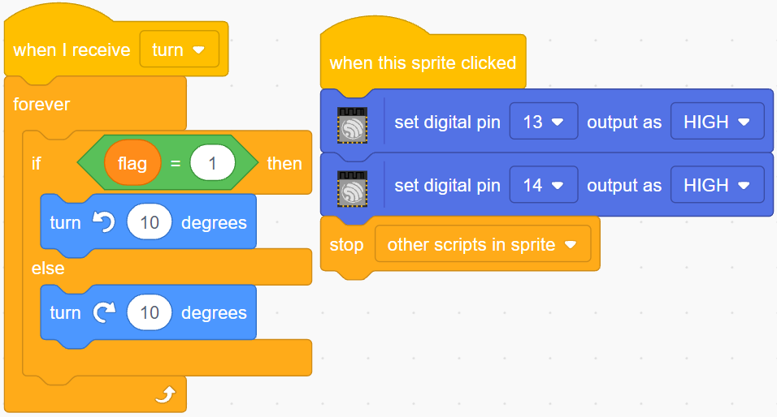

.. _sh_rotating_fan:

2.9 Rotierender Ventilator
============================

In diesem Projekt werden wir ein rotierendes Stern-Sprite und einen Ventilator bauen.

Durch Klicken auf die links- und rechtsweisenden Pfeil-Sprites auf der Bühne wird die Drehrichtung des Motors und des Stern-Sprites im Uhrzeigersinn und gegen den Uhrzeigersinn gesteuert. Ein Klick auf das Stern-Sprite stoppt die Drehung.

.. image:: img/13_fan.png

Benötigte Komponenten
---------------------

Für dieses Projekt benötigen wir die folgenden Komponenten.

Es ist definitiv praktisch, ein ganzes Set zu kaufen. Hier ist der Link:

.. list-table::
    :widths: 20 20 20
    :header-rows: 1

    *   - Name	
        - ARTIKEL IN DIESEM KIT
        - LINK
    *   - ESP32 Starter Kit
        - 320+
        - |link_esp32_starter_kit|

Sie können sie auch separat über die untenstehenden Links kaufen.

.. list-table::
    :widths: 30 20
    :header-rows: 1

    *   - KOMPONENTENBESCHREIBUNG
        - KAUF-LINK

    *   - :ref:`cpn_esp32_wroom_32e`
        - |link_esp32_wroom_32e_buy|
    *   - :ref:`cpn_esp32_camera_extension`
        - \-
    *   - :ref:`cpn_breadboard`
        - |link_breadboard_buy|
    *   - :ref:`cpn_wires`
        - |link_wires_buy|
    *   - :ref:`cpn_motor`
        - |link_motor_buy|
    *   - :ref:`cpn_l293d`
        - \-

Was Sie Lernen Werden
---------------------

- Funktionsprinzip des Motors
- Broadcast-Funktion
- Block zum Stoppen anderer Skripte im Sprite

Schaltung Aufbauen
-----------------------

.. image:: img/circuit/10_rotaing_fan_bb.png

Programmierung
------------------
Das zu erreichende Ziel ist es, mit 2 Pfeil-Sprites die Drehung des Motors und des Stern-Sprites im Uhrzeigersinn und gegen den Uhrzeigersinn zu steuern. Ein Klick auf das Stern-Sprite stoppt die Drehung des Motors.

**1. Sprites hinzufügen**

Lösche das Standard-Sprite, wähle dann das **Star**-Sprite und das **Arrow1**-Sprite aus und kopiere **Arrow1** einmal.

.. image:: img/13_star.png

Unter der Option **Costumes** ändere das **Arrow1**-Sprite zu einem anderen Richtungs-Kostüm.

Passe die Größe und Position des Sprites entsprechend an.

.. image:: img/13_star2.png

**2. Linkes Pfeil-Sprite**

Wenn dieses Sprite angeklickt wird, sendet es eine Nachricht - drehen, setzt dann digitalen Pin12 auf niedrig und Pin14 auf hoch und setzt die Variable **Flag** auf 1. Wenn du das linke Pfeil-Sprite anklickst, wirst du feststellen, dass sich der Motor gegen den Uhrzeigersinn dreht. Wenn sich dein Motor im Uhrzeigersinn dreht, dann tausche die Positionen von Pin12 und Pin14.

Hier gibt es 2 Punkte zu beachten.

* `[broadcast <https://en.scratch-wiki.info/wiki/Broadcast>`_]: aus der **Events**-Palette, verwendet um eine Nachricht an die anderen Sprites zu senden. Wenn die anderen Sprites diese Nachricht erhalten, führen sie ein bestimmtes Ereignis aus. Zum Beispiel hier **turn**, wenn das **star**-Sprite diese Nachricht erhält, führt es das Rotationsskript aus.
* Variable Flag: Die Drehrichtung des Stern-Sprites wird durch den Wert von Flag bestimmt. Wenn du also die **flag**-Variable erstellst, musst du sie für alle Sprites anwenden.

.. image:: img/13_left.png
    :width: 600

**3. Rechtes Pfeil-Sprite**

Wenn dieses Sprite angeklickt wird, sendet es eine Nachricht drehen, setzt dann digitalen Pin12 hoch und Pin14 niedrig, um den Motor im Uhrzeigersinn zu drehen und setzt die **flag**-Variable auf 0.

.. image:: img/13_right.png

**4. Stern-Sprite**

Hier sind 2 Ereignisse enthalten.

* Wenn das **star**-Sprite die gesendete Nachricht drehen erhält, bestimmt es den Wert von Flag; wenn Flag 1 ist, dreht es sich um 10 Grad nach links, andernfalls umgekehrt. Da es in [FOREVER] ist, wird es sich weiter drehen.
* Wenn dieses Sprite angeklickt wird, setze beide Pins des Motors auf hoch, um ihn zu stoppen und stoppe die anderen Skripte in diesem Sprite.

