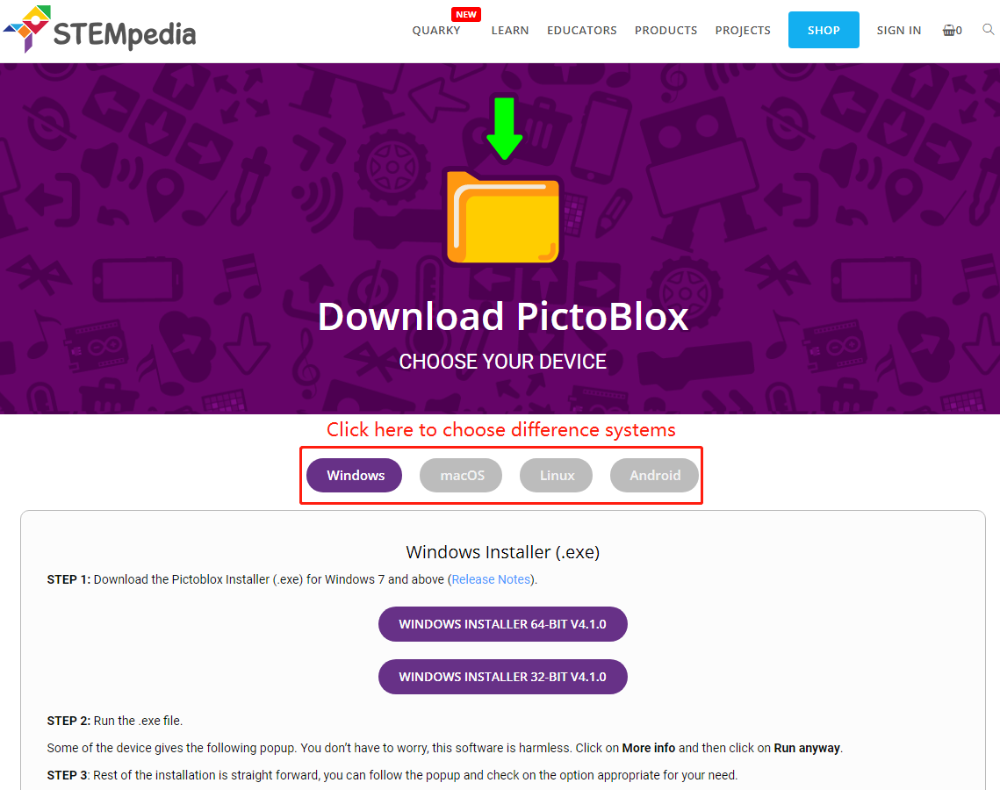

.. note::

    Ciao, benvenuto nella community di SunFounder Raspberry Pi & Arduino & ESP32 Enthusiasts su Facebook! Approfondisci le tue conoscenze su Raspberry Pi, Arduino ed ESP32 insieme ad altri appassionati.

    **Perché unirsi?**

    - **Supporto da esperti**: Risolvi i problemi post-vendita e le sfide tecniche con l'aiuto della nostra community e del nostro team.
    - **Impara e condividi**: Scambia consigli e tutorial per migliorare le tue competenze.
    - **Anteprime esclusive**: Accedi in anteprima agli annunci di nuovi prodotti e alle anticipazioni.
    - **Sconti speciali**: Approfitta di sconti esclusivi sui nostri prodotti più recenti.
    - **Promozioni festive e giveaway**: Partecipa a giveaway e promozioni festive.

    👉 Pronto a esplorare e creare con noi? Clicca su [|link_sf_facebook|] e unisciti oggi stesso!

.. _sh_install:

1.1 Installa PictoBlox
===========================

Clicca su questo link: https://thestempedia.com/product/pictoblox/download-pictoblox/, scegli il sistema operativo appropriato (Windows, macOS, Linux) e segui i passaggi per installare.

