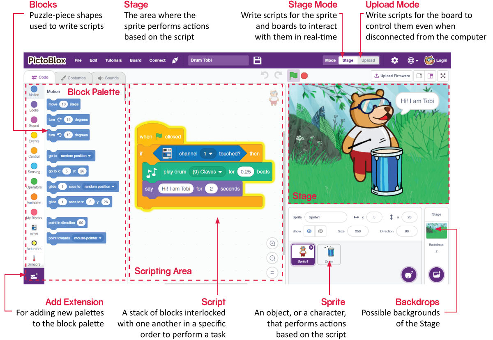

.. _.. _sh_introduce:.. note::

    ¡Hola, bienvenido a la Comunidad de Aficionados a Raspberry Pi, Arduino y ESP32 de SunFounder en Facebook! Profundiza en Raspberry Pi, Arduino y ESP32 con otros entusiastas.

    **쯇or qué unirse?**

    - **Soporte de expertos**: Resuelve problemas posventa y desafíos técnicos con ayuda de nuestra comunidad y equipo.
    - **Aprender y compartir**: Intercambia consejos y tutoriales para mejorar tus habilidades.
    - **Vistas previas exclusivas**: Obtén acceso anticipado a anuncios de nuevos productos y avances.
    - **Descuentos especiales**: Disfruta de descuentos exclusivos en nuestros productos más nuevos.
    - **Promociones festivas y sorteos**: Participa en sorteos y promociones de fiestas.

    游녤 쯃isto para explorar y crear con nosotros? Haz clic en [|link_sf_facebook|] y únete hoy!

1.2 Introducción a la Interfaz
================================

**Sprites**

Un sprite es un objeto o personaje que realiza diferentes acciones en un proyecto. Entiende y obedece los comandos que se le dan. Cada sprite tiene disfraces y sonidos específicos que también puedes personalizar.

**Escenario**

El escenario es el área donde el sprite realiza acciones en fondos de acuerdo con tu programa.

**Fondos**

Los fondos se utilizan para decorar el escenario. Puedes elegir un fondo de PictoBlox, dibujar uno tú mismo o subir una imagen desde tu computadora.

**Área de Scripts**

Un script es un programa o un código en el lenguaje de PictoBlox/Scratch. Es un conjunto de "bloques" organizados en un orden específico para realizar una tarea o una serie de tareas. Puedes escribir múltiples scripts, todos los cuales pueden ejecutarse simultáneamente. Solo puedes escribir scripts en el área de scripts en el centro de la pantalla.

**Bloques**

Los bloques son como piezas de un rompecabezas que se utilizan para escribir programas simplemente apilándolos juntos en el área de scripts. Usar bloques para escribir código puede hacer que la programación sea más fácil y reducir la probabilidad de errores.

**Paleta de Bloques**

Las paletas de bloques están ubicadas en el área izquierda y se nombran por sus funciones, como movimiento, sonido y control. Cada paleta tiene diferentes bloques, por ejemplo, los bloques en la paleta de Movimiento controlarán el movimiento de los sprites, y los bloques en la paleta de Control gestionarán el trabajo del script basado en condiciones específicas.

Hay otros tipos de paletas de bloques que se pueden cargar desde el botón **Añadir Extensión** ubicado en la parte inferior izquierda.

**Modos**

A diferencia de Scratch, PictoBlox tiene dos modos:

* :ref:`stage_mode`: En este modo, puedes escribir scripts para el sprite y las placas para interactuar con los sprites en tiempo real. Si desconectas la placa de Pictoblox, ya no puedes interactuar.
* :ref:`upload_mode`: Este modo te permite escribir scripts y cargarlos en la placa para que puedas usar incluso cuando no está conectada a tu computadora, por ejemplo, necesitas cargar un script para hacer robots móviles.

Para más información, por favor consulta: https://thestempedia.com/tutorials/getting-started-pictoblox
