.. note::

    こんにちは、SunFounderのRaspberry Pi & Arduino & ESP32愛好家コミュニティへようこそ！Facebook上でRaspberry Pi、Arduino、ESP32についてもっと深く掘り下げ、他の愛好家と交流しましょう。

    **参加する理由は？**

    - **エキスパートサポート**：コミュニティやチームの助けを借りて、販売後の問題や技術的な課題を解決します。
    - **学び＆共有**：ヒントやチュートリアルを交換してスキルを向上させましょう。
    - **独占的なプレビュー**：新製品の発表や先行プレビューに早期アクセスしましょう。
    - **特別割引**：最新製品の独占割引をお楽しみください。
    - **祭りのプロモーションとギフト**：ギフトや祝日のプロモーションに参加しましょう。

    👉 私たちと一緒に探索し、創造する準備はできていますか？[|link_sf_facebook|]をクリックして今すぐ参加しましょう！

.. _sh_guide:

1.3 PictoBloxのクイックガイド
====================================

必要な部品
-----------------------

このプロジェクトには、以下のコンポーネントが必要です。

全キットを購入するのが確実に便利です。リンクはこちらです：

.. list-table::
    :widths: 20 20 20
    :header-rows: 1

    *   - 名前
        - このキットのアイテム
        - リンク
    *   - ESP32 Starter Kit
        - 320+
        - |link_esp32_starter_kit|

以下のリンクから個別に購入することもできます。

.. list-table::
    :widths: 30 20
    :header-rows: 1

    *   - コンポーネントの紹介
        - 購入リンク

    *   - :ref:`cpn_esp32_wroom_32e`
        - |link_esp32_wroom_32e_buy|
    *   - :ref:`cpn_esp32_camera_extension`
        - \-
    *   - :ref:`cpn_breadboard`
        - |link_breadboard_buy|
    *   - :ref:`cpn_wires`
        - |link_wires_buy|
    *   - :ref:`cpn_resistor`
        - |link_resistor_buy|
    *   - :ref:`cpn_led`
        - |link_led_buy|

さて、PictoBloxの2つのモードの使用方法を学びましょう。

また、このLEDを2つの異なるモードで点滅させるための簡単な回路も組み立てます。

.. image:: ../img/circuit/1_hello_led_bb.png

.. _stage_mode:

ステージモード
---------------

**1. ESP32ボードに接続する**

ESP32ボードをUSBケーブルでコンピュータに接続します。通常、コンピュータは自動的にボードを認識し、最終的にCOMポートを割り当てます。

    .. image:: ../../img/plugin_esp32.png
        :width: 600
        :align: center

PictoBloxを開くと、デフォルトでPythonプログラミングインターフェイスが開きます。そして、私たちはブロックインターフェイスに切り替える必要があります。

.. image:: img/0_choose_blocks.png

すると、モード切替のための右上の角にあるオプションが見えます。デフォルトはステージモードで、Tobiがステージの上に立っています。

.. image:: img/1_stage_upload.png

右上のナビゲーションバーの **Board** をクリックしてボードを選択します。

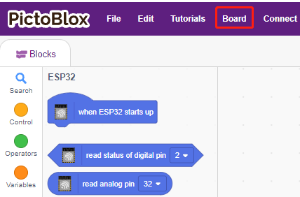

例えば、 **ESP32** を選択します。

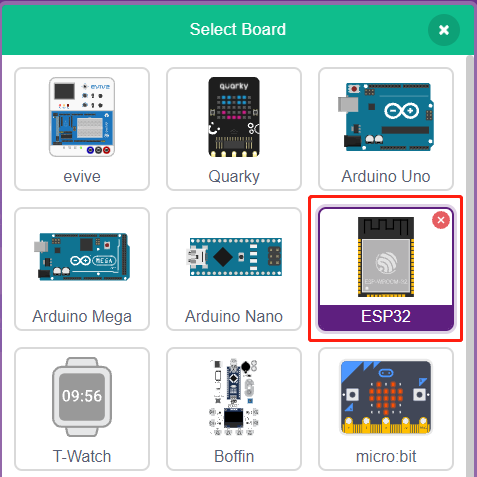

接続ウィンドウがポップアップして、接続するポートを選択します。接続が完了するとホームページに戻ります。使用中に接続が切れた場合は、 **Connect** をクリックして再接続することもできます。

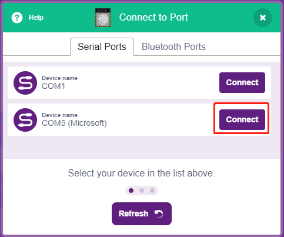

同時に、 **Block Palette** にESP32関連のパレット、例えばESP32、アクチュエーターなどが表示されます。

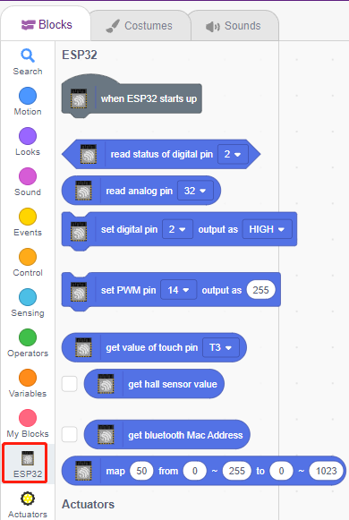

**2. ファームウェアのアップロード**

ステージモードで作業を行うため、ボードにファームウェアをアップロードする必要があります。これにより、ボードとコンピュータ間のリアルタイム通信が保証されます。ファームウェアのアップロードは一度きりのプロセスです。アップロードするには、アップロードファームウェアボタンをクリックします。

しばらく待つと、アップロード成功のメッセージが表示されます。

.. note::

    このボードをPictoBloxで初めて使用する場合、または以前にArduino IDEでアップロードしたことがある場合は、使用する前に **Upload Firmware** する必要があります。

.. image:: img/1_firmware.png

**3. プログラミング**

* スクリプトを直接開いて実行する

もちろん、スクリプトを直接開いて実行することもできますが、まず `github <https://github.com/sunfounder/esp32-starter-kit/archive/refs/heads/main.zip>`_ からダウンロードしてください。

右上の **File** をクリックしてから、 **Open** を選択します。

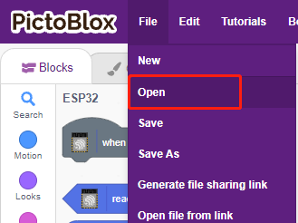

**Open from Computer** を選択します。

.. image:: img/0_dic.png

``esp32-starter-kit-main\scratch`` のパスに移動し、 **1. Stage Mode.sb3** を開きます。 `github <https://github.com/sunfounder/esp32-starter-kit/archive/refs/heads/main.zip>`_ から必要なコードをダウンロードしたことを確認してください。

.. image:: img/0_stage.png

スクリプトを直接クリックして実行します。一部のプロジェクトでは、緑の旗をクリックするか、スプライトをクリックします。

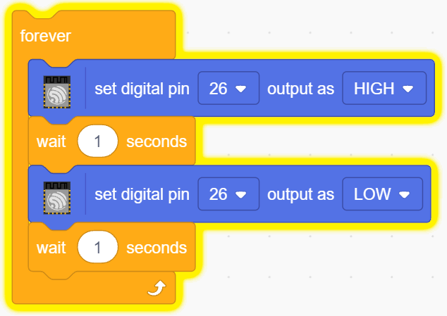

* ステップバイステップでプログラムする

これらのステップに従ってスクリプトをステップバイステップで書くこともできます。

**ESP32** パレットをクリックします。

LEDはデジタルピン26（HIGHまたはLOWの2つの状態のみ）によって制御されるため、[set digital pin out as] ブロックをスクリプトエリアにドラッグします。

LEDのデフォルト状態は点灯しているので、今はピン23をLOWに設定し、このブロックをクリックするとLEDが消えるのを見ることができます。

* [set digital pin out as]: デジタルピンを（HIGH/LOW）レベルに設定します。

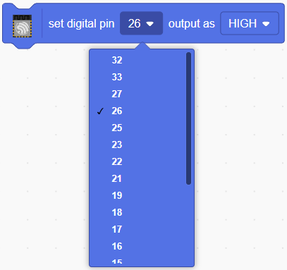

連続して点滅するLEDの効果を見るためには、 **Control** パレットの [Wait 1 seconds] と [forever] ブロックを使用する必要があります。これらのブロックを書いた後でクリックすると、黄色いハローが表示され、実行中であることを意味します。

* [Wait 1 seconds]: **Control** パレットから、2つのブロック間の時間間隔を設定するために使用されます。
* [forever]: **Control** パレットから、手動で一時停止しない限りスクリプトが実行し続けることを可能にします。

.. _upload_mode:

アップロードモード
---------------------

**1. ESP32ボードの接続**

USBケーブルでESP32ボードをコンピュータに接続します。通常、コンピュータは自動的にボードを認識し、最終的にCOMポートを割り当てます。

    .. image:: ../../img/plugin_esp32.png
        :width: 600
        :align: center

PictoBloxを開き、右上のナビゲーションバーの **Board** をクリックしてボードを選択します。

例えば、 **ESP32** を選択します。

接続ウィンドウがポップアップし、接続するポートを選択します。接続が完了するとホームページに戻ります。使用中に接続が切れた場合は、 **Connect** をクリックして再接続できます。

同時に、 **Block Palette** にESP32関連のパレットが表示されます。

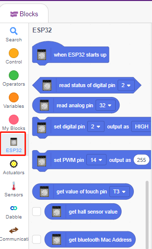

アップロードモードを選択すると、ステージが元のコードエリアに切り替わります。

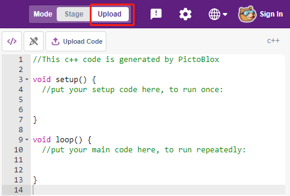

**2. プログラミング**

* スクリプトを直接開いて実行する

右上の **File** をクリックします。

**Open from Computer** を選択します。

.. image:: img/0_dic.png

``esp32-starter-kit-main\scratch`` のパスに移動し、 **1. Upload Mode.sb3** を開きます。 `github <https://github.com/sunfounder/esp32-starter-kit/archive/refs/heads/main.zip>`_ から必要なコードをダウンロードしたことを確認してください。

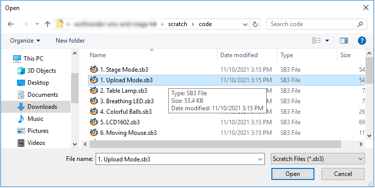

最後に、 **Upload Code** ボタンをクリックします。

.. image:: img/1_upload_code.png

* ステップバイステップでプログラムする

これらのステップに従ってスクリプトをステップバイステップで書くこともできます。

**ESP32** パレットをクリックします。

スクリプトエリアに[when ESP32 starts up]をドラッグします。これはすべてのスクリプトに必要です。

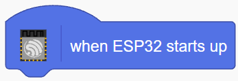

LEDはデジタルピン26（HIGHまたはLOWの2つの状態のみ）によって制御されるため、[set digital pin out as] ブロックをスクリプトエリアにドラッグします。

LEDのデフォルト状態が点灯しているので、今はピン26をLOWに設定し、このブロックをクリックするとLEDが消えるのが見えます。

* [set digital pin out as]: デジタルピンを（HIGH/LOW）レベルに設定します。

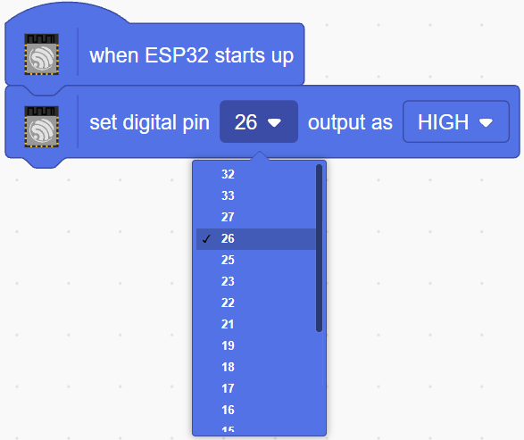

ここで右側にコードが表示されます。このコードを編集したい場合は、編集モードをオンにします。

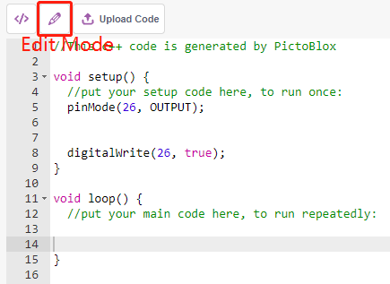

連続して点滅するLEDの効果を見るためには、 **Control** パレットの [Wait 1 seconds] と [forever] ブロックを使用する必要があります。これらのブロックを書いた後でクリックすると、黄色いハローが表示され、実行中であることを意味します。

* [Wait 1 seconds]: **Control** パレットから、2つのブロック間の時間間隔を設定するために使用されます。
* [forever]: **Control** パレットから、電源がオフにならない限りスクリプトが実行し続けることを可能にします。

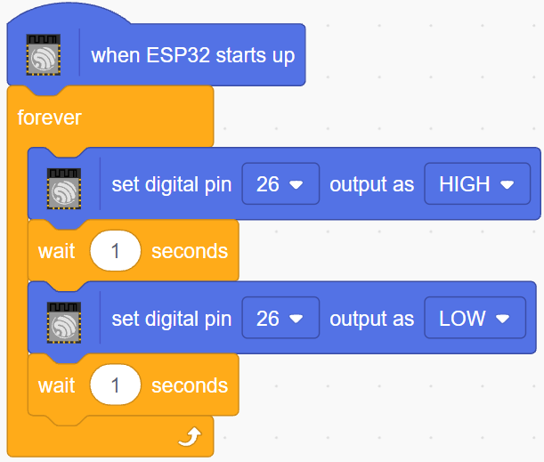

最後に、 **Upload Code** ボタンをクリックします。

.. image:: img/1_upload_code.png
