.. note::

    Bonjour, bienvenue dans la communauté SunFounder Raspberry Pi & Arduino & ESP32 Enthusiasts sur Facebook ! Plongez dans l'univers de Raspberry Pi, Arduino et ESP32 avec d'autres passionnés.

    **Pourquoi nous rejoindre ?**

    - **Support d'experts** : Résolvez les problèmes après-vente et les défis techniques avec l'aide de notre communauté et de notre équipe.
    - **Apprendre et partager** : Échangez des astuces et des tutoriels pour améliorer vos compétences.
    - **Aperçus exclusifs** : Accédez en avant-première aux annonces de nouveaux produits et aux avant-premières.
    - **Réductions spéciales** : Profitez de réductions exclusives sur nos derniers produits.
    - **Promotions festives et cadeaux** : Participez à des tirages au sort et à des promotions festives.

    👉 Prêt à explorer et créer avec nous ? Cliquez sur [|link_sf_facebook|] et rejoignez-nous dès aujourd'hui !

.. _sh_guide:

1.3 Guide rapide sur PictoBlox
====================================

Composants nécessaires
--------------------------

Pour ce projet, nous avons besoin des composants suivants. 

Il est certainement pratique d'acheter un kit complet, voici le lien : 

.. list-table::
    :widths: 20 20 20
    :header-rows: 1

    *   - Nom	
        - ARTICLES DANS CE KIT
        - LIEN
    *   - Kit de démarrage ESP32
        - 320+
        - |link_esp32_starter_kit|

Vous pouvez également les acheter séparément à partir des liens ci-dessous.

.. list-table::
    :widths: 30 20
    :header-rows: 1

    *   - INTRODUCTION AUX COMPOSANTS
        - LIEN D'ACHAT

    *   - :ref:`cpn_esp32_wroom_32e`
        - |link_esp32_wroom_32e_buy|
    *   - :ref:`cpn_esp32_camera_extension`
        - |link_esp32_extension_board|
    *   - :ref:`cpn_breadboard`
        - |link_breadboard_buy|
    *   - :ref:`cpn_wires`
        - |link_wires_buy|
    *   - :ref:`cpn_resistor`
        - |link_resistor_buy|
    *   - :ref:`cpn_led`
        - |link_led_buy|

Apprenons maintenant à utiliser PictoBlox en deux modes.

Construisons également un circuit simple pour faire clignoter cette LED en 2 modes différents.

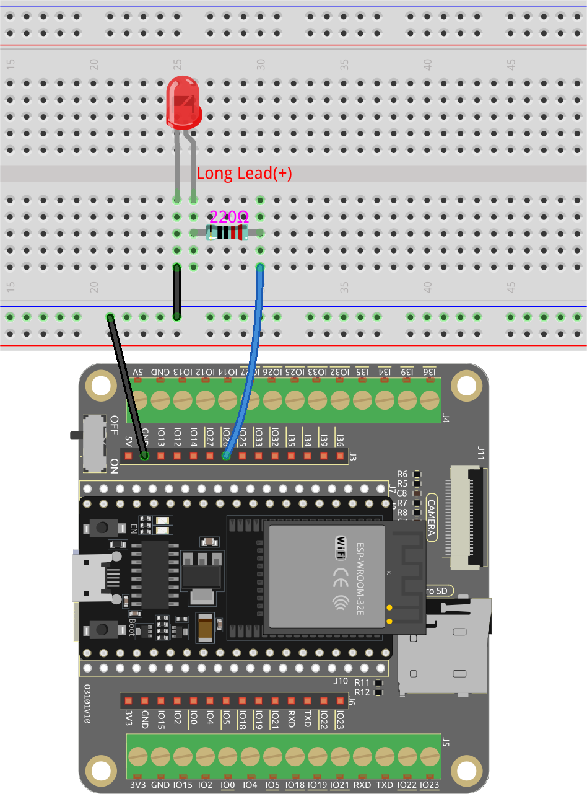

.. _stage_mode:

Mode Scène
---------------

**1. Connectez la carte ESP32**

Connectez votre carte ESP32 à l'ordinateur avec un câble USB, l'ordinateur reconnaîtra généralement automatiquement votre carte et attribuera finalement un port COM.

    .. image:: ../../img/plugin_esp32.png
        :width: 600
        :align: center
    
Ouvrez PictoBlox, l'interface de programmation Python s'ouvrira par défaut. Nous devons passer à l'interface Blocs.

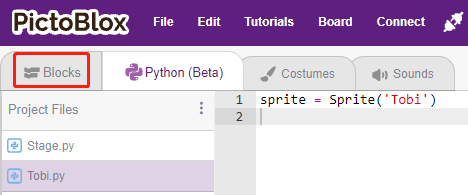

Ensuite, vous verrez le coin supérieur droit pour le changement de mode. Le mode par défaut est le mode Scène, où Tobi se tient sur la scène.

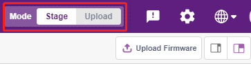

Cliquez sur **Carte** dans la barre de navigation en haut à droite pour sélectionner la carte.

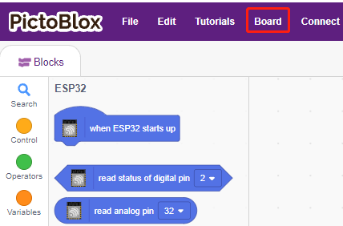

Par exemple, choisissez **ESP32**.

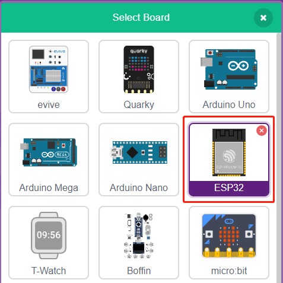

Une fenêtre de connexion apparaîtra alors pour que vous sélectionniez le port à connecter, et revenez à la page d'accueil lorsque la connexion est terminée. Si vous perdez la connexion pendant l'utilisation, vous pouvez également cliquer sur **Connecter** pour reconnecter.

.. note::

    S'il affiche COM1 ou aucun port, il se peut que votre ordinateur ne reconnaisse pas la carte. Voir :ref:`install_driver`.

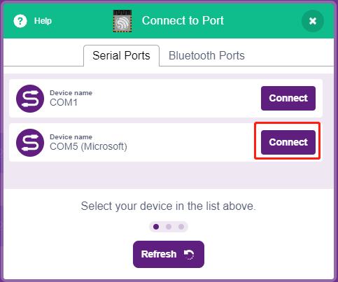

En même temps, des palettes liées à l'ESP32, telles que ESP32, Actionneurs, etc., apparaîtront dans la **Palette de Blocs**.

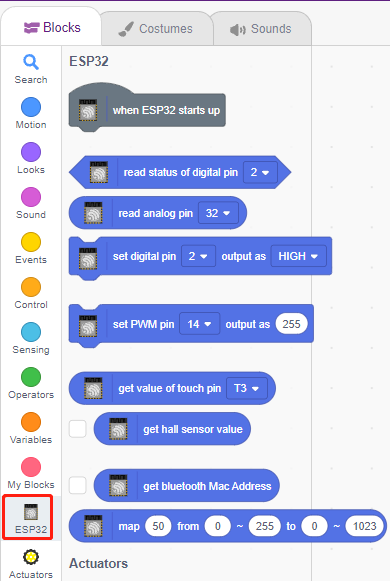

**2. Téléchargez le firmware**

Comme nous allons travailler en mode Scène, nous devons télécharger le firmware sur la carte. Cela garantira une communication en temps réel entre la carte et l'ordinateur. Le téléchargement du firmware est un processus unique. Pour ce faire, cliquez sur le bouton Télécharger Firmware.

Après un certain temps d'attente, le message de réussite du téléchargement apparaîtra.

.. note::

    Si vous utilisez cette carte dans PictoBlox pour la première fois, ou si cette carte a été précédemment téléchargée avec l'IDE Arduino. Ensuite, vous devez appuyer sur **Télécharger le Firmware** avant de pouvoir l'utiliser.

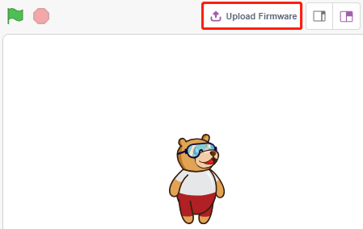

**3. Programmation**

* Ouvrez et exécutez directement le script

Bien sûr, vous pouvez ouvrir directement les scripts pour les exécuter, mais veuillez d'abord les télécharger à partir de `github <https://github.com/sunfounder/esp32-starter-kit/archive/refs/heads/main.zip>`_.

Vous pouvez cliquer sur **Fichier** dans le coin supérieur droit, puis choisir **Ouvrir**.

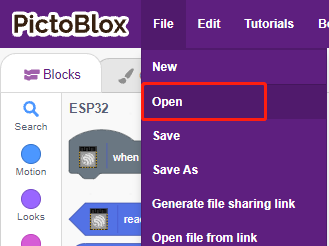

Choisissez **Ouvrir depuis l'ordinateur**.

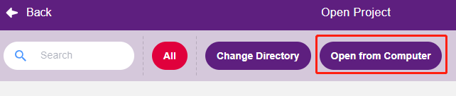

Ensuite, allez dans le chemin ``esp32-starter-kit-main\scratch``, et ouvrez **1. Stage Mode.sb3**. Veuillez vous assurer que vous avez téléchargé le code requis à partir de `github <https://github.com/sunfounder/esp32-starter-kit/archive/refs/heads/main.zip>`_.

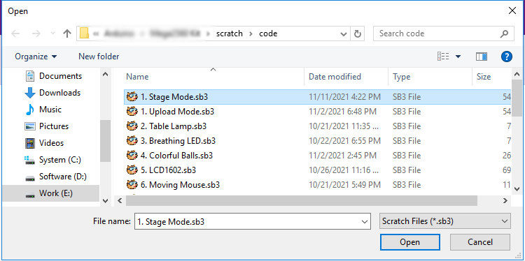

Cliquez directement sur le script pour l'exécuter, certains projets sont à cliquer sur le drapeau vert ou à cliquer sur le sprite.

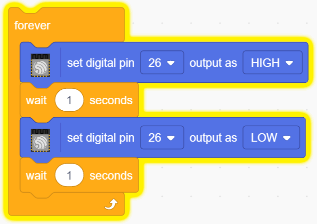

* Programme étape par étape

Vous pouvez également écrire le script étape par étape en suivant ces étapes.

Cliquez sur la palette **ESP32**.

La LED est contrôlée par la broche numérique 26 (seulement 2 états, HIGH ou LOW), alors faites glisser le bloc [définir la broche numérique à] vers la zone de script.

Puisque l'état par défaut de la LED est allumé, réglez maintenant la broche 23 sur LOW et cliquez sur ce bloc et vous verrez la LED s'éteindre.

* [définir la broche numérique à] : Réglez la broche numérique sur le niveau (HIGH/LOW).

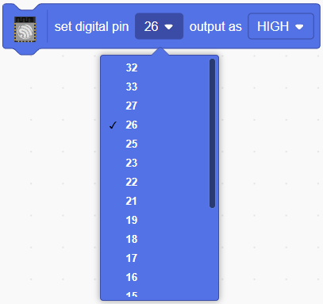

Pour voir l'effet de clignotement continu de la LED, vous devez utiliser les blocs [Attendre 1 seconde] et [toujours] dans la palette **Contrôle**. Cliquez sur ces blocs après les avoir écrits, il y a un halo jaune signifie qu'il est en cours d'exécution.

* [Attendre 1 seconde] : de la palette **Contrôle**, utilisé pour définir l'intervalle de temps entre 2 blocs.
* [toujours] : de la palette **Contrôle**, permet au script de continuer à s'exécuter sauf si l'alimentation est coupée.

.. _upload_mode:

Mode Téléchargement
--------------------------

**1. Connectez la carte ESP32**

Connectez votre carte ESP32 à l'ordinateur avec un câble USB, l'ordinateur reconnaîtra généralement automatiquement votre carte et attribuera finalement un port COM.

    .. image:: ../../img/plugin_esp32.png
        :width: 600
        :align: center

Ouvrez PictoBlox et cliquez sur **Carte** dans la barre de navigation en haut à droite pour sélectionner la carte.

Par exemple, choisissez **ESP32**.

Une fenêtre de connexion apparaîtra alors pour que vous sélectionniez le port à connecter, et revenez à la page d'accueil lorsque la connexion est terminée. Si vous perdez la connexion pendant l'utilisation, vous pouvez également cliquer sur **Connecter** pour reconnecter.

.. note::

    S'il affiche COM1 ou aucun port, il se peut que votre ordinateur ne reconnaisse pas la carte. Voir :ref:`install_driver`.

En même temps, des palettes liées à l'ESP32, telles que ESP32, Actionneurs, etc., apparaîtront dans la **Palette de Blocs**.

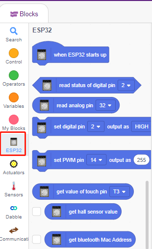

Après avoir sélectionné le mode Téléchargement, la scène passera à la zone de code d'origine.

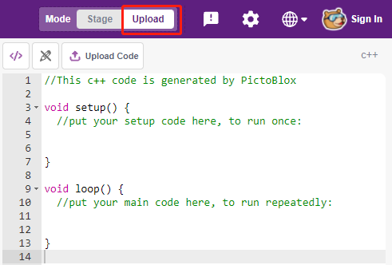

**2. Programmation**

* Ouvrez et exécutez directement le script

Vous pouvez cliquer sur **Fichier** dans le coin supérieur droit.

Choisissez **Ouvrir depuis l'ordinateur**.

Ensuite, allez dans le chemin ``esp32-starter-kit-main\scratch``, et ouvrez **1. Upload Mode.sb3**. Veuillez vous assurer que vous avez téléchargé le code requis à partir de `github <https://github.com/sunfounder/esp32-starter-kit/archive/refs/heads/main.zip>`_.

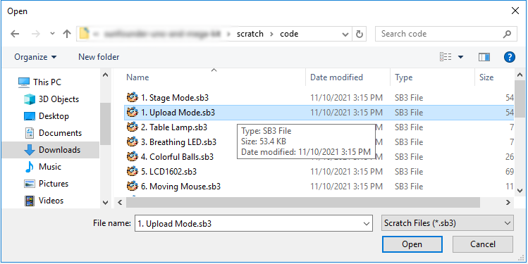

Enfin, cliquez sur le bouton **Télécharger le Code**.

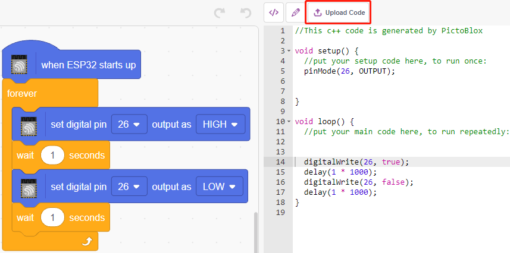

* Programme étape par étape

Vous pouvez également écrire le script étape par étape en suivant ces étapes.

Cliquez sur la palette **ESP32**.

Faites glisser [quand l'ESP32 démarre] vers la zone de script, qui est nécessaire pour chaque script.

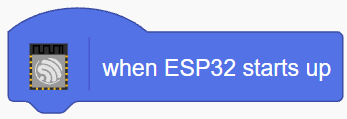

La LED est contrôlée par la broche numérique 26 (seulement 2 états, HIGH ou LOW), alors faites glisser le bloc [définir la broche numérique à] vers la zone de script.

Puisque l'état par défaut de la LED est allumé, réglez maintenant la broche 26 sur LOW et cliquez sur ce bloc et vous verrez la LED s'éteindre.

* [définir la broche numérique à] : Réglez la broche numérique sur le niveau (HIGH/LOW).

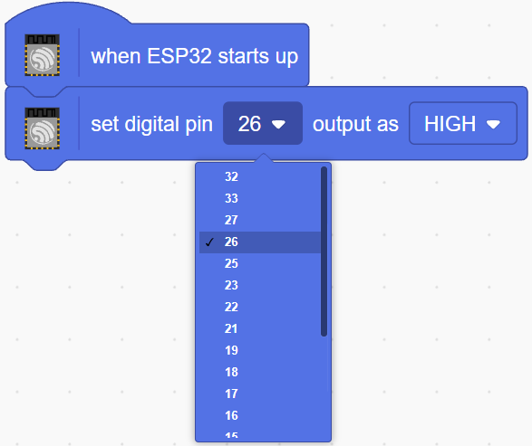

À ce stade, vous verrez le code apparaître sur le côté droit, si vous souhaitez modifier ce code, vous pouvez alors activer le mode Édition.

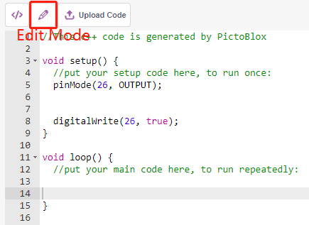

Pour voir l'effet de clignotement continu de la LED, vous devez utiliser les blocs [Attendre 1 seconde] et [toujours] dans la palette **Contrôle**. Cliquez sur ces blocs après les avoir écrits, il y a un halo jaune signifie qu'il est en cours d'exécution.

* [Attendre 1 seconde] : de la palette **Contrôle**, utilisé pour définir l'intervalle de temps entre 2 blocs.
* [toujours] : de la palette **Contrôle**, permet au script de continuer à s'exécuter sauf si l'alimentation est coupée.

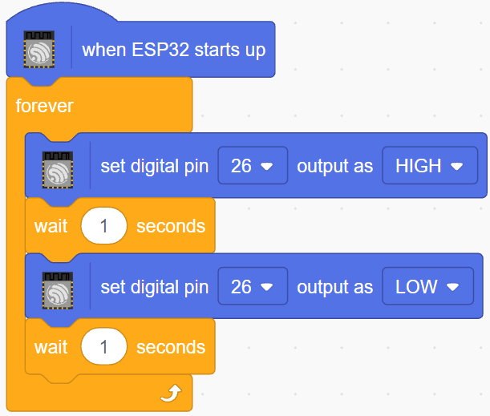

Enfin, cliquez sur le bouton **Télécharger le Code**.

