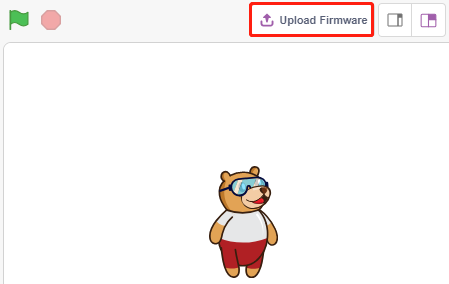

.. note::

    ¡Hola, bienvenido a la Comunidad de Aficionados a Raspberry Pi, Arduino y ESP32 de SunFounder en Facebook! Profundiza en Raspberry Pi, Arduino y ESP32 con otros entusiastas.

    **¿Por qué unirse?**

    - **Soporte de expertos**: Resuelve problemas posventa y desafíos técnicos con ayuda de nuestra comunidad y equipo.
    - **Aprender y compartir**: Intercambia consejos y tutoriales para mejorar tus habilidades.
    - **Vistas previas exclusivas**: Obtén acceso anticipado a anuncios de nuevos productos y avances.
    - **Descuentos especiales**: Disfruta de descuentos exclusivos en nuestros productos más nuevos.
    - **Promociones festivas y sorteos**: Participa en sorteos y promociones de fiestas.

    👉 ¿Listo para explorar y crear con nosotros? Haz clic en [|link_sf_facebook|] y únete hoy!

.. _sh_guide:

1.3 Guía Rápida sobre PictoBlox
====================================

Componentes Necesarios
-------------------------

Para este proyecto, necesitaremos los siguientes componentes.

Es definitivamente conveniente comprar un kit completo, aquí está el enlace:

.. list-table::
    :widths: 20 20 20
    :header-rows: 1

    *   - Nombre	
        - ELEMENTOS EN ESTE KIT
        - ENLACE
    *   - Kit de Inicio ESP32
        - 320+
        - |link_esp32_starter_kit|

También puedes comprarlos por separado en los enlaces a continuación.

.. list-table::
    :widths: 30 20
    :header-rows: 1

    *   - INTRODUCCIÓN DEL COMPONENTE
        - ENLACE DE COMPRA

    *   - :ref:`cpn_esp32_wroom_32e`
        - |link_esp32_wroom_32e_buy|
    *   - :ref:`cpn_esp32_camera_extension`
        - \-
    *   - :ref:`cpn_breadboard`
        - |link_breadboard_buy|
    *   - :ref:`cpn_wires`
        - |link_wires_buy|
    *   - :ref:`cpn_resistor`
        - |link_resistor_buy|
    *   - :ref:`cpn_led`
        - |link_led_buy|

Ahora aprendamos a usar PictoBlox en dos modos.

También construiremos un circuito simple para hacer que este LED parpadee en 2 modos diferentes.

.. image:: ../img/circuit/1_hello_led_bb.png

.. _stage_mode:

Modo Escenario
---------------

**1. Conectar con la Placa ESP32**

Conecta tu placa ESP32 al ordenador con un cable USB, normalmente el ordenador reconocerá automáticamente tu placa y finalmente asignará un puerto COM.

    .. image:: ../../img/plugin_esp32.png
        :width: 600
        :align: center
    
Abre PictoBlox, la interfaz de programación Python se abrirá por defecto. Y necesitamos cambiar a la interfaz de Bloques.

.. image:: img/0_choose_blocks.png

Entonces verás la esquina superior derecha para el cambio de modo. El predeterminado es el modo Escenario, donde Tobi está parado en el escenario.

.. image:: img/1_stage_upload.png

Haz clic en **Placa** en la barra de navegación superior derecha para seleccionar la placa.

.. image:: img/1_board.png

Por ejemplo, elige **ESP32**.

.. image:: img/1_choose_uno.png

Entonces aparecerá una ventana de conexión para que selecciones el puerto a conectar, y regresarás a la página principal cuando la conexión esté completa. Si rompes la conexión durante el uso, también puedes hacer clic en **Conectar** para reconectar.

Al mismo tiempo, aparecerán en la **Paleta de Bloques** paletas relacionadas con ESP32, como ESP32, Actuadores, etc.

**2. Subir Firmware**

Dado que vamos a trabajar en el modo Escenario, debemos subir el firmware a la placa. Esto asegurará la comunicación en tiempo real entre la placa y el ordenador. Subir el firmware es un proceso único. Para hacerlo, haz clic en el botón Subir Firmware.

Después de esperar un rato, aparecerá el mensaje de éxito de la subida.

.. note::

    Si estás usando esta placa en PictoBlox por primera vez, o si esta placa fue previamente subida con el IDE de Arduino. Entonces necesitas tocar **Subir Firmware** antes de que puedas usarla.

**3. Programación**

* Abrir y ejecutar el script directamente

Por supuesto, puedes abrir los scripts directamente para ejecutarlos, pero primero descárgalos de `github <https://github.com/sunfounder/esp32-starter-kit/archive/refs/heads/main.zip>`_.

Puedes hacer clic en **Archivo** en la esquina superior derecha y luego elegir **Abrir**.

.. image:: img/0_open.png

Elige **Abrir desde el Ordenador**.

.. image:: img/0_dic.png

Luego ve a la ruta de ``esp32-starter-kit-main\scratch``, y abre **1. Modo Escenario.sb3**. Asegúrate de haber descargado el código requerido de `github <https://github.com/sunfounder/esp32-starter-kit/archive/refs/heads/main.zip>`_.

.. image:: img/0_stage.png

Haz clic directamente en el script para ejecutarlo, algunos proyectos son hacer clic en la bandera verde o hacer clic en el sprite.

* Programar paso a paso

También puedes escribir el script paso a paso siguiendo estos pasos.

Haz clic en la paleta **ESP32**.

El LED está controlado por el pin digital 26 (solo 2 estados, ALTO o BAJO), así que arrastra el bloque [establecer el pin digital como] al área de script.

Dado que el estado predeterminado del LED es encendido, ahora establece el pin 23 en BAJO y haz clic en este bloque y verás que el LED se apaga.

* [establecer el pin digital como]: Establece el pin digital a nivel (ALTO/BAJO).

.. image:: img/1_digital.png

Para ver el efecto de un LED parpadeando continuamente, necesitas usar los bloques [Esperar 1 segundos] y [siempre] en la paleta **Control**. Haz clic en estos bloques después de escribir, un halo amarillo significa que está ejecutándose.

* [Esperar 1 segundos]: de la paleta **Control**, usado para establecer el intervalo de tiempo entre 2 bloques.
* [siempre]: de la paleta **Control**, permite que el script siga ejecutándose a menos que se pause manualmente.

.. _upload_mode:

Modo de Subida
---------------

**1. Conectar con la Placa ESP32**

Conecta tu placa ESP32 al ordenador con un cable USB, normalmente el ordenador reconocerá automáticamente tu placa y finalmente asignará un puerto COM.

    .. image:: ../../img/plugin_esp32.png
        :width: 600
        :align: center

Abre PictoBlox y haz clic en **Placa** en la barra de navegación superior derecha para seleccionar la placa.

.. image:: img/1_board.png

Por ejemplo, elige **ESP32**.

.. image:: img/1_choose_uno.png

Entonces aparecerá una ventana de conexión para que selecciones el puerto a conectar, y regresarás a la página principal cuando la conexión esté completa. Si rompes la conexión durante el uso, también puedes hacer clic en **Conectar** para reconectar.

Al mismo tiempo, aparecerán en la **Paleta de Bloques** paletas relacionadas con ESP32, como ESP32, Actuadores, etc.

.. image:: img/1_upload_uno.png

Después de seleccionar el modo de Subida, el escenario cambiará al área de código original.

.. image:: img/1_upload.png

**2. Programación**

* Abrir y ejecutar el script directamente

Puedes hacer clic en **Archivo** en la esquina superior derecha.

.. image:: img/0_open.png

Elige **Abrir desde el Ordenador**.

.. image:: img/0_dic.png

Luego ve a la ruta de ``esp32-starter-kit-main\scratch``, y abre **1. Modo de Subida.sb3**. Asegúrate de haber descargado el código requerido de `github <https://github.com/sunfounder/esp32-starter-kit/archive/refs/heads/main.zip>`_.

.. image:: img/0_upload.png

Finalmente, haz clic en el botón **Subir Código**.

.. image:: img/1_upload_code.png

* Programar paso a paso

También puedes escribir el script paso a paso siguiendo estos pasos.

Haz clic en la paleta **ESP32**.

.. image:: img/1_upload_uno.png

Arrastra [cuando ESP32 se inicia] al área de script, lo cual es necesario para cada script.

.. image:: img/1_uno_starts.png

El LED es controlado por el pin digital 26 (solo 2 estados ALTO o BAJO), así que arrastra el bloque [establecer el pin digital como] al área de script.

Dado que el estado predeterminado del LED es encendido, ahora establece el pin 26 en BAJO y haz clic en este bloque y verás que el LED se apaga.

* [establecer el pin digital como]: Establece el pin digital a nivel (ALTO/BAJO).

.. image:: img/1_upload_digital.png

En este punto verás que el código aparece en el lado derecho, si quieres editar este código, entonces puedes activar el modo Edición.

.. image:: img/1_upload1.png

Para ver el efecto de un LED parpadeando continuamente, necesitas usar los bloques [Esperar 1 segundos] y [siempre] en la paleta **Control**. Haz clic en estos bloques después de escribir, un halo amarillo significa que está ejecutándose.

* [Esperar 1 segundos]: de la paleta **Control**, usado para establecer el intervalo de tiempo entre 2 bloques.
* [siempre]: de la paleta **Control**, permite que el script siga ejecutándose a menos que se apague la alimentación.

.. image:: img/1_upload_more.png

Finalmente, haz clic en el botón **Subir Código**.

.. image:: img/1_upload_code.png
