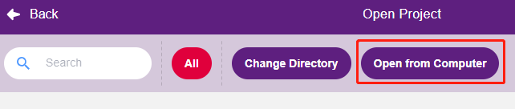
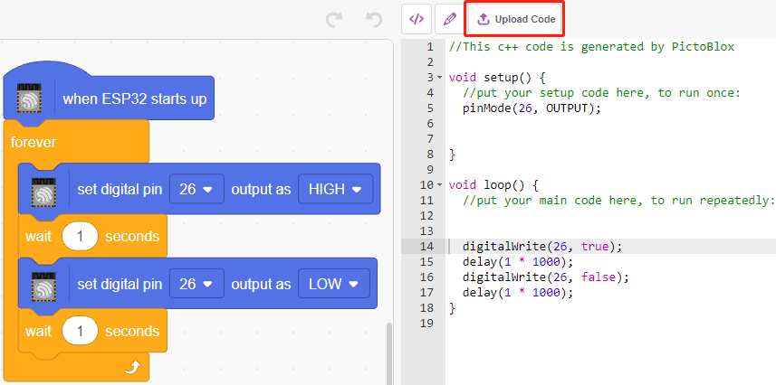

.. _sh_guide:

1.3 Schnellanleitung für PictoBlox
====================================

Benötigte Komponenten
-----------------------

Für dieses Projekt benötigen wir die folgenden Komponenten.

Es ist definitiv praktisch, ein ganzes Kit zu kaufen, hier ist der Link:

.. list-table::
    :widths: 20 20 20
    :header-rows: 1

    *   - Name	
        - ARTIKEL IN DIESEM KIT
        - LINK
    *   - ESP32 Starter Kit
        - 320+
        - |link_esp32_starter_kit|

Sie können die Komponenten auch einzeln über die untenstehenden Links kaufen.

.. list-table::
    :widths: 30 20
    :header-rows: 1

    *   - KOMPONENTENBESCHREIBUNG
        - KAUF-LINK

    *   - :ref:`cpn_esp32_wroom_32e`
        - |link_esp32_wroom_32e_buy|
    *   - :ref:`cpn_esp32_camera_extension`
        - \-
    *   - :ref:`cpn_breadboard`
        - |link_breadboard_buy|
    *   - :ref:`cpn_wires`
        - |link_wires_buy|
    *   - :ref:`cpn_resistor`
        - |link_resistor_buy|
    *   - :ref:`cpn_led`
        - |link_led_buy|

Lernen wir nun, wie man PictoBlox in zwei Modi verwendet.

Außerdem bauen wir eine einfache Schaltung, um diese LED in 2 verschiedenen Modi blinken zu lassen.

.. image:: ../img/circuit/1_hello_led_bb.png

.. _stage_mode:

Bühnenmodus
---------------

**1. Verbindung mit dem ESP32-Board herstellen**

Verbinden Sie Ihr ESP32-Board mit einem USB-Kabel mit dem Computer, normalerweise wird der Computer Ihr Board automatisch erkennen und schließlich einen COM-Port zuweisen.

Öffnen Sie PictoBlox, standardmäßig öffnet sich die Python-Programmierschnittstelle. Wir müssen jedoch zur Block-Schnittstelle wechseln.

.. image:: img/0_choose_blocks.png

Dann sehen Sie in der oberen rechten Ecke den Moduswechsel. Standardmäßig ist der Bühnenmodus, wo Tobi auf der Bühne steht.

.. image:: img/1_stage_upload.png

Klicken Sie in der oberen rechten Navigationsleiste auf **Board**, um das Board auszuwählen.

.. image:: img/1_board.png

Wählen Sie zum Beispiel **ESP32**.

.. image:: img/1_choose_uno.png

Ein Verbindungsfenster wird dann erscheinen, um den Port für die Verbindung auszuwählen, und zurück zur Startseite gehen, wenn die Verbindung abgeschlossen ist. Wenn Sie während der Nutzung die Verbindung trennen, können Sie auch auf **Connect** klicken, um erneut zu verbinden.

.. image:: img/1_connect.png

Gleichzeitig erscheinen ESP32-bezogene Paletten, wie ESP32, Aktuatoren usw., in der **Block Palette**.

.. image:: img/1_arduino_uno.png

**2. Firmware hochladen**

Da wir im Bühnenmodus arbeiten werden, müssen wir die Firmware auf das Board hochladen. Dies stellt die Echtzeitkommunikation zwischen dem Board und dem Computer sicher. Das Hochladen der Firmware ist ein einmaliger Prozess. Klicken Sie dazu auf den Button Firmware hochladen.

Nach einer Weile erscheint die Erfolgsmeldung des Uploads.

.. note::

    Wenn Sie dieses Board zum ersten Mal in PictoBlox verwenden oder wenn dieses Board zuvor mit der Arduino IDE hochgeladen wurde, müssen Sie **Upload Firmware** anklicken, bevor Sie es verwenden können.

.. image:: img/1_firmware.png

**3. Programmierung**

* Skript direkt öffnen und ausführen

Natürlich können Sie die Skripte direkt öffnen und ausführen, laden Sie sie aber bitte zuerst von `GitHub <https://github.com/sunfounder/esp32-starter-kit/archive/refs/heads/main.zip>`_ herunter.

Klicken Sie oben rechts auf **File** und dann auf **Open**.

.. image:: img/0_open.png

Wählen Sie **Open from Computer**.

Gehen Sie dann zum Pfad ``esp32-starter-kit-main\scratch`` und öffnen Sie **1. Stage Mode.sb3**. Stellen Sie sicher, dass Sie den benötigten Code von `GitHub <https://github.com/sunfounder/esp32-starter-kit/archive/refs/heads/main.zip>`_ heruntergeladen haben.

.. image:: img/0_stage.png

Klicken Sie direkt auf das Skript, um es auszuführen, bei einigen Projekten klicken Sie auf die grüne Fahne oder auf das Sprite.

.. image:: img/1_more.png

* Schritt-für-Schritt programmieren

Sie können das Skript auch Schritt für Schritt nach diesen Schritten schreiben.

Klicken Sie auf die **ESP32**-Palette.

.. image:: img/1_arduino_uno.png

Die LED wird durch den digitalen Pin 26 gesteuert (nur 2 Zustände, HIGH oder LOW), ziehen Sie also den Block [set digital pin out as] in den Skriptbereich.

Da der Standardzustand der LED beleuchtet ist, stellen Sie nun Pin 23 auf LOW und klicken Sie auf diesen Block und Sie werden sehen, wie die LED ausgeht.

* [set digital pin out as]: Stellen Sie den digitalen Pin auf (HIGH/LOW) ein.

Um den Effekt einer kontinuierlich blinkenden LED zu sehen, benötigen Sie die Blöcke [Wait 1 seconds] und [forever] aus der **Control**-Palette. Klicken Sie nach dem Schreiben auf diese Blöcke, ein gelber Halo bedeutet, dass es läuft.

* [Wait 1 seconds]: aus der **Control**-Palette, verwendet, um das Zeitintervall zwischen 2 Blöcken einzustellen.
* [forever]: aus der **Control**-Palette, ermöglicht es dem Skript, weiterzulaufen, es sei denn, es wird manuell angehalten.

.. image:: img/1_more.png

.. _upload_mode:

Upload-Modus
---------------

**1. Verbindung mit dem ESP32-Board herstellen**

Verbinden Sie Ihr ESP32-Board mit einem USB-Kabel mit dem Computer, normalerweise wird der Computer Ihr Board automatisch erkennen und schließlich einen COM-Port zuweisen.

Öffnen Sie PictoBlox und klicken Sie in der oberen rechten Navigationsleiste auf **Board**, um das Board auszuwählen.

.. image:: img/1_board.png

Wählen Sie zum Beispiel **ESP32**.

.. image:: img/1_choose_uno.png

Ein Verbindungsfenster wird dann erscheinen, um den Port für die Verbindung auszuwählen, und zurück zur Startseite gehen, wenn die Verbindung abgeschlossen ist. Wenn Sie während der Nutzung die Verbindung trennen, können Sie auch auf **Connect** klicken, um erneut zu verbinden.

.. image:: img/1_connect.png

Gleichzeitig erscheinen ESP32-bezogene Paletten, wie ESP32, Aktuatoren usw., in der **Block Palette**.

Nachdem Sie den Upload-Modus ausgewählt haben, wechselt die Bühne zum ursprünglichen Codebereich.

**2. Programmierung**

* Skript direkt öffnen und ausführen

Klicken Sie oben rechts auf **File**.

.. image:: img/0_open.png

Wählen Sie **Open from Computer**.

Gehen Sie dann zum Pfad ``esp32-starter-kit-main\scratch`` und öffnen Sie **1. Upload Mode.sb3**. Stellen Sie sicher, dass Sie den benötigten Code von `GitHub <https://github.com/sunfounder/esp32-starter-kit/archive/refs/heads/main.zip>`_ heruntergeladen haben.

.. image:: img/0_upload.png

Klicken Sie schließlich auf den Button **Upload Code**.

* Schritt-für-Schritt programmieren

Sie können das Skript auch Schritt für Schritt nach diesen Schritten schreiben.

Klicken Sie auf die **ESP32**-Palette.

Ziehen Sie [when ESP32 starts up] in den Skriptbereich, was für jedes Skript erforderlich ist.

.. image:: img/1_uno_starts.png

Die LED wird durch den digitalen Pin26 gesteuert (nur 2 Zustände HIGH oder LOW), ziehen Sie also den Block [set digital pin out as] in den Skriptbereich.

Da der Standardzustand der LED beleuchtet ist, stellen Sie nun Pin26 auf LOW und klicken Sie auf diesen Block und Sie werden sehen, wie die LED ausgeht.

* [set digital pin out as]: Stellen Sie den digitalen Pin auf (HIGH/LOW) ein.

An dieser Stelle sehen Sie den Code auf der rechten Seite, wenn Sie diesen Code bearbeiten möchten, können Sie den Bearbeitungsmodus einschalten.

.. image:: img/1_upload1.png

Um den Effekt einer kontinuierlich blinkenden LED zu sehen, benötigen Sie die Blöcke [Wait 1 seconds] und [forever] aus der **Control**-Palette. Klicken Sie nach dem Schreiben auf diese Blöcke, ein gelber Halo bedeutet, dass es läuft.

* [Wait 1 seconds]: aus der **Control**-Palette, verwendet, um das Zeitintervall zwischen 2 Blöcken einzustellen.
* [forever]: aus der **Control**-Palette, ermöglicht es dem Skript, weiterzulaufen, es sei denn, die Stromversorgung wird unterbrochen.

.. image:: img/1_upload_more.png

Klicken Sie schließlich auf den Button **Upload Code**.

