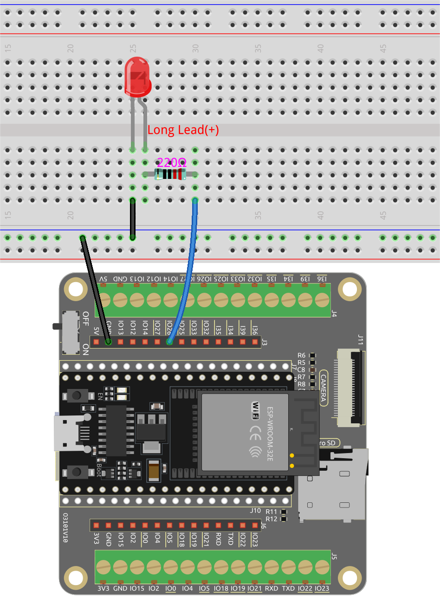

.. note::

    Hello, welcome to the SunFounder Raspberry Pi & Arduino & ESP32 Enthusiasts Community on Facebook! Dive deeper into Raspberry Pi, Arduino, and ESP32 with fellow enthusiasts.

    **Why Join?**

    - **Expert Support**: Solve post-sale issues and technical challenges with help from our community and team.
    - **Learn & Share**: Exchange tips and tutorials to enhance your skills.
    - **Exclusive Previews**: Get early access to new product announcements and sneak peeks.
    - **Special Discounts**: Enjoy exclusive discounts on our newest products.
    - **Festive Promotions and Giveaways**: Take part in giveaways and holiday promotions.

    👉 Ready to explore and create with us? Click [|link_sf_facebook|] and join today!

.. _sh_guide:

1.3 Quick Guide on PictoBlox
====================================

Required Components
-----------------------

In this project, we need the following components. 

It's definitely convenient to buy a whole kit, here's the link: 

.. list-table::
    :widths: 20 20 20
    :header-rows: 1

    *   - Name	
        - ITEMS IN THIS KIT
        - LINK
    *   - ESP32 Starter Kit
        - 320+
        - |link_esp32_starter_kit|

You can also buy them separately from the links below.

.. list-table::
    :widths: 30 20
    :header-rows: 1

    *   - COMPONENT INTRODUCTION
        - PURCHASE LINK

    *   - :ref:`cpn_esp32_wroom_32e`
        - |link_esp32_wroom_32e_buy|
    *   - :ref:`cpn_esp32_camera_extension`
        - \-
    *   - :ref:`cpn_breadboard`
        - |link_breadboard_buy|
    *   - :ref:`cpn_wires`
        - |link_wires_buy|
    *   - :ref:`cpn_resistor`
        - |link_resistor_buy|
    *   - :ref:`cpn_led`
        - |link_led_buy|

Now let's learn how to use PictoBlox in two modes.

Also build a simple circuit to make this LED blink in 2 different modes.

.. _stage_mode:

Stage Mode
---------------

**1. Connect to ESP32 Board**

Connect your ESP32 board to the computer with a USB cable, usually the computer will automatically recognize your board and finally assign a COM port.

    .. image:: ../../img/plugin_esp32.png
        :width: 600
        :align: center
    
Open PictoBlox, the Python programming interface will open by default. And we need to switch to the Blocks interface.

.. image:: img/0_choose_blocks.png

Then you will see the top right corner for mode switching. The default is Stage mode, where Tobi is standing on the stage.

.. image:: img/1_stage_upload.png

Click **Board** in the upper right navigation bar to select the board.

For example, choose **ESP32**.

A connection window will then pop up for you to select the port to connect to, and return to the home page when the connection is complete. If you break the connection during use, you can also click **Connect** to reconnect.

.. image:: img/1_connect.png

At the same time, ESP32 related palettes, such as ESP32, Actuators, etc., will appear in the **Block Palette**.

.. image:: img/1_arduino_uno.png

**2. Upload Firmware**

Since we're going to work in the Stage mode, we must upload the firmware to the board. It will ensure real-time communication between the board and the computer. Uploading the firmware it is a one-time process. To do so, click on the Upload Firmware button.

After waiting for a while, the upload success message will appear.

.. note::

    If you are using this board in PictoBlox for the first time, or if this board was previously uploaded with the Arduino IDE. Then you need to tap **Upload Firmware** before you can use it.

.. image:: img/1_firmware.png

**3. Programming**

* Open and run the script directly

Of course, you can open the scripts directly to run them, but please download them from `github <https://github.com/sunfounder/esp32-starter-kit/archive/refs/heads/main.zip>`_ first.

You can click on **File** in the top right corner and then choose **Open**.

.. image:: img/0_open.png

Choose **Open from Computer**.

.. image:: img/0_dic.png

Then go to the path of ``esp32-starter-kit-main\scratch``, and open **1. Stage Mode.sb3**. Please ensure that you have downloaded the required code from `github <https://github.com/sunfounder/esp32-starter-kit/archive/refs/heads/main.zip>`_.

.. image:: img/0_stage.png

Click directly on the script to run it, some projects are click on the green flag or click on the sprite.

.. image:: img/1_more.png

* Program step by step

You can also write the script step by step by following these steps.

Click on the **ESP32** palette.

.. image:: img/1_arduino_uno.png

The LED is controlled by the digital pin 26 (only 2 states, HIGH or LOW), so drag the [set digital pin out as] block to the script area.

Since the default state of the LED is lit, now set pin 23 to LOW and click on this block and you will see the LED go off.

* [set digital pin out as]: Set the digital pin to (HIGH/LOW) level.

.. image:: img/1_digital.png

In order to see the effect of continuous blinking LED, you need to use the [Wait 1 seconds] and [forever] blocks in the **Control** palette. Click on these blocks after writing, there is a yellow halo means it is running.

* [Wait 1 seconds]: from the **Control** palette, used to set the time interval between 2 blocks.
* [forever]: from the **Control** palette, allows the script to keep running unless manually paused.

.. image:: img/1_more.png

.. _upload_mode:

Upload Mode
---------------

**1. Connect to ESP32 Board**

Connect your ESP32 board to the computer with a USB cable, usually the computer will automatically recognize your board and finally assign a COM port.

    .. image:: ../../img/plugin_esp32.png
        :width: 600
        :align: center

Open PictoBlox and click **Board** in the top right navigation bar to select the board.

For example, choose **ESP32**.

A connection window will then pop up for you to select the port to connect to, and return to the home page when the connection is complete. If you break the connection during use, you can also click **Connect** to reconnect.

.. image:: img/1_connect.png

At the same time, ESP32 related palettes, such as ESP32, Actuators, etc., will appear in the **Block Palette**.

.. image:: img/1_upload_uno.png

After selecting Upload mode, the stage will switch to the original code area.

.. image:: img/1_upload.png

**2. Programming**

* Open and run the script directly

You can click on **File** in the top right corner.

.. image:: img/0_open.png

Choose **Open from Computer**.

.. image:: img/0_dic.png

Then go to the path of ``esp32-starter-kit-main\scratch``, and open **1. Upload Mode.sb3**. Please ensure that you have downloaded the required code from `github <https://github.com/sunfounder/esp32-starter-kit/archive/refs/heads/main.zip>`_.

Finally, click the **Upload Code** button.

.. image:: img/1_upload_code.png

* Program step by step

You can also write the script step by step by following these steps.

Click on the **ESP32** palette.

.. image:: img/1_upload_uno.png

Drag [when ESP32 starts up] to the script area, which is required for every script.

The LED is controlled by the digital pin26 (only 2 states HIGH or LOW), so drag the [set digital pin out as]  block to the script area.

Since the default state of the LED is lit, now set pin26 to LOW and click on this block and you will see the LED go off.

* [set digital pin out as]: Set the digital pin to (HIGH/LOW) level.

.. image:: img/1_upload_digital.png

At this point you will see the code appear on the right side, if you want to edit this code, then you can turn Edit mode on.

.. image:: img/1_upload1.png

In order to see the effect of continuous blinking LED, you need to use the [Wait 1 seconds] and [forever] blocks in the **Control** palette. Click on these blocks after writing, there is a yellow halo means it is running.

* [Wait 1 seconds]: from the **Control** palette, used to set the time interval between 2 blocks.
* [forever]: from the **Control** palette, allows the script to keep running unless the power is off.

.. image:: img/1_upload_more.png

Finally, click the **Upload Code** button.

.. image:: img/1_upload_code.png