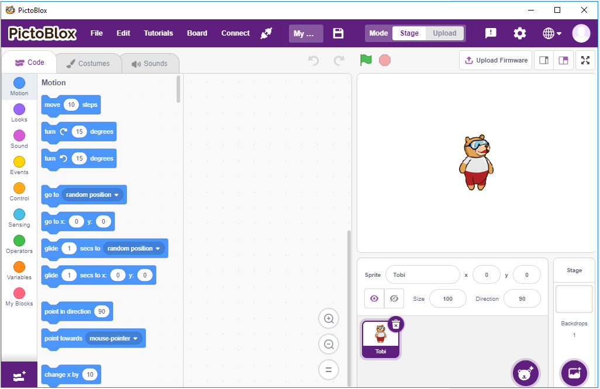

.. note::

    Hallo und willkommen in der SunFounder Raspberry Pi & Arduino & ESP32 Enthusiasten-Gemeinschaft auf Facebook! Tauchen Sie tiefer ein in die Welt von Raspberry Pi, Arduino und ESP32 mit anderen Enthusiasten.

    **Warum beitreten?**

    - **Expertenunterstützung**: Lösen Sie Nachverkaufsprobleme und technische Herausforderungen mit Hilfe unserer Gemeinschaft und unseres Teams.
    - **Lernen & Teilen**: Tauschen Sie Tipps und Anleitungen aus, um Ihre Fähigkeiten zu verbessern.
    - **Exklusive Vorschauen**: Erhalten Sie frühzeitigen Zugang zu neuen Produktankündigungen und exklusiven Einblicken.
    - **Spezialrabatte**: Genießen Sie exklusive Rabatte auf unsere neuesten Produkte.
    - **Festliche Aktionen und Gewinnspiele**: Nehmen Sie an Gewinnspielen und Feiertagsaktionen teil.

    👉 Sind Sie bereit, mit uns zu erkunden und zu erschaffen? Klicken Sie auf [|link_sf_facebook|] und treten Sie heute bei!

.. _play_with_scratch:

Play with Scratch
========================

Neben der Programmierung in der Arduino IDE oder Thonny IDE können wir auch grafische Programmierung nutzen.

Hier empfehlen wir die Programmierung mit Scratch, aber das offizielle Scratch ist derzeit nur mit dem Raspberry Pi kompatibel. Deshalb haben wir uns mit einem Unternehmen, STEMPedia, zusammengetan, das eine auf Scratch 3 basierende grafische Programmiersoftware für viele Boards entwickelt hat - `PictoBlox <https://thestempedia.com/product/pictoblox/>`_.

Es behält die grundlegenden Funktionen von Scratch 3 bei, fügt jedoch die Steuerung von Boards hinzu, wie Arduino Uno, Mega, Nano, ESP32, Microbit und STEAMPedia-eigene Hauptplatinen, die externe Sensoren und Roboter nutzen können, um die Sprites auf der Bühne zu steuern, mit starken Hardware-Interaktionsfähigkeiten.

Darüber hinaus bietet es KI und maschinelles Lernen, sodass auch ohne umfangreiche Programmierkenntnisse diese beliebten und hochtechnologischen Werkzeuge erlernt und genutzt werden können.

Einfach die Scratch-Programmierblöcke per Drag-and-Drop bewegen und coole Spiele, Animationen, interaktive Projekte und sogar Roboter nach Wunsch steuern!

Beginnen wir jetzt unsere Entdeckungsreise!

**1. Erste Schritte**

.. toctree::
    :maxdepth: 2
    
    pictoblox_start/1_install
    pictoblox_start/2_introduce
    pictoblox_start/3_quick_guide

**2. Projekte**

Die folgenden Projekte sind nach Programmierschwierigkeit geordnet. Es wird empfohlen, diese Bücher der Reihe nach zu lesen.

In jedem Projekt gibt es sehr detaillierte Schritte, die Ihnen beibringen, wie Sie die Schaltung aufbauen und Schritt für Schritt programmieren, um das endgültige Ergebnis zu erreichen.

Natürlich können Sie auch direkt das Skript öffnen und ausführen, aber Sie müssen sicherstellen, dass Sie das relevante Material von `GitHub <https://github.com/sunfounder/esp32-starter-kit/archive/refs/heads/main.zip>`_ heruntergeladen haben.

Nachdem der Download abgeschlossen ist, entpacken Sie ihn. Beziehen Sie sich auf :ref:`stage_mode`, um einzelne Skripte direkt auszuführen.

Aber das :ref:`sh_humiture` verwendet den :ref:`upload_mode`.

.. toctree::
    :maxdepth: 1

    1_table_lamp
    2_breathing
    3_colorful_ball
    4_moving_mouse
    5_doorbell
    6_temperature
    7_alarm_clock
    8_dht11
    9_rotating_fan
    10_light_ball
    11_shooting
    12_balloon
    13_star_crossed
    14_apple
    15_parrot
    16_brick
    17_fish
    18_tap_tile
    19_protect_heart
    20_dragon

